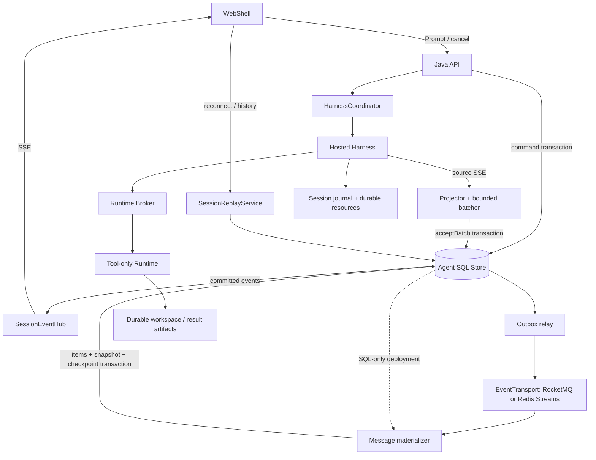

# Managed Agent Storage, Events, and Session Recovery

[English](2026-09-20-managed-agent-storage-event-architecture.md) | [简体中文](2026-09-20-managed-agent-storage-event-architecture.zh-CN.md)

Status: proposed architecture, with P0, the SQL-backed P1 materialization slice, and the P2 SQL delivery-claim slice implemented on this branch. Date: 2026-09-21. This design uses the integration snapshot below; it does not claim production validation of the complete architecture.

## 1. Decisions

Keep the WebShell → Java control plane → Hosted Harness → Runtime Broker → Tool-only Runtime responsibilities. Harness runs the Qwen Agent loop; Java owns admission, state, event projection, and client APIs; Runtime owns tools and the workspace. Model inference and Runtime warmup remain concurrent, with a wait only when an actual tool call needs Runtime.

Define interfaces by responsibility. Keep MySQL as the first implementation; PostgreSQL implements the same business contract. Prefer an existing RocketMQ platform for reliable asynchronous distribution. Without one, start with SQL batch scanning for materialization instead of deploying MQ just for SSE. Redis Streams remains an optional adapter, rather than another default dependency alongside RocketMQ.

The first stage uses **a short-lived SQL batch journal that also serves as an Outbox → immediate SSE after commit → asynchronous distribution and message materialization**. This refines the earlier suggestion of writing directly to MQ and persisting asynchronously: current code commits the Session sequence, Turn state, and Harness cursor in one database transaction. Splitting them immediately creates a dual-write gap. Preserve a bounded transaction boundary while removing permanent per-chunk storage and polling per connection.

The tradeoff is explicit: SQL remains on the event acceptance path. MQ outages can be buffered, but SQL outages still block acceptance of new events. This design does not keep accepting output indefinitely during a database outage. If database fault isolation is mandatory, prioritize the durable source journal work in Section 12 before evaluating an MQ-first path.

This document accompanies the initial schema and SDK integration described below. It does not promise recovery at an arbitrary model token, exactly-once tool side effects, live database switching, or equivalent support for every MQ feature.

The current implementation introduces `AgentStateStore`, bounded Harness event batching, stable Item/Part identities, one-transaction cursor/sequence/terminal updates, and post-commit local SSE delivery with durable replay fallback. Flyway V2 adds Item, Item Part, Snapshot, and consumer-progress tables. Flyway V4 adds the SQL batch journal and durable per-consumer delivery tasks. The SQL materializer claims tasks with fenced leases, applies an exact contiguous batch, and commits Item/Snapshot/progress changes with delivery completion. The WebShell reads a consistent Snapshot plus control events and the unmaterialized tail. The transition still retains one SQL row per public event and also stores its batch payload. Retention enforcement, external EventTransport, PostgreSQL adapter, multi-instance wakeup, and durable Harness/Runtime recovery remain proposed follow-up work.

## 2. Verified Code Baseline

Integration base: branch `feature/managed-agents-p0-p8`, commit `51cb9977f8b165b08e16757343017266fa95cac6`. The P2 delivery slice is implemented on top of that snapshot. Paths below refer to this branch snapshot.

The Java service source root is `packages/sdk-java/managed-agent-server/src/main/java/com/alibaba/qwen/code/managedagent/`.

| Location                                                                                                                                     | Current behavior and design implication                                                                                                                                    |
| -------------------------------------------------------------------------------------------------------------------------------------------- | -------------------------------------------------------------------------------------------------------------------------------------------------------------------------- |
| `store/ManagedAgentStore.java`                                                                                                               | Concrete JDBC class; transactions maintain command idempotency, Turns, source cursors, and public events together. Do not split these into unrelated CRUD interfaces.      |
| `service/HarnessCoordinator.java`                                                                                                            | Consumes Harness SSE; deduplicates with `bootId:eventEpoch:eventId`; submits bounded source batches. Java also generates Runtime status events.                            |
| `service/HarnessEventProjector.java`                                                                                                         | Text and tool projections now carry deterministic Item/Part identities while preserving the explicit public-field allowlist.                                               |
| `service/ManagedEventStreamService.java`                                                                                                     | Uses post-commit local notifications for the live path and periodic SQL reconciliation for gaps or reconnects. The browser never accesses the database directly.           |
| `service/ManagedAgentService.java`                                                                                                           | Transcript reads the latest materialized Snapshot, retained control events, and the event tail after `coveredSequence`, with legacy event paging before a Snapshot exists. |
| `harness/HarnessConnector.java`                                                                                                              | Existing connector interface can be reused; includes submission, SSE, cancellation, and boot generation information.                                                       |
| `src/main/resources/db/migration/V1__managed_agent_core.sql`, `V2__managed_agent_projection.sql`, and `V4__managed_agent_event_delivery.sql` | V1 contains Session, Turn, Command, and Event. V2 adds Item, Item Part, Snapshot, and projection progress. V4 adds batch journal and delivery-claim tables.                |
| `packages/sdk-java/runtime-broker/`                                                                                                          | Already has three Repository interfaces; the Embedded Broker default constructor still uses in-memory implementations.                                                     |
| `packages/core/src/managed-runtime/managed-session-assembly.ts`                                                                              | Directly assembles local Session authority, resource storage, and writer leases; not yet a replaceable remote persistence implementation.                                  |

The latest code uses the same Session UUID for the public Java Session, Harness, JSONL, and Broker. `harnessSessionId` is only a protocol alias; do not introduce another identity mapping. Tenant isolation still uses `(tenantId, sessionId)`; `turnId` and the stable `promptId` have separate purposes.

An ordinary projected event causes multiple UPDATEs and one INSERT. Filtered source events also advance recovery cursors. A chunk is not necessarily a token. The baseline does not include the merging, expiry, or aggregate storage proposed here.

## 3. Data Ownership

| Data                                                                         | Authority and storage                                         | Retention                                                                              |
| ---------------------------------------------------------------------------- | ------------------------------------------------------------- | -------------------------------------------------------------------------------------- |
| Session, Turn, Command, leases, idempotency, and authorization scope         | Java relational database                                      | Business retention policy; idempotency records must outlive the promised retry window. |
| Accepted public events                                                       | Short-lived SQL batch journal; MQ holds distribution copies   | Both the replay window and required consumer progress govern cleanup.                  |
| Display Message/Item, tool cards, and Snapshot                               | SQL projections built from public events and accepted input   | Preserve complete content long term; reference object storage for large payloads.      |
| Model context, private Session records, checkpoints, and resource references | Harness Session authority                                     | Persist independently; never reconstruct these from the public Message table.          |
| Runtime bindings and tool execution ledger                                   | Durable Broker Repositories                                   | Cover at least execution reconciliation and recovery periods.                          |
| Workspace, large tool results, file history, and recovery resources          | Persistent volumes or object storage with reference manifests | Resources referenced by a Session or execution must survive Runtime reclamation.       |

SSE is a transport protocol, MQ distributes events, and the relational database holds business state and query models. None automatically replaces the Harness Session recovery protocol.

## 4. First-Stage End-to-End Flow



1. Java atomically stores Prompt command idempotency, the Turn, input, and control events, then returns the accepted Turn identity.
2. The Coordinator obtains a lease with a generation, submits to Harness using a stable `promptId`, and warms Runtime concurrently. If the submission response is lost, reconcile the original submission rather than submitting a new Prompt.
3. Java parses Harness SSE, projects and deduplicates events, and forms bounded batches. After `acceptBatch` commits, the local node sends the returned events directly to its SSE Hub without reading SQL again or waiting for MQ.
4. The Relay reads the same batch journal and publishes through the configured EventTransport; consumers materialize Message/Item state. Without MQ, a database batch scanner runs the same materialization transaction.
5. Java fills browser reconnect gaps using Session sequences. History queries read complete Items and Snapshots.

User input is not a model delta. The materializer builds user Items from immutable Turn input saved in the admission transaction; extend `turn.accepted` with stable input Item references and revisions. Current events contain only `turnId`, so the existing public stream cannot be assumed to contain the complete conversation by itself. Fix input/projection identity, digest, and associated sequence; Snapshots include only versions within their covered sequence.

“Push and persist concurrently” means **confirm durable acceptance first, then perform presentation and subsequent processing independently**. Starting two asynchronous tasks for SSE and MQ does not make them one reliable operation. An Outbox commits local state and pending publication together, but Relay retries can still duplicate publication, so consumers must be idempotent. [Transactional outbox](https://microservices.io/patterns/data/transactional-outbox.html)

## 5. Interface Boundaries

These are target responsibility sketches and do not require an interface for every table. The checked-in `AgentStateStore` currently covers the P0/P1 subset rather than this complete target surface.

```java
interface AgentStateStore {
    CommandResult acceptCommand(Command command);
    Lease claimTurn(TurnKey turn, Duration duration);
    AcceptedBatch acceptBatch(Lease lease, IngressBatch batch);
    void applyProjection(ProjectionMutation mutation);
    ReplayPage readReplay(SessionKey session, long after, int limit);
    TranscriptSnapshot readSnapshot(SessionKey session);
}

interface EventTransport {
    CompletionStage<PublishReceipt> publish(CommittedBatch batch);
    Subscription consume(ConsumerSpec consumer, BatchHandler handler);
}

interface SessionArtifactStore {
    ArtifactRef putImmutable(ArtifactScope scope, InputStream content);
    InputStream readVerified(ArtifactScope scope, ArtifactRef ref);
}
```

| Boundary                  | Contract                                                                                                                                                                                                                        |
| ------------------------- | ------------------------------------------------------------------------------------------------------------------------------------------------------------------------------------------------------------------------------- |
| `AgentStateStore`         | Business transactions, scope isolation, lease generations, cursors, sequence allocation, and idempotent projections. Commands and their events, and batches and their source cursors, commit in one transaction on one backend. |
| `EventTransport`          | At-least-once distribution of committed batches, explicit processing success/failure, publication acknowledgement, and health. Business `eventId` does not depend on Broker message IDs; clients never use Broker offsets.      |
| `SessionReplayService`    | Application service combining Snapshots, short-lived range reads, and subscriptions; not an adapter claiming every MQ supports per-Session seek.                                                                                |
| `SessionArtifactStore`    | Immutable bytes, length/digest verification, and tenant/Session scope. Object storage does not own leases, journal commits, or tool deduplication.                                                                              |
| Harness Session authority | Extend the existing authority boundary with recoverable journal commits and fencing. Harness remains the sole private Session writer; Java does not become a second writer.                                                     |

`MySqlAgentStateStore` and `PostgresAgentStateStore` may share row mapping and business types while using their own SQL and Flyway migrations. Translate database errors into common conflict results after leaving the failed transaction; do not catch a uniqueness failure inside an aborted PostgreSQL transaction and continue querying. Specify common lock order, transaction isolation, database-time leases, string case semantics, JSON encoding, pagination, and retry scope. Changing the JDBC URL alone is insufficient. [PostgreSQL transaction isolation](https://www.postgresql.org/docs/current/transaction-iso.html)

Reuse the Broker's `RuntimeBindingRepository`, `RuntimeSessionRepository`, and `ToolExecutionRepository` with MySQL/PostgreSQL implementations. Do not invent another Broker storage API. Business operations spanning repositories must still define their transaction or CAS boundaries.

Keep EventTransport's common guarantees small: duplicates and reordering across reconnects are allowed, while the application checks committed sequences, deduplicates, and fills gaps. Adapters may improve ordering and throughput but must not silently weaken acknowledgement or recovery semantics. Implement only the backends actually needed for deployment and their shared contract tests initially, rather than every MQ.

## 6. Event Protocol and Acceptance Transaction

Events carry at least `schemaVersion`, `projectionVersion`, `tenantId` (internal), `sessionId`, `turnId`, `sequence`, `eventId`, `type`, `data`, and `createdAt`. Text also needs stable `itemId` and `contentPartId` fields. Identity comes from a Harness protocol extension, not temporary Java in-memory counters.

Negotiate stable Item/Part identities and Snapshot reset support separately. Retain the old projection path when Harness lacks the former, and the old replay path when a client lacks the latter. Do not infer identities to merge fragments or enable cleanup for incompatible Sessions prematurely.

Internal batches record `batchId`, `firstSequence`, `lastSequence`, `producerGeneration`, source `bootId/eventEpoch`, and the accepted source cursor. Public sequences order commits within a Session; source cursors support Harness recovery. They are not interchangeable. Replay preserves the original projection version, sequence, and content rather than rerunning the latest projector.

`acceptBatch` must complete the following in one transaction:

1. Lock Session and Turn in a consistent order. Validate tenant, active Turn, database-time lease, monotonically increasing owner generation, and source epoch. An expired writer cannot commit even if its process remains alive.
2. Discard input at or before the committed source cursor in the current epoch, then merge. Before commit, IngressBatch preserves source event boundaries so retries can overlap an already accepted prefix. Numeric cursors from different epochs cannot be compared.
3. Allocate consecutive `sequence` values for new public events, store an immutable batch, and advance source cursors and the Session watermark. Commit terminal state and its terminal event together. If every input is filtered, commit only a cursor checkpoint, without an empty public event.
4. Publish to the Hub only after commit. Command-generated control events use the same sequence allocator. Runtime callbacks also validate their operation generation/state and reject late results from obsolete operations.

If the SQL commit response is lost, reconcile by stable submission identity first. A committed batch retains its original `batchId`, sequences, and content; do not allocate new sequences. The same identity with a different digest is a protocol conflict: stop the stream and alert. Keep acceptance receipts and source-cursor deduplication metadata through the promised retry window, independently of short-lived payload cleanup.

Commit the first visible text immediately. Subsequent text with the same `turnId/itemId/contentPartId/type` may be merged. Candidate bounds are `50–100ms` or `64KiB`, whichever is reached first; determine them through load tests. Flush preceding text before promptly committing terminal, tool-boundary, approval, error, and cancellation events. Do not concatenate those as text.

Bound in-memory buffers per Session and globally. A tail lost before acceptance can only be recovered if Harness can actually replay its source stream. Source recovery across boots is unproven in the baseline, so the short in-memory window cannot be described as lossless. Database acknowledgement durability also depends on flushing, replication, and failover configuration.

## 7. Push, Replay, and MQ Consumption

### 7.1 SSE and Multiple Instances

On the accepting node, the commit callback pushes full batches. Its Hub shares a bounded buffer for a Session across browser connections. Disconnect slow connections that exceed their limit and require replay; they must neither block Harness nor cancel a Turn.

For a small multi-instance deployment, use service discovery to notify authenticated Java nodes with coalesced `sessionId + committedSequence` hints. A notified node with local subscribers performs one Session range read and fans out to its local connections. Notifications only wake readers. Periodic, node-level batched checks of active Session watermarks repair lost notifications, at a frequency coordinated with heartbeats. Cross-node range reads remain, but fixed `200ms` polling per browser disappears.

Node broadcasting grows with node count; load-test and bound the first deployment size, then adopt Session shard routing when needed. Putting all SSE nodes in one MQ consumer group does not cause every node to receive every event. Materialization consumption and notifications to SSE nodes are separate responsibilities.

### 7.2 Joining History and Live Events

Register the local subscription and buffer notifications first. Then read a consistent Snapshot and journal high watermark `H`, send data in `(afterSequence, H]`, and drain buffered events with `sequence > H`. Both client and server deduplicate by sequence. Fill gaps before advancing. Protect paged ranges with a short read lease or equivalent so cleanup cannot delete a range halfway through pagination; explicitly retry or reset when protection expires.

Retain numeric SSE `id` / `Last-Event-ID`, scoped by the server to the authenticated Session. Clients use decimal strings or a safe-integer strategy to avoid precision loss. After capability negotiation, expose `minReplaySequence`, `lastSequence`, and `coveredSequence`. For an expired cursor, return an explicit error before opening the stream; after opening, send a `resync.required` control frame that does not advance the business sequence, then close.

The client replaces the state covered by a materialized Snapshot, then reads the tail after `coveredSequence`; it must not append the same text twice. A Snapshot binds a consistent Item content version and watermark. All history pages must use that same Snapshot version. Cleanup advances only through a materialized contiguous prefix, leaving a continuous journal suffix after that Snapshot. Do not expire data that older clients still require until they support reset.

### 7.3 Consumption and Retries

Use `(tenantId, sessionId)` as the message grouping key. The Relay publishes serially per Session, resending the same `batchId` after uncertain timeouts. A crash between publication acknowledgement and its local marker creates duplicates as part of normal recovery.

RocketMQ group ordering requires serial sends from a single producer. Across producer handover, the application must still check sequences; MessageGroup does not replace fencing. [RocketMQ ordered messages](https://rocketmq.apache.org/docs/featureBehavior/03fifomessage/)

Consumers update Item/Snapshot state and their contiguous progress in one database transaction, then ACK. Redelivery does not append duplicate text. Fill gaps from the short-lived journal. If the journal also lacks the data, pause that Session's materialization and alert rather than treating later content as contiguous state. Moving an event to a dead-letter queue after retries must not advance the business watermark by itself.

The implemented SQL-only path creates one `managed_agent_batch_delivery` task in the same transaction as each `managed_agent_event_batch`. Workers scan eligible tasks rather than advancing a global maximum `batch_offset`. An earlier unfinished batch blocks only the same Session and consumer. Claiming uses a compare-and-set update that increments `claim_generation`; materialization locks Session, consumer progress, and delivery in that order, verifies the exact contiguous sequence range, and commits projection, Snapshot, progress, and `DONE` together. An expired or replaced claim can neither complete nor return the task to `PENDING`. `batch_offset` is only a fair scan-order hint, so a lower-offset transaction that commits late remains discoverable.

This is a compatibility transition: public events remain in `managed_agent_event` while newly accepted batches also store an encoded payload and SHA-256 digest. Java control events currently form one-event batches; a Harness acceptance transaction can contain multiple projected events. The 24-hour `expires_at` value is metadata only until cleanup gates and range-read protection are implemented. No RocketMQ/Redis relay or deletion job is enabled in this slice. V4 is intentionally stacked after the separately staged Runtime endpoint V3 migration and must be integrated in that order.

Browser replay uses public Session sequences and never resets the materializer consumer group. RocketMQ positions are topic/queue/offset based, and consumption progress belongs to a consumer group rather than a user Session cursor. [RocketMQ consumer progress](https://rocketmq.apache.org/docs/featureBehavior/09consumerprogress/)

## 8. Schema, Aggregation, and Retention

| Structure                                          | Purpose and current state                                                                                                                                                                                  |
| -------------------------------------------------- | ---------------------------------------------------------------------------------------------------------------------------------------------------------------------------------------------------------- |
| `managed_agent_event_batch`                        | Implemented in V4. One row per accepted batch stores its sequence range, encoded public events, digest, producer/source metadata, and expiry metadata. It serves as both future Outbox and replay journal. |
| `managed_agent_batch_delivery`                     | Implemented in V4 for durable `PENDING`/`LEASED`/`DONE`/`BLOCKED` consumer tasks, lease ownership, `claim_generation`, attempts, and completion. Only the SQL message-projection consumer exists today.    |
| `managed_agent_item` and `managed_agent_item_part` | Implemented in V2 for stable message/tool state and text Parts. The P1 implementation updates cumulative Part text per accepted delta; immutable long-output segments remain follow-up work.               |
| `managed_agent_snapshot`                           | Implemented in V2 as a consistent Item document plus `coveredSequence`; richer terminal/control state and pinned history-page versions remain follow-up work.                                              |
| `managed_agent_consumer_progress`                  | Implemented for the SQL message projection. Publication progress is still future work; Broker ACKs cannot substitute for materialization progress.                                                         |
| Additional Session/Turn columns                    | Lease generation, journal low/high watermarks, storage version, recovery state, and durable resource references.                                                                                           |

Locate batches by `(tenantId, sessionId, firstSequence)`, including the batch covering the requested starting point, and expand events during application pagination. Long-lived Items can be updated at content-block completion, terminal state, or bounded periodic checkpoints. Do not rewrite a growing full body for every delta. Use immutable segments and manifests for long output to avoid cumulative write amplification.

Periodic materialization may defer writes, but must not advance consumer progress or ACK while unsaved content remains only in memory. Successful processing requires content (or verified immutable segment references) and contiguous progress to be persisted in the same transaction. A Snapshot's coverage watermark must also reference a readable, consistent content version.

All cleanup conditions must hold:

- The batch is older than the public replay window `W` and has no active range-read protection.
- Complete content, control state, and required Snapshots cover the batch through its end.
- All required consumers have finished. When MQ is enabled, distribution and required downstream processing must also be complete. New consumers initialize from Snapshots rather than assuming old batches still exist.
- No investigation, recovery, or resource-reference pin remains. Delete in bounded pages to avoid long-held locks.

`W` remains an open parameter, not permanent retention. `24h` can be used for capacity examples but is not a committed product configuration. Passing the window does not imply unconditional deletion. If required consumers fall far behind, throttle, pause new Turns, and alert rather than accumulating indefinitely or silently discarding data.

RocketMQ cleanup follows retention and space policies, including for unconsumed data; “not ACKed” does not imply permanent retention. SQL journal data repairs gaps while required consumers are behind, and admission must stop before capacity limits are reached. [RocketMQ storage policy](https://rocketmq.apache.org/docs/featureBehavior/11messagestorepolicy/)

Merging primarily reduces rows, indexes, and repeated envelopes; content bytes do not disappear. Raw throughput is approximately `C × r × s` bytes/second, with uncompressed window capacity `C × r × s × W`, plus SQL/MQ replicas and indexes. For `C=100`, `r=20` events/second, and `s=200` bytes, raw content alone is `34.56GB/day`. A `100ms` window merges about two events on average, not necessarily an order-of-magnitude reduction. If measured SQL batch storage still exceeds budget, adding MQ is not grounds for launch: shorten an agreed window, limit concurrency, or prioritize the source journal work in Section 12.

## 9. Harness and Runtime Recovery

Storage and ChatRecordingService currently place local chat files at `projects/<sanitized-cwd>/chats/<sessionId>.jsonl` under the runtime directory. The root depends on `QWEN_RUNTIME_DIR`, runtime configuration, and user directories. A file on disk does not inherently prevent decoupling; the questions are whether a replacement process can locate and restore it and whether obsolete writers can still commit.

A complete recovery unit contains the private journal, checkpoints, the transitive closure of referenced resources, Workspace identity/snapshot, file history, and Broker binding/execution records. `LocalProcessRuntimeProvisioner.stopNow` currently deletes the generation directory, so its `outputRoot` is not durable resource storage. Uploading JSONL alone while omitting referenced large results or checkpoint resources is insufficient.

Proposed recovery order:

1. Locate the committed manifest and journal revision by tenant and Session, and fence the old writer. Reconcile results from the old generation.
2. Verify resource digests, lengths, and reference closure. Mount the original Workspace or restore a confirmed snapshot. Missing resources cause `recovery_blocked`, never an empty Session presented as restored.
3. Acquire a new writer generation under the same Session UUID, restore Harness authority, and then create replaceable Runtime execution handles.
4. Query or reconcile uncertain tool calls using the original `executionCallId`. A missing response, timeout, or process death does not prove that no side effect occurred. Block automatic replay when the outcome cannot be established.
5. Continue only at recovery boundaries explicitly supported by the protocol. Private journal restoration, public SSE replay, and continuation of an in-flight model request are distinct capabilities.

Publish and verify immutable resources first, then publish the manifest/journal commit point through a conditional commit using expected revision and writer generation. Successful uploads followed by failed commits leave collectible orphans; a committed manifest must never reference objects not yet durably published. Beyond an object-storage plugin, an authoritative commit mechanism must reject old generations. Local locks or client-side lease-expiry judgments are insufficient.

Production recovery requires Harness protocol extensions defining `journalRevision`, resource manifests, and acknowledgement of recoverable boundaries. Track recovery status separately from Turn completion: a successfully generated answer does not prove migratable state. Do not reclaim referenced resources before persistence acknowledgement and execution reconciliation. Preserve the existing boot-mismatch rejection until these checks pass, rather than changing it to unconditional reattachment.

## 10. Backend Selection and Deployment Configuration

| Component                           | Initial choice and replacement boundary                                                                                                                                                                                                             |
| ----------------------------------- | --------------------------------------------------------------------------------------------------------------------------------------------------------------------------------------------------------------------------------------------------- |
| Relational database                 | Retain MySQL initially to reduce migration variables. Deployments with an existing PostgreSQL platform may select its adapter. Changing database type alone does not solve the current problem.                                                     |
| Event distribution                  | Prefer an existing RocketMQ platform for multiple consumers and backlog recovery; otherwise start with a SQL scanner. Redis Streams is a candidate for short windows, subject to validation of persistence, pending-message recovery, and capacity. |
| Browser replay                      | Use the SQL batch journal uniformly in the first stage. Selecting Redis as the transport does not require another copy of replay storage.                                                                                                           |
| Large objects and Session resources | Use existing object storage or persistent storage satisfying writer constraints. A local development implementation is not evidence of cross-node recovery.                                                                                         |

Select backends at deployment startup through dependency injection and vendor-specific migration directories. The following is proposed configuration, not existing configuration:

```yaml
qwen:
  managed-agent:
    storage:
      backend: mysql # mysql | postgresql
    event-transport:
      backend: rocketmq # rocketmq | redis-streams | sql
    artifacts:
      backend: local # development only; production uses a durable provider
```

`sql` disables external EventTransport and uses a batch scanner for materialization. In-memory implementations are only for development/tests. At startup, verify that selected adapters satisfy required acknowledgement, consumer recovery, and resource-verification capabilities; reject unsupported modes. Inject credentials through deployment configuration, never public events or logs.

Do not switch MySQL/PG or MQ arbitrarily per request. Switching requires pausing writes, draining or checkpointing, migrating data, comparing sequences and digests, then switching and resuming. Running tools twice or dual-writing databases is not a lossless migration strategy.

## 11. Failure Semantics

| Failure point                                          | Handling and guarantee boundary                                                                                                               |
| ------------------------------------------------------ | --------------------------------------------------------------------------------------------------------------------------------------------- |
| Java crashes before batch commit                       | Resume from the last durable source cursor. If the source cannot replay, report a gap/recovery block; the uncommitted tail is not guaranteed. |
| Commit succeeds before SSE push                        | Replay from the journal; browsers deduplicate with original sequences.                                                                        |
| MQ publication succeeds before Relay marking           | Republish the same batch; materialization transactions deduplicate without appending text twice.                                              |
| SSE notification loss or node crash                    | Repair through node watermark reconciliation or reconnect replay. Browser lifetime does not determine Turn lifetime.                          |
| SQL temporarily rejects writes                         | Bounded buffering and backpressure. Explicitly fail if the source cannot reliably pause/replay; do not claim continued acceptance.            |
| MQ unavailable                                         | SQL still supports display of accepted output. Bound Outbox backlog and stop new admission at the threshold.                                  |
| Consumer reordering, dead letters, or missing segments | Check contiguous progress and repair gaps. Pause the Session projection when repair is impossible; do not advance its Snapshot watermark.     |
| Old Java/Harness returns after lease handover          | Both database acceptance and private journal commits validate generations. MQ ordering does not provide this protection.                      |
| Unknown tool outcome or missing Workspace              | Enter `recovery_blocked`; neither execute automatically a second time nor substitute an empty workspace for recovery.                         |

Retain tenant authorization for all queries, replay, resource downloads, and internal notifications. `X-Qwen-Tenant-Id` conveys scope from a trusted entry point, not identity credentials. Internal MQ metadata and private Harness records must not pass directly to the frontend. Preserve explicit public projection and sensitive-field filtering.

## 12. Rollout and Code Changes

| Phase                                                   | Work and exit condition                                                                                                                                                                                                                                                                                                                                                                                                                         |
| ------------------------------------------------------- | ----------------------------------------------------------------------------------------------------------------------------------------------------------------------------------------------------------------------------------------------------------------------------------------------------------------------------------------------------------------------------------------------------------------------------------------------- |
| P0: Contracts and baseline                              | **Implemented foundation.** `AgentStateStore`, bounded ingress batching, idempotent admission, and post-commit Hub delivery are present. H2 tests and a real-MySQL integration test cover the current contract; performance baselines and PostgreSQL parity remain open.                                                                                                                                                                        |
| P1: Batching and direct push                            | **Implemented SQL-backed slice.** Stable Item/Part identity, V2 projection tables, post-commit local SSE, a public Item list with its Snapshot watermark, and WebShell Snapshot-plus-tail hydration are present. Long-output write amplification, snapshot pagination pins, and production fault/performance evidence remain open.                                                                                                              |
| P2: Durable SQL delivery                                | **Implemented first slice.** V4 batch/delivery rows are committed with accepted events; workers claim per-consumer tasks with generation fencing and materialize exact per-Session sequence ranges transactionally. H2 covers stale-claim rejection, and real MySQL covers stale claims plus lower-offset late commits. MQ relay, cleanup, batching policy tuning, and production load/failover evidence remain open.                           |
| P2 follow-up: Transport and retention                   | Add the selected MQ adapter, Outbox Relay, multi-instance notifications, and replay reset. Enable window cleanup only after materialization reconciliation passes. Integrate an existing RocketMQ platform here.                                                                                                                                                                                                                                |
| P3: Durable recovery                                    | Persist the three Broker Repositories. Extend Harness authority and resource manifests, Workspace restoration, and reclamation barriers. Enable automatic takeover only after cross-JVM/Harness/Runtime failure tests pass.                                                                                                                                                                                                                     |
| P4: Change acceptance only when measurements require it | If SQL acceptance throughput or SQL fault isolation is insufficient, first give Harness/ingress an independent durable source journal, single-writer fencing, stable event identities, and replay acknowledgement. Then design direct push after MQ acceptance with asynchronous SQL materialization. Redefine the common ordering of control events/text and public cursors; replacing the `acceptBatch` implementation alone is insufficient. |

P4 is an explicit future design gate, not an existing interface capability. Do not introduce multiple execution modes, a generic query DSL, automatic MQ switching, or another Java Agent loop now.

Migrate through additive tables and per-Session `storageVersion`. Existing Sessions temporarily keep their old event path, while new Sessions gradually adopt the new path. Where historical backfill lacks stable Item identity, preserve the old Transcript rather than guessing and deleting originals. Older clients keep a retained path; only capable clients can enter a mode with window cleanup.

Canary rollout starts with read-only projection comparisons, never duplicate Prompt/tool dispatch. For rollback, stop admission to the new mode and retain compatible reads. Existing new-mode Sessions continue on a compatible service or explicitly pause. After cleanup is enabled, the old binary cannot reconstruct history from deleted deltas, so binary rollback alone is insufficient.

## 13. Acceptance and Open Parameters

Validate against the actual deployed MySQL, PostgreSQL, and MQ versions. Passing H2 or in-memory adapters is not a substitute:

- Two JVMs submit the same idempotency key and compete for a Turn/lease: only one admission succeeds, and stale generations cannot advance source cursors, events, or state.
- Inject crashes before/after commits, publication acknowledgements, and projection transactions. Reconcile events, complete text, terminal state, and consumer progress without silent gaps or duplicate text.
- Combine Java node changes, lost notifications, slow consumers, reconnects, and Snapshot pagination. Verify the transition from buffered live data to replay, cursor expiry, and exclusion against cleanup.
- Preserve boundaries across multi-Part text, interleaved tools/approvals, cancellation, and error termination; verify that public projections exclude private content.
- During cleanup, simulate lagging required consumers, early Broker cleanup, and resource pins. Throttle before capacity limits and repair gaps using retained journal data.
- Restore the same Workspace and Session after deleting Runtime processes and temporary generation directories. Explicitly block missing resources or unknown tool outcomes without executing twice.
- Run the same transaction/idempotency/CAS tests for database adapters and the same lost-acknowledgement, duplicate, reordering, and recovery tests for MQ adapters. Run corresponding builds, type checks, and E2E when integrating source changes.

Performance comparisons record first-text and inter-chunk latency p50/p95/p99, transactions/second per Session, actual SQL bytes and index size, replay throughput, materialization lag, MQ backlog, node/SSE-connection buffers, and resource restoration time. This document reports no performance experiment or fixed speedup.

Before production, determine the existing RocketMQ platform/version, active Session count and event rate, replay window `W`, maximum tolerable backlog, failure guarantees of database/MQ acknowledgements, history/resource retention, and allowed recovery point/time objectives. Interface boundaries and rollout planning do not require these values immediately; production capacity, cleanup, and cross-node recovery configuration do.

Related designs in the integration snapshot: `docs/design/2026-09-19-managed-agent-spring-server.zh-CN.md`, `docs/design/2026-09-20-managed-agent-dual-path-web-shell.zh-CN.md`, `docs/design/managed-agent-session-storage.md`, and `docs/design/managed-agent-session-harness-runtime.md`. This document adds storage and event boundaries without treating prior design documents as implementation validation.
