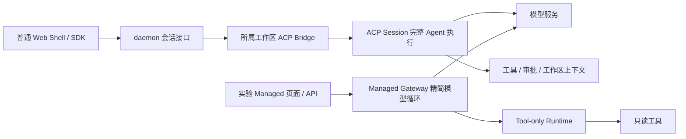
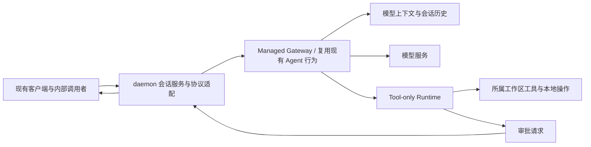

# Managed Agent 作为 daemon 默认执行实现

## 状态与目标

2026-09-09，已完成完整 Agent host 复用入口、环境快照和 Bridge 通道生命周期适配；独立验证已覆盖真实历史回放资源的异步清理；v2 独立 worker 调用链已通过 macOS 真实读写/Edit/前台 Shell、取消、执行中释放和 v1 回归，完整 build/bundle/typecheck 与 2850 项定向测试通过。Core 与 ACP Session 的代理生命周期调度已接通；真实 Config 注册、远端 v2 client 及严格 Session 释放已接通；完整 host 的主 Agent 读写/Shell 与默认自动记忆调用、任务结束和进程清理四组组合验收通过。子 Agent 独立执行、持久父文件历史、默认记忆真实写入及冷加载恢复已通过五组限定验收，详见 [子任务与文件历史](managed-agent-child-scopes.md)。其余完整语义和默认替换继续实施。差异调查起点为代码 `7f498eed1b`，后续实现与验证见下文。用户明确的目标是让 Managed Agent 替换 daemon 的默认 Agent 执行实现，普通 Web Shell、SDK 和 daemon 内部调用者直接使用它。独立 Managed Agents 页面是已有实验验证入口，不是最终交付形态。

本文记录当前差异和建议迁移顺序；没有将 Managed 设为默认，也不声明能力已对齐。已有 P0～P8、P9a 和展示测试继续复用。P9b 外部资源分配不作为本地默认替换的先决条件。

## 当前差异有多大

daemon 的 HTTP 服务、认证、工作区注册、部分工具基础设施和 UI 组件可以复用；Agent 执行能力及会话协议的迁移仍在进行。独立 Managed 页面仍使用原只读实验模型循环；新增完整 host 已能通过独立 Runtime 完成部分读写工具链，但普通 daemon 默认入口及其余完整工具语义仍需接入，不能仅替换一个路由就宣称能力对齐。

| 方面         | 普通 daemon 当前实现                                                                      | 独立 Managed 页面实验链路                                                                                                      | 替换前要求                                                                      |
| ------------ | ----------------------------------------------------------------------------------------- | ------------------------------------------------------------------------------------------------------------------------------ | ------------------------------------------------------------------------------- |
| 推理执行     | 请求进入所属 Bridge，再进入 ACP `Session.prompt`，包含上下文、Hooks、压缩、工具和停止处理 | Gateway 直接调用 `generateContentStream`，使用独立系统提示词和循环                                                             | 复用现有 Agent 行为，迁移模型与工具执行的所有权，避免维护第二套精简 Agent       |
| 工具能力     | 沿用普通 Session 的工具注册、调度及权限交互                                               | Gateway Agent Definition 和 Runtime manifest 均按安全只读 kind 过滤                                                            | 补齐编辑、Shell 等能力前，先接通审批、执行取消及副作用结果处理                  |
| 配置与扩展   | 存在会话模型设置、工作区配置以及 Session 的 Hooks/记忆处理                                | 一个 Gateway runner 持有自身配置；跳过 workspace settings、MCP discovery、Hooks、Skill Manager、文件检查点，固定 low reasoning | 定义每个逻辑 Session 的有效配置和上下文快照；复用现有解析与策略，保持工作区隔离 |
| 会话模型     | 可先创建空 Session，再发 Prompt；普通 load/resume、fork、归档等已有契约                   | 创建会话同时提交初始 Prompt；续轮依赖已有成功提交的模型历史                                                                    | 支持空会话、失败首轮后的合理继续行为，并兼容现有会话操作                        |
| 历史与恢复   | 普通 transcript、replay、压缩和会话持久化链路                                             | 自有 conversation/presentation journal；模型历史仅在成功结束时提交                                                             | 统一面向客户端的历史契约，明确失败/取消时展示与模型上下文的差别，补齐压缩和迁移 |
| 长任务限制   | 完整 Agent 路径自身的限制与配置                                                           | 固定 16 个工具轮次、32 次工具调用、4096 输出 token；历史至多 256 个 Content entry、每记录 4 MiB                                | 不把实验常量当作普通 daemon 的兼容承诺；沿用产品已有预算和压缩语义              |
| 对外协议     | 普通 session 接口、DaemonEvent 与 ACP 传输等                                              | 独立 `/managed/sessions` REST/SSE，Managed SDK 方法直接走 REST，事件类型不同                                                   | 保持既有客户端协议，统一事件投影及操作结果，覆盖 ACP 与 REST 两条路径           |
| 进程生命周期 | Bridge 管理 ACP 子进程和会话所有者                                                        | Gateway 保留模型状态，Runtime 专门执行工具；P9a 支持本地 worker 激活、复用、失效与清理                                         | 保留 Managed 的职责划分，继续验证工作区生命周期与在途执行边界                   |

“跳过 MCP/Skill 初始化”特指独立 Managed 页面实验链路中的 Gateway 初始化，不能据此声称 Runtime 中所有扩展都不可用。实际可执行集合仍受 Gateway Definition、Runtime manifest 和兼容校验共同约束，尚不是普通 Session 的完整扩展契约。

当前证据入口（仓库相对路径）：

- `packages/cli/src/serve/routes/session.ts`：普通 `/session/:id/prompt` 调用 `ownerBridge.sendPrompt`，与 Managed admission/list/transcript/cancel 路径并存。
- `packages/acp-bridge/src/bridge.ts`：普通 Prompt 入队、取消、权限交互、模型设置及会话生命周期。
- `packages/cli/src/acp-integration/session/Session.ts`：`prompt`、`#sendMessageStreamWithAutoCompression`、UserPromptSubmit/Stop Hooks、记忆和权限处理。
- `packages/cli/src/serve/managed-gateway-model-runtime.ts`：只读 Definition、独立循环、固定预算、Gateway 配置初始化。
- `packages/cli/src/acp-integration/acpAgent.ts`：Runtime manifest 的只读过滤；Tool-only Session 拒绝模型 Prompt。
- `packages/cli/src/serve/managed-gateway-conversation-store.ts`、`managed-prompt-service.ts`：历史上限、成功提交、续轮资格与并发轮次拒绝。
- `packages/sdk-typescript/src/daemon/DaemonClient.ts`、`managed-sessions.ts`：独立 Managed 请求与事件类型。
- `packages/cli/src/serve/run-qwen-serve.ts`：实验开关、工作区绑定、Gateway runner 与 Runtime Provider/Activator 的接线。

### 内部入口不能只靠 HTTP 改道

Web Shell 的普通 Session client 与 SDK 依赖普通 Prompt 的 ACK/事件契约；ACP 服务入口还会直接调用所属 Bridge。Conversations、Live 任务等也有内部 `sendPrompt` 调用，并非所有请求都经过 `/session/:id/prompt`。当前 Managed 创建还明确拒绝内部 Conversations 工作区。

Channels 通过 `packages/cli/src/commands/channel/daemon-worker.ts` 和 `packages/channels/base/src/DaemonChannelBridge.ts` 使用普通 Session SDK，依赖 workspace、model、approvalMode、`sourceType=channel` 和实例级 `sourceId`。交付要等待正式回复、内容块和 stopReason，不能用 Prompt admission 代替。适配层须保留受信 channel metadata、附件在 admission 不确定时的保留行为，以及 thread/user 路由与取消归属。

定时任务存在两类路径：手动 fresh-session 触发通过 `routes/scheduled-tasks.ts` 创建 Session 并 `sendPrompt`；自动 tick 则由 ACP `Session.ts` 的 `startCronScheduler` → `#enqueueCronPrompt` → `#executeCronPrompt` 在子进程内推进模型。Tool-only Session 在 `acpAgent.ts` 中明确不启动该 scheduler。因此，只替换 Bridge 的 `sendPrompt` 也会漏掉自动执行。

替换时应将需要模型推进的定时/自动任务接入 Gateway 准入与执行所有者，同时保留现有 cron 锁、执行记录和过期 one-shot 处理规则。Goal、通知触发、后台子任务等同样要逐项审计实际模型入口，不能让 Tool-only worker 为兼容功能重新运行模型。相关入口还包括 `standalone-session-service.ts`、`live-session-coordinator.ts`、`live-task-service.ts`，迁移清单应记录最终回复交付和取消归属，而不仅记录发送函数。

## 目标执行与复用边界

普通客户端继续创建和使用逻辑 Session。daemon 在内部为该 Session 选择并持久化执行所有者；最终新建普通 Session 默认由 Managed Gateway 执行。Gateway 持有模型凭据、模型循环和模型历史；Runtime 持有工作区文件、工具执行及需要本地进程的操作。

先建立一次真实调用所需的最小内部接缝，再逐项迁移，不预先引入通用插件式执行框架。不能将整个 ACP Session 原样搬到 Gateway：它包含工作区、副作用和客户端交互依赖。应从现有执行路径中识别可复用的模型轮次、提示词构建、上下文压缩与停止语义，通过明确的工具执行和交互边界运行。复用范围需由首个实现切片验证，本文不声称只换一个类就能完成。

工作区指令、Skill 内容、MCP capability 和 Hooks 需要显式区分“提供给模型的上下文”和“读取文件或执行命令的本地行为”。前者经所属工作区受控解析后交给 Gateway；后者留在 Runtime。跨边界的数据须带有效配置版本，reload 后旧版本不得用于新执行。共享 worker 不代表可以共享不同 Session 的模型上下文。

## 协议、身份与会话所有权

1. 维持普通 Session ID 的稳定性，新增内部执行来源必须持久化。操作按已记录所有者分派；未知、冲突或不可用状态不能回退到 primary workspace 或另一种执行引擎。
2. 面向客户端兼容现有 Session API/ACP 语义。Managed 自有事件可以继续作为内部事实流，普通消息、工具状态、权限请求、用量和结束事件由适配层投影；不能只改事件名称而省略字段或时序。
   例如，普通 Prompt 的 HTTP 202 响应是 `{promptId,lastEventId,eventEpoch}`，后续消费普通 `turn_complete` / `turn_error` 事件；它与 Managed admission 和终态事件不是同一契约。当前普通路由还会拒绝 `sourceType=managed-gateway` 的 Tool-only Session，不能通过取消这项检查来实现默认替换。
3. 创建空 Session 与提交 Prompt 分开。将当前 Managed “创建即首轮 admission”保留为实验 API 的便捷组合，普通创建操作不得偷偷发模型请求或启动工具执行。
4. 保持所属工作区解析、认证和信任校验。普通用户不需要新的 Managed client ID 来重新建立一份目录；当前实验关联机制的兼容仅保留给旧 `/managed` 调用者。
5. 任务状态与 Runtime readiness 仍独立。工具 Runtime 失败不能改写已提交的回答；轮次完成、取消请求 ACK、SSE 断连是不同事实。
6. 既有普通 Prompt 的排队、取消、截止时间及幂等结果必须逐项保持。当前 Managed 单活跃轮次拒绝语义不能直接覆盖 Bridge 的队列行为。

路由所有权应在实现时逐项标注：创建依赖 selected-runtime；活动操作依赖逻辑 Session 的持久化工作区与执行所有者；历史和归档依赖 persisted-workspace；服务能力描述属于 process-global。不能让“Managed 默认”抹掉这些区别。

## 编码能力与交互

编辑和 Shell 的开放以完整权限往返为前提：Runtime 提出工具/操作对应的审批，Gateway 与 daemon 保留关联，客户端通过原有交互返回决策，Runtime 校验 Session、轮次、调用和执行版本后继续。取消或过期后到达的批准不得恢复执行。审批等待、拒绝、超时和用户问题均需要客户端事件及终态处理，不能用自动批准填补缺口。

复用普通工具调度与权限规则，明确哪些模型侧 Hooks 在 Gateway 执行、哪些本地 Hooks 在 Runtime 执行，并对执行次数和顺序做回归。编辑、检查点、撤销、Shell 输出/退出、后台任务、子 Agent、计划/Goal、用量以及模型切换列入能力清单；未对齐项必须显式标明，不能在默认切换时静默丢失。

工具执行已分发后出现崩溃或网络不确定性时，沿用现有 Managed 的保守恢复原则，不自动重放可能有副作用的调用。模型历史与展示历史分开记录，失败或取消不能伪装成成功提交。写工具需要增加执行结果与模型提交之间的一致性验收，早期只读测试不足以证明这一点。

## 旧会话与回退

迁移期间，既有普通会话继续由旧执行路径负责，新建会话在明确启用的开发阶段进入 Managed。首次进入 Managed 不直接将普通 JSONL 当作 Managed history 读取；恢复、fork、压缩边界、工具结果及工作区身份需要经过有版本的转换验证。

默认切换时仅改变新会话的创建策略，不热迁移在途 Prompt。关闭新默认后，新会话可以回到旧路径；已创建的 Managed 会话仍按其所有者继续处理或明确报告不支持。不能把 Managed ID 交给普通 Bridge 去“尝试恢复”。未实现转换之前，保留旧执行路径是旧会话兼容措施，不是 Managed 失败时的隐式降级。

普通会话列表、标题、归档、删除、导出、分支和通知应读取统一逻辑会话投影，避免双目录和重复通知。Tool-only Runtime Session 继续隐藏；展示的对象始终是 Gateway 的逻辑 Session。

## 实施顺序与退出条件

| 切片                       | 交付内容                                                                                                                   | 退出条件                                                                                                              |
| -------------------------- | -------------------------------------------------------------------------------------------------------------------------- | --------------------------------------------------------------------------------------------------------------------- |
| D1：内部执行接缝与普通入口 | 为逻辑 Session 持久化执行所有者；在开发 opt-in 下串起普通 create/prompt/events/transcript/cancel；复用现有权限与工作区检查 | 普通 URL 和现有 SDK 可完成只读轮次，无需 Managed 页面；空会话、取消、重连、队列语义有契约测试。此时仍不是默认替换完成 |
| D2：现有 Agent 行为复用    | 用现有提示词、上下文/压缩与模型配置路径替换实验精简循环；明确本地上下文和 Hooks 边界                                       | 同一配置与固定模型夹具下，普通/Managed 的关键请求内容、工具顺序、停止行为和历史一致；长会话可压缩继续                 |
| D3：编码与交互能力         | 审批往返、写文件、Shell、检查点及任务/子 Agent 等现有能力逐项接通；补齐扩展和模型设置                                      | 现有编码任务可完成，审批拒绝/取消不会执行副作用，崩溃不会重复写入；其余产品能力无静默丢失                             |
| D4：目录、恢复与所有入口   | 统一展示投影；旧会话兼容；覆盖 ACP/REST、内部调用者与工作区生命周期                                                        | 刷新/重启后 ID、历史、设置及状态一致；列表不重复、Runtime 不泄露，多工作区不串环境                                    |
| D5：默认切换               | 新建 daemon Session 默认 Managed，保留明确旧会话与回退策略；独立页面降为实验诊断入口                                       | 既有 daemon 验收与新增故障矩阵通过，切换/回退不重放在途 Prompt；文档和能力声明同步                                    |

D1 的开发启用方式沿用实验配置入口，不先对普通用户增加新的引擎选择 UI。只有 D2～D4 的兼容门槛满足，D5 才改变默认。

### 首个实现切片：可托管的完整 Agent

代码调查确认 ACP Bridge 已有 `ChannelFactory` 和内存 ACP 通道。已从 `runAcpAgent` 提取使用注入 Stream 的 `createAcpAgentHost`，stdio 入口复用这个 host；这样后续 Gateway 可以使用同一个 Qwen Agent 和普通 ACP 契约，无需复制 Prompt、队列或定时任务协议。host 负责 bootstrap Config、反向 MCP 通道绑定、私有父进程握手与幂等的资源清理；环境变量消费、console 重定向、stdio、信号、进程退出和全局退出清理仍属于进程入口。调用者拥有 transport，关闭连接后须等待 host 的 `dispose`，不能将 transport 关闭视为资源清理完成。

真实 ACP 验证还发现两项生命周期问题：内存通道在 NDJSON 写入持锁时调用 writable abort 会漏关一端；ACP SDK 0.14.1 在连接关闭后会保留尚未响应的 RPC。前者改为对双向 TransformStream controller 置错，后者由 host 对 Qwen 使用的客户端请求（权限、反向扩展调用、文件读写）绑定关闭信号。该保护不代表原始 SDK 任意调用自动获得取消语义；后续 Bridge 接入仍须保留其请求退出保护。

此切片用真实内存 ACP 连接验证初始化、会话调用、错误 capability 和断开清理，并回归原 stdio 生命周期。workspace MCP discovery 的独立 Config 和在途队列也归 host 清理；加载、初始化或 discovery 期间关闭时，不得随后启动或发布新资源。重载队列以及直接 restart、manage、runtime-add/remove 等 MCP 控制请求统一等待结束，再清理 bootstrap/session Config 和 pool；discovery Config 在有在途操作时执行最终清理，防止晚建立的连接泄漏。它仅建立复用入口，尚不启用 Gateway 托管或改变默认：这一最初接缝仍存在会话配置加载修改 `process.env` 的问题（后续显式 host 接线见下文），工具构造和审批准备也会读取工作区。后续必须解决本地操作边界，再接入 Managed Runtime；不能把完整 Session 直接嵌入 daemon 当作最终的模型/工具分离。

当前已通过 ACP Agent/host、worktree 恢复与 RPC 生命周期单测 593 项、内存通道单测 12 项，以及 70 次独立关闭竞态探针。普通 daemon 的工具调用后正式最终回复、关闭并恢复同一会话两项隔离 E2E 已通过；Managed 默认路径尚未接入，不能据此声明其行为已验收。全仓 build/bundle 和 workspace 包 typecheck 通过；该切片验收当时，根 typecheck 的 integration 阶段仍有此前相同的四个错误（`daemon-worker.ts:913` 隐式 any，`run-qwen-serve.ts:5228/6120/7089` 的 ProcessRegistry src/dist 类型身份冲突）。这些结果只证明本切片；D1～D5 的默认替换验收尚未完成。

### 显式环境快照：模型消费者与宿主接线

`loadCliConfig` 的 host-only options 现在可以传入冻结的 `runtimeEnvironment`，Config、模型选择与鉴权刷新、跨 provider 子 Agent、settings 插值、scope reload、输出 token 上限和流超时使用同一环境。缺键保持缺失，不再借用 `process.env`；未传快照的独立 stdio 入口保留原有环境解析。Config 现有的 `environment?: string[]` 仍是提示词上下文，与环境字典无关。同一模型的鉴权刷新按记录的来源键重读有效凭据，保留通用 API key 回退，同时不会保留已删除的环境凭据。快照目前固定于 Config 生命周期，尚未实现工作区热更新。

OpenAI/DashScope SDK 显式接收 base URL、organization 和 project，缺失值不会触发 SDK 的全局补入。Google 的 Gemini/Vertex 模式、API key、项目、地域和 endpoint 也明确解析；Vertex ADC 校验使用同一份项目环境。OpenAI/Anthropic 的快照 dispatcher 固定代理绕过规则和 TLS 验证策略，缓存包含 `NO_PROXY`，代理构造失败明确报错，不回到全局 dispatcher。显式安全 TLS 也传入 `rejectUnauthorized=true`，避免继承进程级关闭验证的状态。

真实 producer 从 `run-qwen-serve` 捕获的 `daemonRuntimeBaseEnv` 进入现有共享 runner，环境发现限定在 HOME。先解析 home `.env`，再解析用户/系统 `settings.env`，最后用有效环境解析模型配置；不读取 primary、请求工作区或其祖先的配置。独立测试发现 HOME 经符号链接解析后与未规范化 HOME 比较会越过边界，已在环境发现函数中统一比较规范路径。这是共享 Gateway 的宿主快照，当前 runner 仍只有一份配置，不能宣称每个 workspace 的完整 Config 已迁移。

完整 CLI 的 warning settings 预读原先会先把 primary 环境写入进程，再被 daemon 当作启动基线继承。现在先捕获 launch 环境及 HOME 专属启动键，普通模型键仍由各工作区自行发现；token、限流和 ACP HTTP 开关保留原 daemon 启动配置。HOME bootstrap 只加入初始加载允许且不能热重载的键，拒绝 loader 注入，并在传入 worker 前删除私有 Tool Guard credential。它不把 HOME 模型 key 固化为工作区基线，因此不改变 workspace 优先于 HOME 的模型配置顺序。直接构造 runner 也经过同一 bootstrap，保留 HOME TLS/CA 的启动语义。

网络和账户边界分开处理。普通显式快照 Config 不安装全局代理或修改进程 TLS；唯一共享 runner 由 daemon 授予 host-only `processNetworkOwner`，保留固定宿主出口供 Google SDK 和 OAuth 的全局 fetch 使用，并在首次鉴权前等待代理安装。该字段不来自用户 settings、环境或 HTTP 请求。Google ADC 与 Qwen OAuth 仍使用宿主账户及 HOME/QWEN_HOME 缓存，工作区快照不构成账户隔离；Google/账户请求的逐工作区传输策略仍待接入。固定宿主策略仅维持现有实验入口的兼容，不是最终多工作区网络隔离方案。

本轮 build、bundle、变更文件 lint 和 workspace 包 typecheck 已通过；最终定向回归为 core 1,386 项、CLI 674 项，以及真实 app 的启动基线/ACP 开关回归 1 项，共 2,061 项。该切片验收当时，根 typecheck 仍是此前四项 integration 错误：`daemon-worker.ts:913` 隐式 any，`run-qwen-serve.ts:5232/6124/7094` 的 ProcessRegistry src/dist 类型身份冲突。独立验证覆盖核心快照 10 个样本、7 次 Google SDK 本地截获请求、5 次 OpenAI 本地 HTTP 请求、HOME 符号链接修复复验，以及 2 次宿主全局代理本地 HTTP 请求。HTTPS 实测确认：进程关闭证书验证时空快照仍拒绝自签名证书；真实 HOME bootstrap 保留显式 TLS 配置，允许该本地请求，同时 primary 模型配置优先级不变。最终 bundle 的真实 CLI 验证覆盖 Managed full-yargs、普通 fast path 与普通 full-yargs：Managed 的唯一模型请求使用 HOME key/URL/organization/project，primary trap 零请求；两种普通入口的唯一请求均使用 primary `.env` 与 `settings.env`，输出预算为夹具指定的 2,233。三种入口都验证 HOME token 的错误凭据 401/正确凭据 200、只读限流 20 次成功后 429，以及 ACP 关闭返回 404 而 REST 仍可完成会话。Managed 实验循环仍固定 4,096 输出 token，此验证不能证明其已继承完整 Agent 预算。Google ADC 使用替身鉴权，未验证真实账户。验证结果只支持上述边界；本地工具、MCP、PTY、Hooks 的环境仍须在 Tool-only Runtime 中处理。以上验证对应模型环境基础切片；完整 ACP host 的后续配置接线见下文，普通入口和默认策略尚未切换。

### 完整 ACP host 的工作区与环境绑定

`createAcpAgentHost` 的显式 `runtimeEnvironment` 模式将 host 固定到 bootstrap Config 所属 canonical cwd、信任状态与持久化输出根。调用者和 bootstrap Config 的环境必须相同；host 在第一次异步操作前复制冻结快照。Session 新建、load/resume、transcript replay、辅助 MCP discovery、权限和其他 settings 重读统一使用该快照，绕过仅按 cwd 缓存且会修改进程环境的旧 settings cache。重读磁盘 settings 仍生效，但 `.env` 和调用者对象的后续变化不会修改既有 host 的环境；此模式不会调用全局 `reloadEnvironment`。

host 初始化、ACP 连接读循环及异步请求后代、资源清理使用 `Storage.runWithResolvedRuntimeBaseDir` 固定输出根；历史读取及 Config 构造沿用同一根。Session 新建、恢复、列表和扩展请求拒绝其他 canonical cwd，省略 cwd 的扩展请求使用绑定工作区。MCP pool 的开关、预算和 ACP 本地读取根也使用 host 快照，鉴权预检不再借用全局 key 或 Vertex project。扩展 workspace settings 的 `.env` 路径与敏感值存储 namespace 也明确传入所属 cwd，包含安装更新读取旧设置的路径；权限持久化重读继承同一信任决定，未信任工作区的文件不参与用户规则保存。`sessionCd` 的目标 path 同样受绑定检查，不能绕过请求 cwd 校验。未显式传入环境的 stdio host 继续使用旧配置缓存、环境重载和目录迁移。

独立真实 ACP 基线已经复现旧版两个 host 均借用 ambient C 凭据、共享输出根、跨 cwd 创建成功，以及 reload/restore 后凭据漂移。本轮全仓 build/bundle、变更文件 lint、workspace 包 typecheck 通过；CLI 961 项及 core 扩展 182 项定向测试通过，共 1,143 项。该切片验收当时，根 typecheck 仍只有上文记录的四项既存 integration 错误。真实完整 host 的四次模型请求分别使用 A/B key 与 origin，ambient C 零请求；关闭/恢复保留真实历史且不重新调用模型。跨 cwd 新建、load 和 sessionCd 被拒绝，缺键鉴权失败；未信任 host 的坏 JSON 读取计数为零，bootstrap 与 Session 的用户权限保存均成功。四个 host、三个本地模型端口及临时数据已清理。扩展文件与敏感值 namespace 另有双工作区单测覆盖，敏感值存储在测试中使用替身，未访问系统 keychain。独立审查无剩余发现，最终 host 构建 SHA-256 为 `d92843ddabdfabaf34afe32757320e06f56c6187d0655b4df63e6d627e976c38`。这一阶段只建立可复用 host 的配置和归属边界，尚未把完整 host 接入普通 Gateway，也未改变默认执行策略。

完整 host factory 已接收 generation guard，具体生命周期见下一节；生产 workspace registry 的 factory 替换仍待工具边界完成。一个 workspace generation 内同一时刻最多一个未清理的 host：现有 QwenAgent 只有一个 MCP pool/discovery Config，并向其 Session 广播 workspace reload。环境变化必须从 daemon 基础环境重新构建新 generation，不能以上一次快照为基线保留已删除键，也不能把旧 Session 静默迁入新 generation。本地文件、MCP、Skill 与 Hook 依赖继续迁移到 Tool-only Runtime，然后接入普通 create/prompt/events/transcript/cancel，完成 D1～D5。生产接入点已定位为 primary、secondary 和 replacement generation 的 `ChannelFactory`；普通路由继续走既有 Bridge 契约。内存 channel 的退出必须等待 host 异步清理，不能把同步 abort 当作 containment 完成；Tool-only provider 必须指向独立 worker，不能重新使用 Gateway 自身 registry。上述执行边界完成前，不将完整内存 host 开启为普通默认。

### Bridge 所有的完整 Agent 通道

已增加 `createManagedAgentChannelFactory`，由 generation 的 canonical cwd、环境、信任决定、输出根及 CLI 参数快照构造真实 bootstrap Config 和完整 ACP host。它返回现有 `AcpChannel`，由 Bridge 完成初始化、私有握手、Session 索引及 Prompt 队列；不引入另一套会话注册表。私有父 capability 与 Tool Guard 标记只进入 host options，不进入模型环境；源环境及参数在 factory 构造时复制，不能受之后的调用者修改影响。工作区 generation 的关闭信号在异步启动期间和通道存活期间均生效，关闭后不发布新 host。

传输失效立即停止 Bridge 接受工作，但 `exited` 只在 host 的异步 `dispose` 成功后完成。daemon 的 workspace 清理不再用 `killAllSync()` 的返回代替成功的异步 shutdown；失败 generation 保持 blocked，不能继续安装 replacement。该要求同样适用于现有 spawn 通道：同步发出停止请求本身不证明资源已终止。主动 kill、意外 EOF 和 generation 关闭共享一次清理；同一个 factory 的后继 host 必须等待前驱清理成功，清理失败后拒绝再次创建。启动期间已创建的 Config/host 若清理失败，以 `AcpChannelTeardownError` 交给 Bridge 保留，即便尚未返回 channel，shutdown 也不能吞掉这个失败。普通无残留的启动失败仍可重试。清理失败通过 `kill()`/Bridge shutdown 传播，不得把同步 abort 当成已完成的资源回收。独立验证使用真实 Bridge、完整 host 和本地模型夹具，检查普通新建、Prompt、历史、私有握手及退出竞态。该通道切片验收当时，完整工具注册与独立 Tool-only provider 是后续前置要求；目前四种工具及独立 provider 已接通，其余完整语义仍待迁移，primary、secondary、replacement 三处生产 factory 尚未替换。

只读 transcript 回放也纳入完整 Config 所有权。独立真实探针发现旧实现仅异步调用 tool registry 的 stop，尚未结束就报告 channel 退出。现在回放缓存失效、host 关闭、创建失败及关闭后晚返回均执行并等待严格的 Config shutdown；独立集合覆盖被新 settings 替换但尚未完成的旧回放创建。失败保留在回放自己的清理表中，不能被普通 Session 清理或 Promise.allSettled 忽略，也不会调用全局 telemetry shutdown。

本切片全仓 build/bundle、变更文件 lint 和 workspace 包 typecheck 通过，定向单测共 1,970 项（ACP Agent/host 592、通道 16、workspace registry 23、定时路由 116、daemon 371、Bridge/内存通道 852）。该切片验收当时，根 typecheck 仍有相同四项既存 integration 错误。六组隔离真实验收通过：普通新建/Prompt/历史/恢复、启动前关闭、启动中关闭、在途 kill、generation 关闭、启动失败后清理失败。13 个实际初始化 Config 均完成一次真实 shutdown，5 个 channel 均退出；持有回放 registry stop 时 exited 保持 pending，释放后才退出。关闭/恢复没有新增模型请求，失败清理后的重试没有初始化新 Config。端口、socket 和临时目录已清理；未触碰 4170。最终 host 构建 SHA-256 为 `a225574c045f03b18a7852eafe7be5846040932094806d67454033ba9bc7b41f`。EOF 由通道单测覆盖，真实探针未注入；这些结果不证明独立 Tool-only 执行或默认路由已验收。

## 验收矩阵

以下为待实现后的验收计划，不是已通过结果。

- 用既有普通 Web Shell 和未改调用方式的 SDK 走 create → prompt → thought/tool → completed；检查普通 SSE 与 ACP 的等价事件投影、用量和通知。
- Channels 检查 thread/user 会话恢复、附件和最终交付；自动调度检查 controller/run 血缘、锁、错过 one-shot 的确认行为及单次执行。子任务完成通知须由 parent 持久接受，不能把 UI 收到事件当作交付完成。
- 只读、编辑、Shell、用户问题分别覆盖允许、拒绝、取消、超时、重复决策和失联；写工具执行计数与文件结果必须可核对。
- 首轮失败/取消、后续失败/取消、空会话、排队消息及完成竞态；展示历史与模型历史的差异必须可解释。
- 工作区指令、Hooks、MCP/Skills、模型与模式设置、上下文压缩：校验模型请求和实际本地行为，不仅检查 UI 文本。
- refresh/reconnect/restart、旧 Session restore/fork/archive/delete/export；确认没有重复模型调用和工具副作用。
- primary/secondary/dynamic workspace 的 reload、撤信任、移除；共享 Runtime 中取消一个 Session 不影响另一个，配置和凭据不跨工作区。
- 默认开启/关闭与版本回退：已有会话所有者不变，未知所有者失败明确，绝不隐式执行另一套 Agent。

测试使用隔离端口、目录和可控模型服务；当前 4170 预览不作为迁移试验对象。已运行上述 host 和普通 daemon 回归；默认替换后的行为矩阵仍待实现和验收。

## 本轮结论与待细化项

优先解决的是 Agent 能力复用和普通会话契约。完整 Agent host、工作区环境快照和可等待的通道生命周期已落地；[Runtime invocation v2 方案](managed-agent-runtime-invocations.md) 的独立 worker 内核已通过本地 macOS 验收，Core/ACP Session 也已接入代理的准备、权限、确认、Hook 回执、单次执行及取消排空。代理直接执行没有调度器授权时失败；工具提示与物理执行结果分开记录，响应丢失不重复执行副作用。

代理已注册到真实 Gateway Config/factory，新建空会话的无工具轮次不等待 Runtime，四种内置工具声明不依赖构造本地工作区工具；完整模型循环的主 Session 已通过独立进程验收。父子 Agent 的独立 Runtime 与持久父文件历史已接通，并通过下文五组真实验收。接下来完成不同 cwd 的完整组合、其余工具、MCP/Skill、媒体/产物、后台进程及完整 Hook 语义，再切换 primary、secondary、replacement 三处普通会话 factory。当前完整 host 验收不代表旧会话、全部消费者或默认替换已验收。

具体可提取的 Agent driver 边界、普通历史转换格式和全部内部调用者迁移顺序，需要在对应切片中完成精确接口设计；本文不提前承诺实现工期，也不把这些项目列为已完成。独立本地 CLI/TUI 的执行默认不在此次 daemon 替换范围内。

## 当前注册与远端 Session 接线（实施中）

完整 channel factory 已把工具 Session producer 同时传给 bootstrap Config 与 ACP host，host 在创建或恢复实际 Session Config 时继续传入。四种内置工具沿原 disabled/deferred/eager 注册规则生成代理；共享纯声明不加载真实工具、不等待 Runtime。每个实际执行 Config 使用独立的 Runtime Session 身份。新建且没有已跟踪文件历史的会话在第一次工具准备时获取 owned worker v2 client；已有文件历史的父轮次 checkpoint 可以提前获取 client，模型仍可并行开始。该 factory 尚未接入普通 daemon 三处默认 channel 选择，不能将接口接线当作默认迁移完成。

远端 v2 使用现有认证 lease 与 owned worker 的类型化调用、文件历史及终结释放路由；Session 释放失败保留 retiring 状态并允许清理重试，worker abort 必须等待真实退出才能证明排空。Config 普通关闭和 host writer handoff 都先等待工具 Session 释放；释放失败继续持有 writer，不把取消信号或 HTTP ACK 当成资源已经退出。Write/Edit/Shell 编辑确认选择“本会话始终允许”后，在真实 Runtime 确认成功时同步 Gateway 的 AUTO_EDIT 模式。

本阶段已完成完整模型循环的主 Session 真实进程验收，并修复默认自动记忆提取依赖全局历史缓存及额外未处理拒绝的问题。提取任务使用本会话捕获快照；默认开启时两次真实提取 Agent 和主轮次均正常结束。上述主 Session 注册阶段当时仍会拒绝未绑定子作用域；后续子任务接入与五组验收见下节。物理文件撤销、Gateway 工作区初始化、其余工具和媒体/产物迁移、旧会话及全部客户端兼容继续推进。

### 2026-09-09 注册绑定验收补充

完整 Agent Config 已注册共享声明的 Read/Write/Edit/Shell 代理；新建且无已跟踪文件历史的会话在首次工具调用时取得 owned Runtime，已有文件历史的父 checkpoint 可以提前获取。Gateway 保留原模型循环和权限调度。真实默认记忆验收四组通过，并修复自动提取依赖共享模型参数槽及未处理拒绝导致的进程退出。新的 owned v2 终结释放在 Session 关闭后保留身份标记，迟到 HTTP 请求不再重新创建已关闭 Session；完整 server 白名单和真实 worker 关闭链路均已验证。详细边界、失败反例与复验记录见 [Runtime invocation v2](managed-agent-runtime-invocations.md)。

这仍是阶段 2 的生产注册与远端绑定切片：普通 daemon 的三处 channel factory 尚未切换。子 Agent 及持久文件历史的后续进展见下节；物理文件撤销和其余工作区能力仍须接通，逐项验收普通 Web Shell、SDK、Channels、定时任务及旧会话后进行默认切换。

### 2026-09-09 子任务与持久文件历史验收补充

已接入实际前台/后台 Agent、cold resume、InProcessBackend、工具型 fork/Memory 和 Manager 的独立执行作用域，并共享持久父 Session 的真实 FileHistoryService。保留最近父快照语义，子调用不增加父快照；备份身份使用逻辑父 Session，索引由 Gateway 原 writer 严格确认持久化。作用域关闭先取消并排空后代，再同步历史、释放 Runtime 和 Gateway 资源；失败保留重试。实现和未覆盖范围见 [子任务与文件历史](managed-agent-child-scopes.md)。

五组 macOS 真实进程验收覆盖子首次 Read/Write、父子读取记录隔离、后台跨轮次重复写入、默认自动记忆在原 trusted 根的真实写入，以及旧 worker 退出后 loadSession 在新 Runtime 中读取原备份。完整 build/bundle/typecheck 与本阶段去重 2,191 项定向测试通过；各组共用 42 项基础构建摘要，补充依赖后联合 57 项保持一致，全部自有进程、端口及临时目录完成清理。当前 4170 预览未访问或重启。

Glob 和可选 LS 的后续迁移已完成下述限定验收；接着处理 Grep 后端声明、NotebookEdit/媒体、MCP/Skills/Hooks、后台进程/Git 与物理历史入口，同时接入可信工作区初始化快照。当前共享 owner 串行执行的并发限制、8 MiB 历史额度、external-v1 子任务、不同 cwd/故障组合和完整客户端兼容仍是默认切换前的条件。本阶段不改变三处普通会话 factory，不将冷加载备份可达误记为完整 rewind/branch 或旧会话迁移完成。

### 2026-09-09 Glob/LS 搜索与执行上下文验收补充

[搜索工具方案](managed-agent-search-tools.md)已将 Glob 和显式启用的 LS 接入共享声明、Gateway 代理及 owned Runtime。Read/Write/Edit/Shell 继续复用同一调用链。每个父子作用域在 bind 中传递实际目录列表、文件过滤、记忆根和 LS 启用状态；同 cwd 也派生独立工具视图，保留 custom ignore、目录权限和读取缓存。配置变化后既有绑定拒绝继续活动调用，清理仍可执行；同会话热更新与完整有效 CLI 配置对齐尚待补足。

四组真实搜索验收覆盖默认 Glob、argv LS、注册 worktree 子任务/附加目录/custom ignore，以及 memory allow 与外目录 ask/reject；另用既有真实子任务 prior-read 组验证独立读取记录和备份。全部自有进程、端口及临时根完成清理；build/bundle/typecheck 和本阶段去重 322 项定向测试通过。此记录不替代此前子任务验收，也不代表完整默认切换：三个普通 factory、完整消费者及其余工具和初始化边界仍须完成。

Grep 的公共声明、原生 Runtime 执行、配置传递和 POSIX 进程退出等待已实现，517 项定向测试与 16 组本机隔离验收通过。覆盖两后端父子搜索、worktree/输出阈值/部分读取后写入、权限差异、rg/grep/git 的取消与释放、版本探测超时及损坏 bundled 的系统回退。独立审查 Agent 因额度不可用，手工复审不记为独立审查通过。已验证边界及剩余工具、初始化、平台和默认切换工作见 [Managed Grep](managed-agent-grep-tools.md)。

### 2026-09-09 NotebookEdit Runtime 与审批修改

NotebookEdit 已使用原生 Runtime 实现，与 Read 共享所属会话的完整读取记录。模型公共声明保持一致，用户修改整份 notebook 通过私有 prepare 元数据与旧引用关联；取消排空后重新准备、审批，保留用户修改说明和原生写入/备份规则。689 项去重定向测试及真实完整 host 的 Read→编辑→最终回复通过；私有 wire 追加验证两轮修改、幂等准备、失效引用拒绝与实体父备份。测试边界、失败夹具及未覆盖项见 [NotebookEdit 与多媒体边界](managed-agent-notebook-tools.md)。独立 Agent 仍受额度限制，本轮采用主任务人工审查。

本切片没有切换 primary、secondary、replacement 普通会话 factory。后续继续完成 Notebook 故障时序和多媒体边界，以及此前工具/初始化/历史/客户端迁移清单；完整默认替换目标保持不变，当前预览及用户数据不参与试验。
