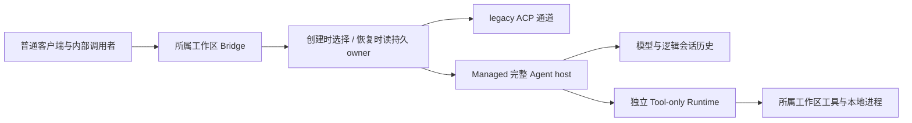

# Managed Agent 作为 daemon 默认执行实现

## 目标、基线与文档分工

更新日期：2026-09-10；本轮源码核对基线：`a8360814668b3dfdff72ad3d99cbcaf26dd009a9`。目标是将 Managed Agent 替换为 daemon 的默认执行实现，复用现有 Agent 能力，兼容普通 Web Shell、SDK、Channels、定时任务及旧会话。独立 Managed 页面保留为实验和诊断入口。独立 CLI/TUI 的默认引擎、Kubernetes/VM 部署和生产多租户调度不属于本次 daemon 默认替换的前置要求。

本文件是完整范围、能力状态和验收要求的总入口；[首阶段实施计划](../plans/2026-09-09-managed-daemon-default.md)决定当前执行顺序；[执行引擎详细设计](managed-session-execution-engine.md)定义固定 owner、双通道和兼容选择。工具、媒体与子任务细节由下文链接的专项设计负责。原总方案的逐次调查、失败与验收记录完整保留在[历史记录](managed-agent-daemon-default-history.md)，其中的旧顺序和“下一步”不再作为当前计划。D1～D5 是历史切片命名，当前顺序以首阶段计划为准。

普通默认入口尚未切换。当前已有完整 Agent host、独立 Tool-only Runtime、若干工具与子作用域、持久 owner、配对 Bridge、严格 settings/项目 MCP 读取；相应限定验收不能代替普通入口的完整验收。本轮只调研和整理文档，没有新增生产实现或重跑历史产品测试。

首阶段先接普通 Web Shell/SDK，完成必要故障验收后有限启用。MCP、Hooks、Channels 的 Managed 迁移后置；完整媒体展示、Skills/工作区初始化、后台能力和历史操作按后续阶段补齐，已验证行为保留。正确 cwd、信任、模型、权限、有效依赖识别和最小持久恢复是当前必需项。定时任务及后置能力始终属于完整目标，有限启用不能作为全部完成的证据。

## 架构与不变量

普通客户端继续使用现有 Session/Prompt/ACP/REST 契约。所属工作区的一个 Bridge 管理两种执行通道，服务端在创建时选择并持久化引擎；后续操作沿 Session 的实际 owner 分派。Managed Gateway 复用完整 ACP Agent 的模型循环、提示词、压缩、权限与停止语义，工作区文件和原生工具在独立 Runtime 执行。模型状态与 Runtime 生命周期分离，不另养一套精简 Agent，也不让 Tool-only worker 推进模型。

1. 同一 Session ID 的执行引擎不可变。完整旧历史无引擎记录时保持 legacy；非法、冲突、不可读 owner 不能猜测。已有 Managed 恢复不兼容时明确失败，不切换 legacy。
2. 用途与真实配置都明确兼容才选 Managed。延期依赖或未知组合的新会话在创建时选 legacy；Managed 初始化或执行失败后不重跑另一套引擎。
3. 创建空会话不提交 Prompt。普通 Prompt ACK 与最终回复、终态事件分开；不能用 admission 成功替代完成，也不能只重命名事件而丢字段或时序。
4. 模型和本地操作使用所属 workspace/generation 的配置与信任边界。缺失配置不借用 primary 或其他会话；工具、文件、审批和回执必须属于同一逻辑调用。
5. cancel ACK、HTTP abort 和根 PID 消失不单独证明副作用已结束。写调用回执不确定时查询或清理原调用，不自动重放；清理失败保留占用、writer 和错误。
6. 同一 Bridge 继续共享 Session 总量、ID reservation、事件和权限账本；两种通道不能翻倍资源预算。Runtime 容量、根进程、后代进程、驻留 Config 和 Session 分别计量。
7. 当前 4170 预览和用户数据不作为夹具；使用自有目录、端口和配置。每次发布代码与方案同步到授权分支，未验收条目不得标为完成。

## 入口清单与执行归属

以下是必须覆盖的调用者清单，不是这些入口已经接通 Managed 的声明。

| 入口                                                     | 当前源码路径或接缝                                                      | 目标与验收要求                                                                                                                                                                                     |
| -------------------------------------------------------- | ----------------------------------------------------------------------- | -------------------------------------------------------------------------------------------------------------------------------------------------------------------------------------------------- |
| primary、启动时 secondary、dynamic/replacement workspace | `run-qwen-serve.ts` 三处 legacy factory                                 | 接同一个 selector 和配对 factory，绑定各自 cwd、信任、环境、generation、日志与共享准入，不漏 replacement                                                                                           |
| 直接嵌入 daemon                                          | `server.ts` 的自有默认 Bridge                                           | 第四处接线；未注入 Bridge/registry 时采用同一策略，外部注入者保持自有执行与生命周期责任                                                                                                            |
| 普通 Web Shell、TypeScript SDK、REST 和 ACP HTTP         | 普通 session routes、ACP service、DaemonClient                          | 无需 `?managed=1`、新 client ID 或改调用方式；create/prompt/events/transcript/cancel/权限、队列与重连均经过同一 owner                                                                              |
| Channels                                                 | daemon-worker、DaemonChannelBridge                                      | 首阶段维持 legacy，在创建及热 attach 校验可信来源；后续保留实例/thread/user 路由、附件、正式回复内容块、stopReason 和取消归属                                                                      |
| 手动定时运行                                             | scheduled-tasks routes 的 fresh-session/create/sendPrompt               | `default` 来源不等于普通用途，须识别 `scheduled_task_run:` 等服务端关联；接入前保持 legacy，迁移后保留 controller/run 血缘、锁和执行记录                                                           |
| 自动定时运行                                             | keepalive、Session scheduler/createSubSession/enqueue cron              | 符合条件的 per_run 创建 fresh child，失败回父队列；其他已接纳任务直接入当前队列，条件见表后。两类均验证 owner、keepalive/rehydrate、锁/单次执行、错过 one-shot、关闭/禁用和取消，worker 不推进模型 |
| Conversations、Live、独立会话                            | standalone-session-service、live-session-coordinator、live-task-service | 逐个识别工作区、父子关联、触发与完成交付；Live 可使用缺省 source 或 default 加前缀，不能直接放行。实验 Managed API 拒绝 Conversations 不代表普通入口也应永久拒绝                                   |
| Goal/自动继续、通知触发                                  | 已有 Session 的 GoalTurnHost/queue 等内部入口                           | 延续原 owner；检查动态控制、自动续轮、停止、重启和父接受结果，不新建另一引擎来接管                                                                                                                 |
| 子 Agent、后台继续、Memory/fork/Manager                  | AgentTool、InProcessBackend、runForkedAgent、SubagentManager            | 每个作用域有独立执行身份、读取记录与取消责任；父接收结果和持久历史可核对                                                                                                                           |
| 旧会话和历史操作                                         | load/resume/replay、列表/归档/导出等                                    | 执行恢复读持久 owner，展示保留容错；fork/rewind/转换需独立协议与验收，未支持时准确拒绝                                                                                                             |
| Tool-only worker、实验 Managed API                       | worker entry、owned runtime routes、`/managed/sessions`                 | worker 排除普通完整 host 接线，避免递归；实验协议继续兼容，其验收不替代普通入口验收                                                                                                                |

自动调度在 token 限制停用或错过 autonomous sentinel 时先跳过；仅当非 missed、sessionMode 为 per_run、不是 @wakeup、无 delivery 且无 autonomous sentinel 时，才调用 createSubSession。其他已接纳任务直接 enqueue 当前 Session。fresh child 分派失败另有回父 task Session 排队的路径；迁移须区分明确未创建与回执不明，防止 child 可能已执行的工作被重复运行。直接队列分支也必须纳入 owner、动态用途和取消验收。

## 完整能力与验收总表

“限定验收”表示已有专项实现及报告，仅覆盖所列场景；“待接线”表示已有接缝但普通默认链未完成；“后续阶段”仍在完整目标内。最终验收须关联真实入口、产物与源码版本，不能只依靠测试数量。

| 编号 / 能力                | 涉及入口                                               | 当前状态                                                                                               | 剩余交付与验收标准                                                                                                                                                              |
| -------------------------- | ------------------------------------------------------ | ------------------------------------------------------------------------------------------------------ | ------------------------------------------------------------------------------------------------------------------------------------------------------------------------------- |
| C01 完整 Agent 行为        | 普通主/子 Session                                      | 完整 host 已复用，限定验收                                                                             | 普通默认路径复用原提示词、模型配置、上下文压缩、停止和预算；固定夹具核对请求、工具顺序和历史，长会话可继续；实验固定预算不成为普通限制                                          |
| C02 owner 与双通道         | 创建、发送、取消、关闭、冷恢复                         | 已实现并有专项验收                                                                                     | 接四处普通 factory；正向确实选 Managed，旧会话仍 legacy，错误回执/未知 owner/清理失败不发布错误 entry、不重复执行                                                               |
| C03 有效配置与初始化       | selector、bootstrap、new/load/resume、reload           | settings/项目 MCP 严格读取已接入，其余待接线                                                           | 复用真实合并与信任；QWEN_HOME/system path、env、cwd、模型权限一致；扩展无写探测，启动与变更共用检查，不跨 workspace 借值                                                        |
| C04 内置工具               | 完整 host → owned v2 Runtime                           | 九种代理已注册；Read/Write/Edit/Shell、Glob/可选 LS、Grep、NotebookEdit、Zoom 的相关路径有各自限定验收 | 对照原工具注册及全部本地副作用；权限、读取缓存、ignore、WebFetch/WebSearch/LSP/Artifact/ImageGen/Git/worktree/Monitor/Workflow 等其他能力、输出与模型依赖均有归属；不静默丢工具 |
| C05 审批与用户交互         | 普通 Web Shell/SDK、原调度器                           | 工具调度及部分私有 wire 已验证；普通交互待验收                                                         | 允许/拒绝/修改/取消/超时、重复/迟到决策、失联、模式持久化、用户问题恢复准确；未授权写入计数为零                                                                                 |
| C06 媒体与产物             | Read/Zoom、模型输入、客户端                            | M1 与 PDF 物理取消限定验收                                                                             | Gateway PDF 转写、图像/音视频/DisplayImage、产物授权访问、超限和并发结果按专项补齐；核对真实字节/哈希、调用者与取消后文件                                                       |
| C07 工作区上下文与 Skills  | 主/子 Config、模型上下文、本地初始化                   | 环境及部分执行上下文已接通；完整迁移后置                                                               | 指令、Skill 内容和动态能力在所属可信根解析，模型消费与 Runtime 文件/进程行为分离；热更新、不同 cwd、记忆根和版本不串用                                                          |
| C08 MCP                    | settings、项目、CLI/session、extension、runtime/client | 首阶段迁移后置，依赖识别必需                                                                           | 先证明依赖会话保留 legacy；后续定义 capability/鉴权/发现/资源/prompt、取消/重连/动态增删的所有权，模型只在 Gateway，验收后扩大范围                                              |
| C09 Hooks                  | 用户/项目/extension、Skill/agent 动态注册              | 首阶段迁移后置，保留原回执                                                                             | 识别有效依赖并挡住运行中注入；后续定义模型侧/本地 Hook、顺序、次数、修改结果、取消和失败；不把已有错误记成成功                                                                  |
| C10 Channels               | 通道 worker/SDK 与逻辑 Session                         | 首阶段 legacy 保留，Managed 后置                                                                       | 独立验证附件/admission 不确定、身份路由、正式交付、重试去重、取消与重启，普通 SDK 成功不替代通道交付                                                                            |
| C11 定时/自动任务          | 手动 run、自动 tick、Goal/Live 等                      | 已调查入口，普通 Managed 未验收                                                                        | 区分手动/自动并统一执行 owner；锁、血缘、单次执行、missed one-shot、恢复和取消可追溯，重复调度不重复副作用                                                                      |
| C12 子任务、后台与记忆     | AgentTool、cold resume、Memory/Manager                 | 独立作用域、父快照和部分真实记忆写入限定验收                                                           | 补不同 cwd/并发/父子关闭、后台 Shell/进度、父接受完成、Memory scaffold/index；子任务不借父读取缓存或跨作用域权限                                                                |
| C13 文件历史与撤销         | checkpoint、备份、rewind/diff/branch/delete            | 父备份及新 Runtime 冷读取已验证                                                                        | 物理撤销、分支和完整迁移后置；验证所属轮次、备份持久化、恢复字节和失败原子性，冷读取备份不替代 rewind                                                                           |
| C14 会话目录与旧会话       | load/resume、列表/标题/归档/导出、fork                 | 引擎保护和部分恢复已验证；Managed fork 当前拒绝                                                        | 普通 UI/SDK 同一投影不重复、不暴露 Tool-only；保持设置/历史/owner，未知或跨引擎恢复不写原数据；转换另设版本和回退验证                                                           |
| C15 事件、用量与通知       | SSE、ACP、SDK、浏览器和父任务                          | Bridge 归属绑定已验证；普通端到端待验收                                                                | promptId/sessionId、重放/去重、终态、用量和通知一致；ACK 与完成分开，后台/失焦通知与父持久接受分别验证                                                                          |
| C16 Runtime 与资源生命周期 | 四处 factory、registry、shutdown/reload/remove         | P9a 与 host 有专项实现；普通组合待接线                                                                 | 延迟 provider 绑定、共享预算且仅清理自有资源；先排空 host 再停 worker，环境与代际一致；一个工作区退役不关另一工作区进程                                                         |
| C17 故障、平台与观测       | Gateway/worker/模型/传输/存储                          | 多组 macOS 限定验证；Linux 未实测，Windows owned command 当前明确 unsupported                          | 断网/丢回执/崩溃/写失败/容量竞争/迟到结果；Windows/Linux 等效测试，区分根与后代退出；记录 TTFT、工具等待、队列、错误和残留且不泄密                                              |
| C18 默认切换与回退         | 新建策略、全部消费者、发布                             | 普通默认未启用                                                                                         | 先验收允许范围再逐项扩大至完整目标；关闭新默认只影响新建，已有 owner 不变；代码、方案、平台边界和远端分支一致                                                                   |

专项设计与证据：[执行引擎](managed-session-execution-engine.md)、[Runtime invocation v2](managed-agent-runtime-invocations.md)、[子任务及历史](managed-agent-child-scopes.md)、[搜索](managed-agent-search-tools.md)、[Grep](managed-agent-grep-tools.md)、[Notebook](managed-agent-notebook-tools.md)、[媒体](managed-agent-media.md)、[P9a](managed-agent-local-runtime-activation-p9a.md)、[实验展示](managed-agent-session-surfaces.md)。历史数字及平台范围在专项文档保留，不累计成一个“全量通过”数字。

## 当前切片：配置兼容与四处工厂

共同 selector 读取服务端实际用途、canonical cwd、信任、环境、argv、settings、全部 MCP/Hooks 来源、扩展状态及动态注入。不能将 default source、零 toolCount、部分空 cache 或读取失败解释为兼容。bare/safe、disable、allow/exclude 和 top-tier 输入按真实消费规则判断，不能另造一套设置解释器。

新建结果分为兼容、延期依赖、不确定，仅第一类选 Managed。恢复先读持久 owner，再检查该引擎输入；实际 Managed bootstrap/new/load/resume 在 Hooks/MCP/模型/工具副作用前复核。热 attach、动态 MCP、Hook/extension reload 不能绕过固定 owner。严格文件读取已落地，但全局路径仍使用原 Storage/system getter，显式环境插值不能冒充完整跨 QWEN_HOME 来源隔离。

### 空扩展只读快照

现有 ExtensionManager refresh 通过 store 锁进入初始化/恢复。实际空 store 基线证明：首次 refresh 创建 state、基础 lock、三个事务目录和 enablement；第二次字节虽不变，元数据仍会变化。基础 `lock` 是普通文件，持锁标记是另一个 `lock.lock` 目录。基线只证明现状，新 API 尚未实现。

无安装扩展不等于无 Skills，也不证明 Gateway 已无本地初始化；Config 的 FileService、SkillManager 等实际消费者仍须纳入 C03/C07 兼容检查。第一步严格证明无已安装扩展，允许全新路径和正常初始化空 store；安装候选、非空策略或未知状态暂不进入 Managed，即使扩展 disabled。区分真缺失、坏链接、权限/解析错误和读取中变化；不加锁恢复、不 mkdir、不写 migration/cache/plugin data。读前后复核目录身份/清单、state、projection 和事务，不声称能对非协作外部写入提供跨文件原子性。

快照绑定实际 Config 的同一个 ExtensionManager。两次初始化 refresh、后续 source/status/显式刷新共用只读复核；禁止管理 mutation、install 和 prepared commit 绕过检查填 cache。外部变化引入扩展时准确拒绝，legacy Manager 正常加载与管理不变。正向测试必须覆盖普通 Manager 真实生成的空目录，不能仅测不存在的目录。

### 普通资源协调、关闭和重载

四处 factory 使用一个 daemon 所有的协调器，保留原 legacy factory，提供 Managed factory 与共同 selector。Bridge 先于 registry 构造，协调器构造不得启动进程；首次 Managed 启动才绑定真实 registry/provider。普通资源不依赖实验页面 flag；Tool-only worker 和外部注入 Bridge/registry 排除。此为待实现内部接缝，不新增用户引擎选择 UI。

Activator 若接入共享 ProcessRegistry，只能停止自有 generations/children，不能调用共享实例的全局 shutdown/killAllSync。保留同一 generation 的 factory teardown 屏障、名额与 heap policy 原观测语义，不另造无界 worker 池。

正常关闭先封闭新工作，保留 provider/worker 供原调用 cancel/status、history 同步和 terminal release；等待 Bridge/host 清理后，再 revoke worker、确认物理退出、dispose provider，最后由唯一 owner 关闭共享 registry。异常清理保留原错误和未证明状态，强制 containment 不等于历史同步成功。现有实验资源先于 Bridge dispose 的顺序不能直接复用。

reload 暂停本代新 Managed 启动，处理在途创建与现存 host，待清理后停旧 worker，成功发布新有效环境后才解封。新 host/worker 取新快照，活 host 保留原快照；失败保持暂停，旧代不匹配同 cwd 新代。首个切片若尚无安全 host retirement，须明确拒绝有活 Managed host 的 reload，不能只刷新 legacy 控制通道就报全量成功；完整替换最终仍需完成 reload 语义。

## 实施顺序与完成门槛

| 阶段                             | 当前状态                                | 交付与退出条件                                                                                                                     |
| -------------------------------- | --------------------------------------- | ---------------------------------------------------------------------------------------------------------------------------------- |
| R1 固定 owner 和配对 Bridge      | 已有专项实现与验收                      | 维持固定归属、共享准入和真实 ACK，作为接线基础，不单独声明默认替换                                                                 |
| R2 有效配置与四处 factory        | 严格 settings/项目 MCP 完成，其余待实现 | 空扩展、全来源依赖/用途、动态保护、协调器及生命周期接通；四入口有真实 Managed 正向及 legacy/未知/恢复负向证据                      |
| R3 普通 Web Shell/SDK 和必要故障 | 待接线后验收                            | 完成总表首阶段适用项：普通 create/prompt/events/history/permission/cancel/reconnect，核对写入、owner、物理清理与平台边界           |
| R4 有限范围默认启用              | 未开始                                  | 新建兼容范围确实默认 Managed 且不依赖实验页；延期入口保留 legacy，旧 owner 不变，无失败后重跑；分支与方案一致                      |
| R5 定时及后置能力逐项扩大        | 按专项推进，未整体验收                  | 补齐 C06～C13、内部入口及剩余平台/历史/故障；每项有独立接口、迁移和普通入口验收后扩大范围；C01～C18 适用要求全部有证据才完成总目标 |

完整验收至少覆盖普通无工具轮、原生读写及 final、审批允许/拒绝/修改、取消与迟到结果、首轮失败后继续、队列/重复请求、冷恢复、旧 owner、跨工作区/代际隔离、reload/remove/撤信任、手动/自动调度、默认关闭和版本回退。需要同时核对模型请求、物理结果、持久历史与客户端事件，不能以 UI idle 或测试清单存在替代行为证据。

横向组合至少区分新建/热 attach/冷恢复、root/child/background、primary/secondary/replacement/embedded、REST/ACP/SDK/Web Shell，以及 macOS/Linux/Windows；支持、准确拒绝和未测试分别记录。工具边界核对声明、prepare/build、确认、execute、进度、终态、产物、恢复和释放，不能只验证 execute 而漏掉 Gateway 校验、fallback 与初始化中的本地操作。

故障验证覆盖 acquire/prepare/execute/commit/cleanup 各边界的失败与恢复；写入可能已执行而回执不确定时不重放。取消成功要求原调用结算或原进程树退出，容量和 writer 不提前释放。性能验证记录可复现基线与实际数值；当前没有设定或验证新的硬内存限制、吞吐和延迟 SLO。

后置能力进入实施时补具体 DTO、调用者清单、状态转换及真实脚本；总表不冒充这些细节已完成。源码新增入口或能力时同步扩表。每轮沿用设计、定向验证、自审、独立审查和授权发布。本轮纯文档检查源码对应、状态、链接与镜像，不运行无关产品测试。

## 待收敛的设计决定

1. 全局 settings、extension、Skills 与 runtimeEnvironment 的来源绑定：统一真实根，或对不能证明一致的组合保持首阶段 legacy；不能只改 settings reader 而让实际 Config 仍读另一个根。
2. 自动定时和内部继续的接缝：确认调度 owner、锁、父接受与失败恢复；尤其为 fresh child 创建的回执不明与已有回父 task Session 路径建立去重规则，不能把 child 可能已执行的工作再运行一次。不把模型 scheduler 搬进 Tool-only worker。
3. 后置扩展能力的模型侧/Runtime 侧边界和动态版本：随 C07～C09 的专项设计确定，严格探测不等于能力迁移完成。
4. 跨引擎转换、Managed fork/rewind、跨平台进程所有权及压力门槛：各自需要证据，现阶段保留明确不支持和原路径，不凭局部测试推定兼容。

## 本次调研的源码与证据

| 结论                                   | 核对源码                                                                                                                                 |
| -------------------------------------- | ---------------------------------------------------------------------------------------------------------------------------------------- |
| 四处默认接线与生命周期                 | CLI 的 `serve/run-qwen-serve.ts`、`serve/server.ts`                                                                                      |
| 完整 host、严格配置与前驱清理          | CLI 的 `serve/managed-agent-channel.ts`、`acp-integration/acpAgent.ts`、`config/config.ts`、`config/settings.ts`、`config/mcpServers.ts` |
| 扩展读取有写入与正常空布局             | core 的 `extension/extension-store.ts`、`extension/extensionManager.ts`、`config/config.ts`                                              |
| 关闭需要活 provider，reload 走控制通道 | CLI 的 `serve/managed-tool-session.ts`、`serve/local-process-runtime-activator.ts`、`serve/workspace-service/index.ts`                   |
| worker 排除完整 host                   | CLI 的 `serve/managed-runtime-worker-entry.ts`                                                                                           |

本地工作产物：`.qwen/investigations/managed-engine-default-coordinator.md`、`.qwen/investigations/managed-engine-empty-extension-implementation.md`、`.qwen/issues/managed-engine-extension-snapshot-baseline.md`。空 store 通过组为 `63217 / exit 0`；首轮夹具环境对象比较失败已保留。该组无模型、Hook/MCP、端口或用户配置参与，不扩大为默认入口验收。关键结论已写入本文件，阅读方案不依赖这些未跟踪文件。
