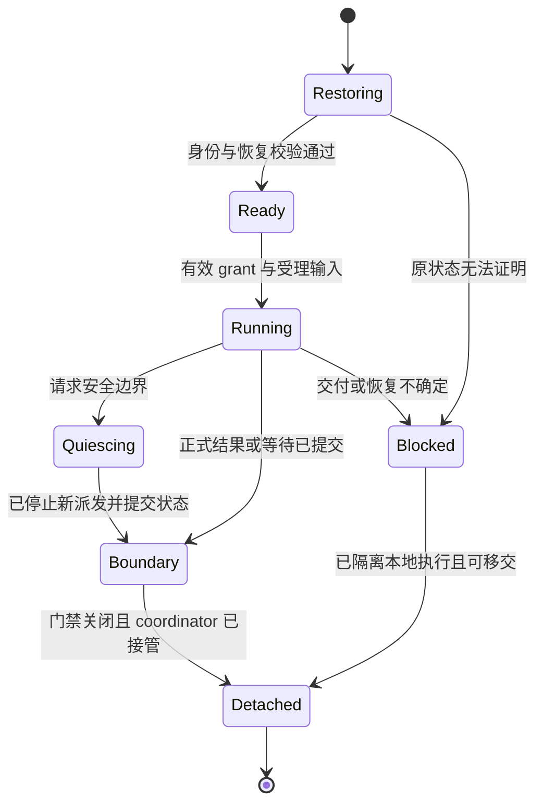

# Managed Harness：完整 Agent 的装配与可恢复执行

更新日期：2026-09-11；源码基线 `a8360814668b3dfdff72ad3d99cbcaf26dd009a9`，前一版文档 `4dc4a90dcc`。本文是待实现的 Harness 专项设计，配合[全局架构](managed-agent-session-harness-runtime.md)、[私有协议](managed-agent-control-protocol.md)、[coordinator](managed-agent-coordinator.md)及[Session 兼容方案](managed-agent-session-compatibility.md)。新增接口和恢复能力尚未实现，本轮不改变生产行为。

## 1. 首版实现与依赖边界

Harness 复用完整 `QwenAgent → Session → LlmChat` 模型路径及既有工具/权限编排。现有 `createManagedAgentChannelFactory → createAcpAgentHost` 是首版装配基础，不把实验 ResidentManagedGatewayModelRunner 升级成第二套默认模型循环。legacy SessionExecutor 继续原 spawn/Bridge 实现；Managed 才接入可恢复的增强协议。

一个物理/进程内 ACP host 可以承载多个 Session，逻辑 Harness handle 只绑定一次 activation。Factory 可借用原 channel/host 池，但不另起与 Bridge slot/ProcessRegistry 重复的容量账本。一个 handle detach 不能 kill 整个共享 host；物理 host 的最终 teardown 由原资源 owner 在所有引用排空后执行。

Harness 在运行中持有 Agent 执行状态，continuation 续跑依赖持久 checkpoint，不能仅重放展示消息重建执行。需要保留的状态经 Session 外置，使用 checkpoint 不等于要求原 handle 永久存活；可恢复范围由已提交状态和原调用证明决定，见[全局架构](managed-agent-session-harness-runtime.md)§7。合作式替换须到 §3 的安全点；崩溃后从最后已验证 checkpoint 对账，不能任意 token 精确续流。已引用 checkpoint 的九组状态缺失/损坏即 blocked；新建或已提交历史维护的合法无 checkpoint 起点按存储 §2.2 初始化，不与损坏降级混同。

| 注入依赖                   | owner 与要求                                                                                                                          |
| -------------------------- | ------------------------------------------------------------------------------------------------------------------------------------- |
| 有效配置/AgentDefinition   | 服务端解析 workspace/env/argv/trust/source 与 model route；引用可恢复的非敏感内容和 revision，凭据由受控来源重新取得，不放 checkpoint |
| `HarnessSessionClient`     | authority 提供 RestoreBundle、条件提交和只读命令投影；Harness 不取得物理 writer、文件路径或任意 append 权限                           |
| `CoordinatorRuntimeAccess` | coordinator 持有稳定 Runtime bindings、派发门禁与原调用收尾；Harness 使用 scoped proxy，不能创建新 Runtime ID 伪装原调用恢复          |
| 既有 Agent/工具服务        | 原 prompt、压缩、权限、模型切换、工具结果转换、预算和停止规则继续复用；本地副作用按真实消费者迁入 Runtime，不能仅关闭初始化跳过功能   |
| activation grant           | Session authority 颁发，coordinator 完成 Runtime 门禁安装后交付；handle 不能自领 epoch、续命或在旧 grant 下恢复新执行                 |

启动顺序：验证原 Session engine 和配置 → 获取已提交恢复包 → 构造 host/per-session Config 的受限适配 → 恢复上下文、调用和权限状态 → 对账 Runtime 与 activation → 发布可执行 handle。Goal/cron/通知/子任务回调必须在恢复和准入完成后启用；bootstrap Config 不等于用户 Session Config。

## 2. 最小 Factory / Handle 接口

以下方法是内部设计名称，复用私有协议的数据结构；不替换普通 sendPrompt/close 等公开返回语义。SessionExecutor 是外部兼容面，HarnessHandle 是其内部一次激活的执行对象。

| 方法                            | 输入与返回                                                                                                                       | 必须保证                                                                                                  |
| ------------------------------- | -------------------------------------------------------------------------------------------------------------------------------- | --------------------------------------------------------------------------------------------------------- |
| `HarnessFactory.create`         | Session owner binding、已核对全部门禁 ACK 的 RunnableGrant、RestoreBundle、有效配置和两个 scoped client → Promise<HarnessHandle> | 仅装配/恢复，不自行发送新用户 prompt；失败等待自有资源清理并保留失败责任，不换 engine、不关闭共享 sibling |
| `HarnessHandle.run`             | 已持久受理的 turn/continuation 引用 → Promise<HarnessBoundary>                                                                   | 一个 handle 至多一个 run，消费原输入 ID；返回的是已提交的明确 boundary，不等同宿主退出或所有后台工作完成  |
| `HarnessHandle.requestBoundary` | idle/handoff 的合作式请求 → Promise<HarnessBoundary>                                                                             | 封闭继续派发并到达可证明的安全点；不能把 abort 当作持久等待，模型流或未提交结果仍在运行时不得伪造成功     |
| `HarnessHandle.detach`          | 已提交 checkpoint/boundary 与 coordinator 接管证明 → Promise<HarnessDetachReceipt>                                               | 解除该 handle 的模型/回调/私有连接引用；不 cancel/release 原 Runtime，不关闭 Session 或其他 handle        |

用户 cancel、Session close、workspace drain 由原 SessionExecutor/coordinator 控制面执行；它们携带不同原因，使当前 handle 中断模型并进入对应收敛流程。最终 Session/host dispose 保留原终结责任，但不能用于实现 requestBoundary 或可恢复 detach。Factory/handle 不是可远程传递的 Config、Promise 或 AbortController 容器。

HarnessBoundary 是封闭 union，共四种结果：`turn_complete`、`durable_wait`、`recovery_blocked`，以及仅用于无活 turn 的生命周期 prompt Hook 的 `hook_complete`（字段与适用范围见 §8）。每种都包含 checkpoint/提交回执、subject/activation 与原因。前两者需要完整已提交证明；存储本身不可用时只能返回错误并由 coordinator 保留最后已验证 checkpoint，不能编造带成功 receipt 的 blocked boundary。新增 boundary 需要同时更新本节、coordinator 的释放原因和私有协议的 `releaseActivation`，不允许只在某一处出现。

## 3. 状态机与安全点

这是 handle 内部状态；authority 的 Session/turn/activation、Runtime 物理状态和 Bridge 对外枚举独立。Detached 后续跑由新 handle、新 activation 承接；不在同一个旧 grant 上把对象改回 Running。失败清理未完成时仍有资源责任，Blocked 不等于安全退出。

| 安全点                        | 必需提交/接管                                                                                                                                                  | 首批支持范围                                                                                                |
| ----------------------------- | -------------------------------------------------------------------------------------------------------------------------------------------------------------- | ----------------------------------------------------------------------------------------------------------- |
| A：最终 turn 完成             | 正式 assistant/tool 结果、用量、终态与必要后续 intent 已提交；本轮模型流结束、批次归并完成                                                                     | R2.S2 优先；仍活的后台/child 必须有独立可追踪 owner，否则 handle 继续驻留                                   |
| B：等待审批/问答              | 完整模型调用、稳定 tool ID、问题/允许选项与输入/权限版本已提交；Runtime 审批附原 prepare/ref，纯问答附 actionRequest/decision 引用；旧 transport waiter 可解除 | R2.S3；一般权限与 AskUserQuestion 分别验收，不伪造问答的 Runtime invocation，不将已有窄恢复当作全部审批恢复 |
| C：等待已准入工具             | 原 invocation 和状态已提交，coordinator 接管 status/cancel/history/result/唤醒；模型无并行新流                                                                 | R2.S3；detach 保留原调用，不能进入当前 runTool 的默认 cancelAndDrain finally                                |
| D：工具已结算，下一模型请求前 | 各来源 ToolOutcomeRef 已提交；Runtime 工具另保留原生/Hook 结果、完整媒体/输出 refs 与父 history；批次按原 ordinal 归并                                         | R2.S2 先支持无未决工作；continuation 明确哪些 functionResponse 尚未消费                                     |
| E：恢复被阻塞                 | 原身份、调用引用和原因可保存时提交 blocked；隔离旧模型/派发，资源和清理仍归 coordinator                                                                        | 记录缺口、配置不匹配、worker 丢失、未知交付或不可恢复的本地 child；不自动重放副作用                         |

不支持任意 token 或任意 await 的进程快照。模型流中存在 retry rollback、partial 内容暂存、压缩和路由切换，只有正式输出决定后才能作为恢复事实。中断流必须停止原请求；需要重试模型时记录新 attempt 和可能重复费用，不宣称接续原供应商流。

`requestBoundary` 到达安全点后立即暂停继续派发；有效 grant 可以在合作收敛期间续租，超期则中断并由 coordinator fencing。用户取消仍按原 cancel 语义执行，不能为了保留调用而忽略取消。

## 4. HarnessCheckpoint v1

checkpoint 复用 SessionRestoreProjection 的已提交数据/引用，另外保存 continuation 必需状态，不克隆整个运行对象。它覆盖的 sequence 不得超过 authority 已提交位置；所有 durable_wait 引用必须已受控保存。无字段依据或不能重建时拒绝该安全点，不用默认空队列/零预算补齐。

Factory 必须校验 RestoreBundle 的 `restoreBasis/restoreProofRef/checkpointRef`，唯一分型与字段规则见[存储 §2.2](managed-agent-session-storage.md#22-恢复基础与空检查点)。initial 或合法 history_rewind/history_copy/format_upgrade 起点允许 null；Harness 在获得有效 activation 后初始化完整状态，先提交 before_model checkpoint（boundary=null），再运行原 Agent。null 不承接未决工具/审批，也不允许为丢失 checkpoint、坏资源或未知作用域清空历史与预算。初始化不新增 HarnessBoundary 分型；之后的合作式 detach 仍须已有完整 boundary receipt。

| 分组                | v1 必需内容                                                                                                                                                      | 恢复规则                                                                                             |
| ------------------- | ---------------------------------------------------------------------------------------------------------------------------------------------------------------- | ---------------------------------------------------------------------------------------------------- |
| 身份与版本          | schemaVersion、SessionKey、engine、checkpointId、coveredSequence、原 activation/turn/prompt、definition/config revision、输入摘要                                | 校验所属 workspace 与持久 engine；本次新 grant 与原执行引用分开                                      |
| 既有恢复基础        | SessionRuntimeResumeState：apiHistory、recording/turn parents/source/model/engine、token counts、fileHistory/artifact、Goal/evidence、initialTurn、已消费通知 ID | 复用完整模型恢复投影；replay:none 只影响展示，不能丢模型历史与 owner 信息                            |
| continuation        | phase：before_model/model_output_committed/await_action/await_runtime/results_ready/turn_settled；待消费事件和上个 checkpoint                                    | 只允许验证过的组合；模型流未知是 blocked 原因，不是可直接 run 的 phase                               |
| 模型 attempt 与路由 | attemptId、有效 route/capability/sampling 配置引用、输出提交状态、用量来源与预算累计                                                                             | 认证重建必须满足原 continuation 约束；旧模型 fallback 不自动构成相同请求恢复证明                     |
| 工具批次与身份      | 原 functionCall ID 到 executionCallId 的映射、model message/part、batch ordinal、输入摘要、来源分型 ToolOutcomeRef、未开始/进行中/已结算项、结果消费位置         | provider 无 callId 时首次产生稳定 ID 并持久保存；恢复不再次生成随机 UUID，不能乱序消费部分并行批次   |
| Runtime 关联        | 原 InvocationBinding、capability/policy/media 版本、dispatch/settled/committed 状态、原进度 cursor                                                               | 先对账原 binding，不创建新 Runtime 重新执行；进度 cursor 不是 Session 提交 sequence                  |
| 审批与问答          | action requestId/kind、允许选项、参数/确认版本、最终决定与消费状态；Runtime 审批另附原 invocation ref                                                            | 票据/决定从 authority 重建；纯问答使用领域结果回执，不恢复旧连接 Promise，不将中间投票当最终执行授权 |
| 输出与历史          | 原 llmContent/物理 status、Hook 结果、持久媒体/文件 refs、父 history binding+revision                                                                            | 展示裁剪不能覆盖模型结果；parent owner 不因 Harness 更换重新绑定，失败不推进 revision                |
| 后续工作与 child    | 未消费输入/撤销/Goal permit/cron/通知/子任务引用、预算/停止守卫所需状态和 scope lineage                                                                          | authority 保存原意图；无法重建的后台/本地子任务保留驻留或阻塞 detach，不能清队列后重新无限续轮       |

Config、LlmChat 实例、文件 lease、AbortController、SDK connection、permissionRequestTails、provider credential、注册回调和运行 Promise 均不序列化。进程内状态先转成上述已有事实及 scoped 引用；恢复时重新构造可替换对象，但不改变原副作用身份。

上述 Runtime 关联与物理 history 字段只对对应调用必需。AskUserQuestion、Todo、Goal、Agent 等模型侧工具按私有协议的 domain/orchestration 结果恢复，保留各自领域提交或子任务引用；不得为了统一字段把它们移入 Tool-only worker，或给纯问答生成虚假的 Runtime 引用。

## 5. 必须同时迁移的真实接缝

以下是内部职责映射，补充已有 268 项公开成员清单；不是把巨型 Agent 类全部搬到新目录。路径均相对仓库，行号使用上述基线。

| 职责             | 现有具体入口                                                                                                           | 适配与验收                                                                                                                     |
| ---------------- | ---------------------------------------------------------------------------------------------------------------------- | ------------------------------------------------------------------------------------------------------------------------------ |
| host 装配        | CLI serve/managed-agent-channel.ts:70、acp-integration/acpAgent.ts:createAcpAgentHost:2736                             | 保留 private parent、canonical cwd、env/trust/generation 检查；分离 bootstrap 与 per-session Config                            |
| 创建/恢复/发布   | QwenAgent.newSession:5390、loadSession:5520、resumeSessionWithProfiler:6024、createAndStoreSession:14183               | authority reader/writer 接缝先于初始化与可执行发布，cold/hot/load/resume 语义保持                                              |
| 配置与模型       | newSessionConfigInRuntimeContext:13748、session-model-persistence、Config.initialize/activateChatRecording             | 新 Managed 不抢第二 writer；精确恢复配置与认证，未知路由阻塞原 continuation，不悄悄换模型                                      |
| 模型初始化与发送 | Core LlmClient.startChat:2049；ACP Session.#sendMessageStreamWithAutoCompression:7472/7657 → LlmChat.sendMessageStream | ACP 直接调用 LlmChat；只改 LlmClient.sendMessageStream 会漏主路径。强提交、压缩和 retry 边界在真实调用点接入                   |
| 工具编排         | ACP Session.runToolCalls:10279、runTool:10984、finalizeRunToolResult:10319；CoreToolScheduler 的另一条路径             | 两条执行链都接 scoped Runtime；稳定调用 ID/批次位置、not_started/物理成功及媒体完整保留                                        |
| 权限等待         | Session.#requestPermissionQueued:9999、runTool 确认/预检/授权段                                                        | 原连接队列与领域 action 分开；detach 转交 waiter，普通 cancel 仍调用原取消分支；决定先提交再执行                               |
| 原生恢复修复     | LlmClient.startChat:2142、LlmChat.sendMessageStream:2998、session-recovery 的孤立工具修复                              | Managed pending invocation 在每个模型入口之前对账；禁止合成失败 functionResponse 后继续模型，不能只修 load-time preserve       |
| 内部队列         | Session prompt/Goal/cron/notification/mid-turn drain；QwenAgent.activePromptCalls                                      | 保留用户抢占、历史 mutation gate、permit、去重与停止预算；本地队列变投影，不吞未决输入                                         |
| Runtime/父子历史 | Config managed scope factory；serve/managed-tool-session；managed-tool-file-history-session                            | coordinator 保留随机生成后已固定的 Runtime ID、父 owner 和原 refs；新 Config 不能重新生成绑定                                  |
| 终态和脱离       | Session.#settleTurnRecording:7377、runTool finally:13280、Session.dispose:4065、QwenAgent.beginManagedShutdown:3979    | boundary 等 Journal ACK；为 ownership transfer 增加退出分支，保留旧 cancelAndDrain 的终结语义；不调用 host dispose 模拟 detach |

上述 ACP Session 指 `packages/cli/src/acp-integration/session/Session.ts`；QwenAgent 在 `acpAgent.ts`；Core 文件由各自目录中的实际定义定位。更改方法签名时仍需逐调用者查读写点并同步测试。

两个特别容易误判的恢复路径必须保留明确保护。现有 AskUserQuestion 恢复只支持很窄的尾部调用组合，不证明 Shell/Edit 审批能挂起恢复；现有 orphan repair 会补造失败结果，Managed 对账前不能进入它。原模型恢复可因认证失败回 settings model，这一 legacy 行为保留，但不能拿它冒充未决 Managed attempt 的原配置证明。

## 6. detach 与终结实现约束

可恢复脱离顺序（本节是该顺序的唯一来源，coordinator 文档引用此处）：暂停该 handle 新模型/工具/内部续轮 → 执行端门禁撤销并取得 ACK → 将原引用与等待 owner 转给 coordinator → 提交完整 checkpoint/boundary → 解除该 handle 的本地 waiter/回调/连接引用 → 确认停止并释放 activation 容量。门禁撤销必须早于 checkpoint：否则提交期间仍可能产生新派发，checkpoint 声明的覆盖范围在落盘瞬间即已失效，恢复会漏掉这些调用。结果在任何窗口到达都先由 coordinator 提交，并通过 wake intent 对账，不丢给已销毁回调。

当前 `runTool` finally 会 cancelAndDrain，权限等待 abort 可能发送 Cancel，Config shutdown 会关闭 child/root Runtime。新增 transfer 状态只允许经过 authority/coordinator 确认的 detach 使用；普通用户 cancel、错误和 Session close 继续收敛自有调用。若无法绕开某个本地 Promise/child 的终结式 finally，首版保持该 handle 驻留并如实占槽，不能宣称完成可恢复脱离。

Session close 的完整顺序由 coordinator 文档约束。关闭共享 host 之前逐 handle 排空，writer 与 Runtime provider 在必要结果和文件历史提交期间保持可用；原 generation 已移出 active registry 也保留限权清理资格。

## 7. 实施与验收

| 编号 | 实施/故障场景                                                         | 完成证据                                                                                                                                                                                                                                       |
| ---- | --------------------------------------------------------------------- | ---------------------------------------------------------------------------------------------------------------------------------------------------------------------------------------------------------------------------------------------- |
| H01  | 完整普通 turn 到 A/D 安全点后更换 handle/host                         | 原 history/owner/config 与后续轮次保留，仅一套完整 Agent 模型循环                                                                                                                                                                              |
| H02  | partial tool-call 流错误、retry、无 provider callId、路由恢复失败     | 正式历史与实际结果相符，稳定调用 ID 不变，未提交 partial 不派发工具，未知配置明确阻塞                                                                                                                                                          |
| H03  | 等待权限/问答时 detach，重复/迟到/改参/无客户端答复                   | 旧 waiter 不误取消原请求，原合法最终决定持久后才授权；AskUserQuestion 和一般权限分别验收                                                                                                                                                       |
| H04  | 原工具正在写/已写而 ACK 丢失时替换 Harness                            | 原 PID/Runtime ID/invocation/history owner 保持，结果按原引用消费；保证是**原 invocation 不被二次派发**（at-most-once 派发），不是外部副作用 exactly-once——见[私有协议](managed-agent-control-protocol.md)§5；杀 worker 的未知场景另行 blocked |
| H05  | 并行 Agent 批次部分完成、父 child 工作、原结果提交失败                | 保持 batch ordinal、未决 refs 与父快照，不提前发模型下一步或回收唯一资源                                                                                                                                                                       |
| H06  | 用户抢占 cron/通知、Goal permit/mid-turn 恢复                         | 队列和停止预算不复位，输入不重复或丢失；延期用途继续固定 legacy                                                                                                                                                                                |
| H07  | 同 host sibling Session 存活，detach/close/reload 分别执行            | 单 handle 脱离不杀 sibling，终结仍实际取消/排空；清理失败保留责任和真实容量                                                                                                                                                                    |
| H08  | 新建首轮前冷恢复、合法历史维护无 checkpoint；对照丢失/损坏 checkpoint | 合法起点先提交 before_model checkpoint 再完成 Read/final，保留选定历史和预算；非法 null/残留 continuation 阻塞，旧工具不重跑，维护 owner 不冒充 Harness 提交检查点                                                                             |

**正向门槛。** H01～H08 每条都必须同时给出应当成功的对照用例并观测到实际继续执行，不能只验证“拒绝/阻塞”分支：H02 路由恢复成功的分支要真的用同一稳定调用 ID 派发并完成该工具；H03 合法最终决定持久后必须真的授权原调用并推进模型，不能停在等待；H04 的对照是原回执可按原引用取回并被模型消费（未知场景才 blocked）；H05 部分完成的批次在剩余结果到达后必须完成整批并回到父作用域；H06 抢占后原队列必须继续执行到终态；H07 单 handle detach 后原 Session 必须能由新 handle 继续。**对任何输入都返回 `recovery_blocked` 的实现视为验收不通过**——保守阻塞是未知场景的正确结果，不是全部场景的合格结果。每条记录写明正向用例的观测点（已提交 boundary、消费的回执、客户端可见终态）。

R2.S1 先交付 Session client、唯一 writer、稳定工具身份及提交记录；R2.S2 接 Factory、基础 activation 门禁和 A/D 安全点，验证旧 handle 已排空再替换；R2.S3 再接 B/C 的持久等待、在途门禁交接和原调用接管。基础门禁不能等到 S3 才接，否则 S2 的 RunnableGrant 与跨 host 替换缺少执行端证明。完整可恢复 child/后台、MCP/Hooks/Channels、Skills/本地初始化与完整媒体等按原后置阶段逐项验收；已实现功能不因本次抽象被删掉。不支持的等待必须有明确驻留/阻塞策略，不能空实现后报告恢复成功。

本轮仅设计。实现前将上述 checkpoint/continuation 字段与实际恢复入口形成编译可验证的 schema，补齐隔离 E2E 操作和失败注入；通过定向与真实行为验收后，才在能力表标记可恢复 Harness。

## 8. 全量领域与运行视图

全量输入和执行域见[覆盖表](managed-agent-full-design.md)。[配置与扩展](managed-agent-config-extensions.md)定义 RootSnapshot、EffectiveConfigBundle、Skill/MCP/Hook revision；checkpoint 引用这些已提交视图与动态注册状态，恢复不能重放初始化副作用。[自动任务](managed-agent-automation.md)定义 Goal/Live、schedule、child、parent acceptance 和 memory 的领域记录；Harness 只消费 authority 已受理的输入和结果。[工具与历史](managed-agent-tools-history.md)列出全部注册工具与混合工具分段，模型阶段留在 Harness，物理阶段必须有原 Runtime 回执。

上述专项细化已有九组 checkpoint，不引入第二份 Harness 日志。来源/根与不可恢复回调缺失仍按安全点能力声明拒绝 detach；已提交领域发送和历史维护可由 OperationGrant 完成，不为这些动作启动空模型轮。首阶段保留的驻留和延期行为仅是实现阶段，不代表这些领域尚无设计。

### 生命周期 prompt Hook 的全量激活分型

**阶段归属先写清：** Hooks 整体是 C09、落在 R5/F5，本小节的 hook-purpose activation 与 `hook_complete` boundary 随该片交付。R2.S1～S3 只需在 boundary union 与 `ActivationSubject` 里留出这两个分型并让 validator 认识它们，**不实现该执行路径**；在 F5 之前，无活 turn 的生命周期 prompt Hook 保持原 legacy 行为，不得因为本小节已有设计就在 R2 提前接线。这样做的原因是它需要“关闭中仍可运行一次模型”的窄例外，在持久等待与维护屏障尚未验收前接入会扩大关闭路径的风险面。

首版上述 turn 接口保留；全量 Factory 的 RunnableGrant/RestoreBundle 增加私有协议的 ActivationSubject 分型，run 接受 `turn` 或已受理 `hook_operation` 引用。后者装配已绑定 Config/Session client 与原 PromptHookRunner，恢复原 occurrence，不重新触发 SessionStart/Goal/cron 或建立主 Agent 推理轮。共享同 Session epoch/模型槽位，普通 turn 的 prompt Hook 继续在原有效 activation 内执行。

无活 turn 的 Notification/SessionEnd/SessionDelete 等 prompt Hook 由受限 hook-purpose activation 运行。其 boundary 增加 `hook_complete {operationId,occurrenceId,hookReceiptRef,commitReceipt,activationId}`，不使用 turn_complete，不生成普通最终回复或通知；pending 模型期间不声明 durable_wait。关闭/删除先完成或明确阻塞该维护 Hook，再释放 writer、模型凭据、provider 与最后内容 pin。OperationGrant 仅授权领域/物理 phase，不可替代这个模型资格。
