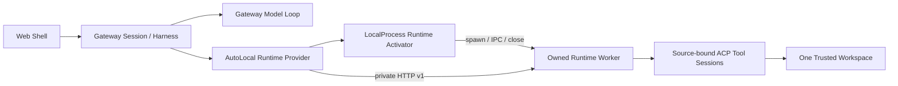
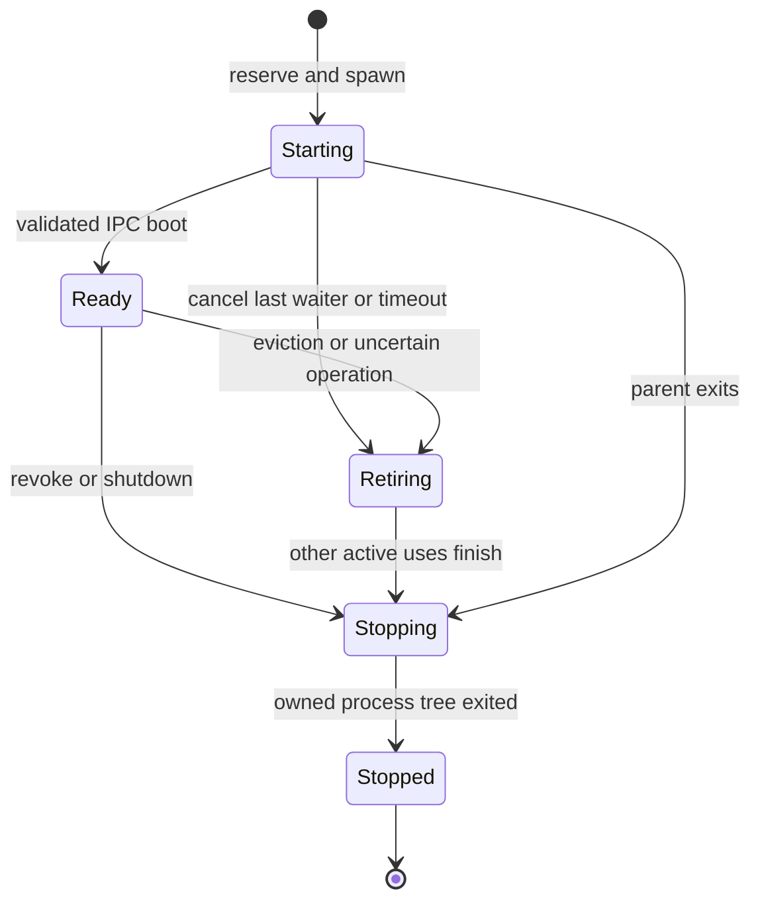

# Managed Agent 本地 Runtime 自动激活 P9a

> 状态：待实现设计，2026-09-08。代码调查基线为 `feature/managed-agents-p0-p8` 的 `5406d3fa1d`；P8 双进程协议和 Session Surfaces 已实现，本文描述的自动激活参数、租约校验和回收能力尚未实现。

## 1. 目标与边界

用户只启动 Gateway，在 Web Shell 创建 Managed 任务；Gateway 开始权威模型推理，同时按需启动本机 Tool-only Runtime。模型请求工具时等待该 Runtime，工具结果回到原模型上下文；续轮复用仍有效的 Runtime。会话目录、展示日志、模型历史和 Prompt outcome 始终属于 Gateway。

P9a 交付本地进程生命周期，包括启动、共享、有限容量、租约校验、取消、撤信任和退出清理。固定 Runtime URL 模式与 P7 进程内模式继续可用。Kubernetes/VM placement、预热池、分布式 lease store、生产多租户身份、动态 MCP/Skill 发布和可变更工具仍留在后续阶段。

当前公开路由把 `tenantId` 设置为 `workspaceId`，`managedClientId` 仅用于实验调用者关联。下文的租户字段用于保持绑定一致，不能被理解为新增了生产租户认证或操作系统安全隔离。

## 2. 当前代码与必须补齐的接点

| 当前事实（基线 `5406d3fa1d`） | P9a 的处理 |
| --- | --- |
| `run-qwen-serve.ts:6386` 选择固定 URL 或 Local Provider；`:6509` 同步取得 handle 后立即调用模型，只有工具路径等待 readiness。 | 新增 AutoLocal Provider，保持 `prepare()` 不等待进程启动；在 Harness 实际 dispatch 时触发，不在 HTTP 准入或历史读取时启动。 |
| `managed-runtime-provider.ts:667` 的 Remote Provider 固定 endpoint，缓存 Session prepare；`:851` 的 dispose 只 abort/清 Map。 | 复用 HTTP 客户端，每个 worker incarnation 一个实例；外层补工作区资源所有权与可等待的进程回收。 |
| `managed-runtime-protocol.ts:22` 严格白名单校验 v1 body，当前没有 Runtime lease。 | 保持 v1 body 不变，owned worker 使用独立的内部 lease headers 与启动时绑定校验；不把额外字段塞进旧 body。 |
| `run-qwen-serve.ts:1871` 返回 `RunHandle`，含 `url/server/runtimeReady/close`；`:8447` 取得实际监听端口。 | 内部 wrapper 用 `port: 0`，经 IPC 报告 endpoint，不解析 stdout 或先探测空闲端口再释放。 |
| `server.ts:2697` 后仍挂普通 Session/Auth API，WebSocket upgrade 有独立入口。 | owned worker 使用私有 HTTP profile，只允许五条 Managed Runtime POST 路由，并拒绝其他 HTTP 与全部 upgrade。 |
| `run-qwen-serve.ts:4337` 同步 dispose providers，`:7421` 起已有工作区 drain/remove/trust 生命周期。 | await owned resources 关闭，并接工作区 drain、撤信任、第二次退出信号的强制回收。 |
| `managed-prompt-service.ts` 已拒绝重放恢复到 processing 的模糊执行；Session Surfaces 已持久化状态并恢复观察。 | 保留失败关闭；重新创建 Runtime 不能触发重跑旧 Prompt/Tool，也不能创建新的展示会话。 |

代码路径均相对 `packages/cli/src/serve/`，除显式注明的跨包路径。行号是调查基线锚点，实现后应更新。

## 3. 分层与资源单位



| 对象 | 归属和复用范围 | 结束条件 |
| --- | --- | --- |
| Gateway Session | 持久会话，跨 Prompt 和 Runtime replacement 不变。 | 既有会话保留规则；worker 退出不删除它。 |
| Harness activation | 一次 Prompt 推进，受现有 activation epoch 与 slot 限制。 | Prompt 结束、取消、deadline 或失去 activation 所有权。 |
| Runtime worker | 同一 Gateway incarnation 内，按 `tenantId + workspaceId + canonicalCwd` 复用。绑定当前 WorkspaceRuntime 对象、信任状态和受控 reload revision。 | 容量压力下回收空闲 worker、工作区失效、异常退出、Gateway 退出。 |
| Tool Session | worker 内按 Gateway Session 独立的 `managed-gateway` ACP Session。 | 原有 Session release/清理，或整个 worker 结束。 |
| Runtime use | 每次 dispatch 一个内存引用，绑定确切 worker generation；工具请求另计 in-flight。 | dispatch 的 `finally` 幂等释放；不直接杀死其他会话共用的 worker。 |

复用 worker 不复用模型上下文，也不把 Harness 变成一会话一个进程。不同工作区或不同租户绑定不能共享 worker。canonical cwd 由已解析的可信 WorkspaceRegistry 提供，不能从模型或浏览器参数重新拼接。配置/信任重建后即使路径相同，旧 worker 也不复用。

## 4. 内部接口与生命周期

只增加 CLI 内部的小接口，不新增 Core 调度抽象。建议命名和契约如下，接口不是对外 SDK API；所有新字段都须有明确生产调用方和测试：

| 接口 | 契约 |
| --- | --- |
| `ManagedRuntimeActivator.activate(scope)` | 同步返回一次 Runtime use；同 scope 的并发调用共享启动 Promise，但每个 use 有独立、不可重复扣减的引用 ID。容量/启动失败表现为 endpoint Promise 拒绝，不阻塞无工具模型调用。 |
| `RuntimeUse.endpoint` | `Promise<RuntimeEndpoint>`，内部 endpoint 包含 loopback URL、随机 token、`leaseId + epoch`。此时 worker HTTP 可用，不代表该 Session 的工具已 prepare。 |
| `RuntimeUse.signal` | 当前 worker incarnation 失效通知；替换、撤信任、退出后永久 abort。旧 handle 不重新指向新 worker。 |
| `RuntimeUse.release(reason)` | 释放确切 use，区分正常结束、失败与取消，决定是否保留无人等待的启动；闭包捕获 scope、lease 和引用 ID，旧 use 或重复 release 不影响新 generation。 |
| `Activator.beginDrain/cancelDrain/workspaceActivity` | 与现有 WorkspaceRuntime 生命周期对齐；drain 阻止新 activate，回滚只恢复仍可信且未终止的工作区。 |
| `Activator.revokeWorkspace(runtime)` | 同步使旧 handle 失效，再返回可 await 的收敛 Promise；只回收该 WorkspaceRuntime 拥有的 worker。 |
| `Activator.close()` / `killAllSync()` | 全局停止准入、取消启动、等待所拥有的进程树结束；强制路径只作用于本 Activator 注册的进程。 |

AutoLocal Provider 实现既有 `ManagedRuntimeProvider`。其 handle 增加一个 dispatch 完成钩子（例如必需的 `finish(reason): void`），由 `run-qwen-serve.ts` 的 dispatch `finally` 按模型执行结束/失败/abort 传入原因并调用，AutoLocal 在此释放 Runtime use；Local/固定 URL 实现为空操作。钩子不表示取消 Session，不持久化引用。

`Provider.release(sessionId, expected)` 仍表示释放工具 Session，不能被解释为杀死共享 worker。AutoLocal 必须先捕获对应 worker/delegate，再异步释放；不得在 await 后按 sessionId 查到 replacement 并误释放它。bootstrap 失败的现有 discard 路径也使用这一规则。



状态图表示 worker 生命周期，Session 的 `runtime_ready` 仍要求自己的 prepare 完成。启动失败/进程异常均走停止收敛，保留失败原因；停止失败不算 Stopped。

每个 worker 的 Remote Provider 绑定不可变 endpoint/token/fence，销毁后不重新使用。AutoLocal 在 Session prepare 成功后才解析公共 handle 的 `ready`，在 manifest/execute 前后检查 use 的失效信号与工作区绑定，并跟踪分发中的工具和取消收尾。Worker 死亡使已有 handles 失败；只有后续新 dispatch 可以创建新 generation，同轮不透明切换 worker。

## 5. 启动、readiness 与本地租约

1. Gateway 启动时创建 Activator，**不启动 Runtime**，并像固定 URL 模式一样跳过普通 ACP preheat。已准入但排队中的 Prompt、目录/历史读和 SSE 重连都不 activate。
2. Harness 取得执行 slot 后，AutoLocal 同步登记 use 并异步启动 worker，立即返回 handle 给模型循环。有效工作区/身份校验失败仍使整个 dispatch 失败关闭。
3. Activator 在 spawn 前登记进程 reservation，使用当前安装/工作树对应的 Node 和受信内部 worker 入口，参数数组启动，禁用 shell。生产 bundle 和开发 tsx 入口都必须在构建产物验证中覆盖。
4. Wrapper 在任何启动 await 前注册 IPC disconnect、错误和退出处理；没有 IPC、握手超时、重复 boot 或父端已断开时退出。boot 消息只含协议版本、scope、token/fence 和必要启动配置，不含 Prompt、模型配置或模型历史。
5. Wrapper 调用 `runQwenServe`，固定 `127.0.0.1:0`、单一 canonical workspace、owned worker profile，禁用 Web UI、Gateway 模式、channels、IDE 扩展根目录及自动打开浏览器。参数来自受信父端，不能由工具输入指定。
6. `runQwenServe` 完成 listener/runtime bootstrap 后，wrapper 经 IPC 返回结构化 endpoint 与对应 lease。父端确认消息来自捕获的 ChildProcess、scope/fence 完全一致且仍有效；关闭期间的迟到 ready 丢弃并清理。
7. 父端再使用 bearer + lease headers 调用现有 `/prepare`。这一步成功后才发布 Session 的 `runtime_ready`；工具 manifest 仍在 Tool 边界做 schema/digest 验证。

端口 0 由操作系统分配，监听后读取实际地址；参见 [Node.js 22 net 文档](https://nodejs.org/docs/latest-v22.x/api/net.html#serverlistenport-host-backlog-callback)。启动/IPC/Session prepare 共用一个最多 5 分钟的预算，不把两段重试窗口串成 10 分钟；测试通过内部注入时钟缩短，不新增用户参数。取消当前等待只中断该 use；共享启动遵循 worker 生命周期。最后一个 use 在取消后离开时可立即回收仍在启动的 worker；成功的无工具回答允许预热继续，仍受同一预算和容量约束。

本地 lease 由 `gatewayIncarnation`、随机 `leaseId`、scope 内单调 `epoch` 标识。epoch 在同一 Gateway 生命周期内递增并保留计数；重启产生新 incarnation 和全新 token/lease，不接管旧 PID、端口或 worker。它是本机父子进程所有权标识，不宣称跨主机 TTL lease 或分布式互斥。

owned worker 的每条私有操作要求：

- 有效 bearer token；
- `X-Qwen-Managed-Lease-Id`、`X-Qwen-Managed-Lease-Epoch` 与 boot 绑定完全一致；
- body 的 tenant、workspaceId、canonical cwd 与 boot scope 一致；Session identity 继续由 Local Provider 检查；
- worker 尚未 draining，工作区仍有效。

缺失/陈旧 lease 返回明确的非重试冲突，身份不符失败关闭；不能重试为无 lease 请求。lease headers 只由 AutoLocal 的 Remote Provider 构造，客户端 API/SDK/展示日志不暴露 token 或内部 lease。固定 URL 模式继续使用原有 bearer + v1 body，不需要新 headers，且不会被自动回收。

## 6. 有限容量与复用

P9a 初始设独立的 worker 数量硬上限 4，作为内部常量和测试注入项，不新增并发配置面板。计数包含 reservation、启动中、运行中和尚未确认退出的 draining 进程，不能用 ready 数代替。

同一 scope 优先复用；容量满且新 scope 到达时，回收最久未使用、无 active use/工具请求的 worker，并等待退出后才占用新 slot。仍有启动任务但已无使用者的 worker 也可作为回收候选。全部繁忙时返回 `managed_runtime_capacity_exhausted` 的 Runtime 失败，模型若不使用工具仍可完成；不另建无界 Runtime 队列。后续新轮可重试激活。

P9a 不增加后台预热池或周期性 idle TTL。worker 进程上限不等于总 RSS 保证：worker 内仍有 ACP 子进程与缓存，继续使用既有 Session 上限/清理策略，并在 E2E 记录进程树和峰值 RSS。生产总内存配额、公平性与成本模型需要另行设计；不能把现有只读 Gateway RSS 的 headroom 判断当作全进程预算。

## 7. 取消、替换和恢复

| 场景 | 预期行为 |
| --- | --- |
| 排队时取消 Prompt | 既有 inbox 取消完成，不 spawn worker。 |
| 等待启动时取消 | 停止该 Prompt 的等待、释放该 use；不取消同 worker 上其他使用者。 |
| execute 时取消 | 沿用确切 `executionId` 的 cancel；请求确认不等于工具终止。结果不确定时将 generation 置为 retiring，保留不确定操作占用，迟到结果不进入模型。 |
| cancel 与 completed 竞争 | 沿用既有提交规则；请求取消不等于已取消，已提交 completion 不改写。 |
| worker 在无工具回答期间失败 | Runtime 状态失败；未依赖它的模型仍可完成。 |
| worker 在工具分发前/后失败 | 当前工具路径失败，execute 分发后不自动重试；后续新轮可建立新 worker，不能重跑原 Prompt。 |
| 旧 ready/result/release 到达 | 与捕获的 lease/use/当前工作区对象比较；旧结果不能推进新状态，也不能终止新 worker。 |
| Gateway 重启 | 从 inbox/展示日志恢复；processing 继续按模糊执行失败关闭，queued 工作按现有规则调度；新 dispatch 才 activate。 |
| 空闲 worker 已回收后续轮 | Gateway 模型历史不变；新 worker 可创建 source-bound Tool Session，无需复制模型历史。 |

当前 Remote Provider/ACP bridge 在 abort 后可提前拒绝 execute Promise，ACP cancel 也只是中断 controller 后立即确认。因此 `finish(reason)` 只释放 Prompt use，**不能把 cancel ACK、HTTP abort 或本地 Promise 拒绝当作工具已经结束**。AutoLocal 在 execute 分发前登记操作：有效最终结果才清除正常占用；取消/超时/断网后的不确定操作将 worker 标为 retiring，拒绝新 use，保留其资源占用。已有其他 Session 的 use 可完成，最后一个正常 use 结束后 await 整个 owned worker 回收，以进程树退出证明不确定操作不能继续执行；不因取消一个任务而立刻杀死其他任务。回收未完成时同 scope 的新工具轮明确不可用，无工具轮仍可独立完成。

这采用保守的本地回收策略，不扩张 v1 为工具完成查询协议。retiring worker 继续计入容量，不能作为普通空闲 worker 复用；Gateway 退出/撤信任可直接使其所有 handles 失效并进入强制清理。实现测试应让工具忽略取消一段时间，证明收到 ACK 后不会被错误记为空闲。

复用失效后要清理 AutoLocal 的 Session delegate 缓存，不沿用 Remote Provider 内已经 resolve 的旧 `ready`。读取展示历史不能触发 `resumeSession` 或 activate。取消或 Runtime cleanup 不能删除 Gateway 的 inbox、conversation store 或 presentation journal。

## 8. 工作区生命周期与关闭

普通配置 reload 也需要显式失效，不能仅比较 WorkspaceRuntime 对象地址：`routes/workspace-lifecycle.ts` 的 primary `/workspace/reload` 和 selected `/workspaces/:workspace/reload` 均进入 `workspace-service/index.ts:reload`，应在 service 的 reload 边界接入可等待的 owned Runtime 失效回调。`run-qwen-serve.ts` 的 primary `replaceRuntimeEffectiveEnv`、secondary/dynamic `createRuntimeEnvMetadata().replace` 及 model-provider env 刷新路径也须在发布新环境前同步 seal 旧 generation、推进 revision，并加入同一个关闭 Promise。只有新快照成功建立且旧进程确认回收，后续 use 才可取得新 worker；失败保持不可复用。回调应集中复用，不能只在一条 HTTP 路由里处理。P9a 不增加文件 watcher；未经过既有 reload/信任通知的磁盘编辑不保证即时同步。

在现有 `workspaceRuntimeRemoval` 中接入 Managed 生命周期：`beginDrain` 同步阻止新 use；`getActivity` 包含尚未结束的 Managed dispatch/工具/相关启动，不把仅保留的空闲 worker 算作永远忙碌；普通移除按既有 busy/force 语义执行。`cancelDrain` 只恢复准入，不复活已经撤销的 lease。撤信任/运行时配置替换使旧 handles 立即失效，`disposeRuntime` 必须 await 旧 worker 回收。

Gateway 正常退出的顺序为：停止 admission/dispatch → seal Activator 并 abort pending starts → 停止模型和工具活动、发 worker shutdown → 等待启动任务 settle（含迟到 spawn）→ 等待 owned 进程树退出 → 关闭展示日志等资源。Provider dispose 可调整为 `void | Promise<void>` 并由 owner await；所有正常、启动失败和二次信号路径都需要核对。

Activator 使用独立 `ProcessRegistry`，复用 `reserve/attach/terminate/shutdown/killAllSync`，避免把 worker root 混入原 ACP Session 容量计数。POSIX 独立进程组按现有 `ownsProcessTree` 契约创建；正常优先 IPC shutdown + `RunHandle.close()`，超时走现有有界 TERM/KILL。不能只等 root PID 消失，必须核对已知 ACP/MCP 后代；也不能只调用 registry.shutdown 而漏掉仍未 attach 的 pending spawn。

父 Gateway 异常退出时，wrapper 的 IPC disconnect handler 立即停止服务并执行 close；worker 崩溃时，利用 ACP 管道关闭的既有清理作为兜底。`detached` 本身不保证父死子退出，发送 kill 成功也不代表进程已经结束，参见 [Node.js 22 Child process 文档](https://nodejs.org/docs/latest-v22.x/api/child_process.html#subprocesskill-signal)。同时强杀父子或操作系统无法终止进程时，不宣称绝对零残留；回收失败要记录并保持该 generation 不可复用，不能删除记录后宣告成功。

## 9. Owned worker 的边界

新增内部启动 profile，由 wrapper 的 IPC boot 固定，不把它作为浏览器可选参数。允许的网络面仅为现有五条 `/internal/managed-runtime/v1/*` POST：prepare/manifest/execute/cancel/release；其他 HTTP 路由返回 404，WebSocket/ACP upgrade 直接拒绝，`OPTIONS` 等也不绕过限制。它们属于该 owned worker 进程和其固定工作区，不能访问 Gateway 的其他工作区。原手动 P8 worker 的兼容行为保持不变。

启动环境用小型允许列表保留运行所需 PATH、HOME/平台目录、临时目录、locale 和明确需要的网络证书/代理配置；剔除 Gateway 控制 token、模型 ambient secrets、IDE 多根目录标记、普通用户 `NODE_OPTIONS` 等 loader 注入。开发 loader 只能来自受信 launcher 的显式解析。token/fence 经 IPC 进入内存 options/闭包，不放 argv、不传播给 ACP、不写日志。

配置路径与执行产物分开处理：父端传入已解析的非秘密配置路径（包括自定义 `QWEN_HOME`、`QWEN_CODE_TRUSTED_FOLDERS_PATH`）和 canonical cwd，worker 使用相同信任来源重新判断，不能用 `trusted=true` 强行绕过。路径在受控 boot 中确定；worker 观察到与父端不同的信任决定时失败关闭。

每个 worker generation 使用独立的 `<managedStateDir>/workers/<leaseId>/` 执行产物目录（私有权限），包含其 Tool Session、runtime/debug/logs。owned profile 在 settings/env overlay 解析后固定最终 `QWEN_RUNTIME_DIR` 和相关输出根，不能被 workspace `.env` 或 `advanced.runtimeOutputDir` 改回 Gateway/普通用户目录。跨 generation 不复用 Tool-only store；新 worker 由现有 continuation 的 missing-session 路径重建工具会话，用户工作区文件与 Gateway 模型历史仍保留。清理只在确认该 owned 进程树退出后作用于这一代的输出根，不删除 Gateway messages/conversations/presentation、QWEN_HOME 配置或用户工作区。异常退出留下的目录不作为 worker 存活/可接管依据，也不在启动时盲目按 PID 扫描删除。

这只保证不直接转发 Gateway ambient credentials。当前 `runQwenServe` 会重新加载 HOME 与可信 workspace 配置，同 UID worker 也可访问同一文件系统；P9a 不宣称 credential-minimal binary 或沙箱隔离已经完成。Runtime HTTP 请求仍不能包含 Prompt、模型历史、provider 配置和 ACP client id，工具执行保持 P8 只读白名单。

## 10. API、显示与可观测性

公共 `/managed/sessions` 路由、调用者关联和幂等请求保持原契约。新增 additive 生命周期事件 `runtime_released`，表示有意回收后 `runtimeState=unknown`、`runtimeReady=false`，不改变 Prompt phase。异常 worker 退出仍用 `runtime_failed`。只更新仍绑定该 worker generation 的 Session；历史会话不因同目录新 worker ready 而自动变成 ready。

事件 broker 只在内存中追踪 Runtime generation，用它过滤回调；journal 记录对外状态变化，不记录 token/lease。重启仍将 Runtime 状态重置为 unknown。SDK 补事件类型，消息投影忽略不含消息的生命周期事件；Web Shell 复用现有独立 Runtime badge 与详情轮询，不新增页面。需要验证终态后回收/崩溃的状态可刷新、旧 generation 事件不会覆盖新轮。

记录 spawn/startup/prepare 时延、复用次数、容量拒绝、回收原因、worker exit 和 cleanup failure，关联 workspace/session/prompt 与不含密钥的 generation。stdout/stderr 必须持续消费且有界保存，避免阻塞和无界内存；boot token、Prompt 正文和模型凭据不得进入诊断。先沿用现有日志设施，不另建观测服务。

## 11. 开关与兼容

拟新增显式 opt-in `--experimental-managed-runtime-auto-local`，要求 `--experimental-managed-agents`，并与固定 URL、显式 Runtime token、worker 模式互斥。组合不合法在启动阶段拒绝，不能悄悄回退到其他 Provider。auto-local 不读取 `QWEN_MANAGED_RUNTIME_TOKEN` 或复用 Gateway token，始终生成独立 worker token。未设置时行为完全沿用 P8。

以下为实现后的预期入口，当前基线不支持此参数：

```bash
node dist/cli.js serve --port 4170 --workspace /absolute/workspace \
  --experimental-managed-agents --experimental-managed-runtime-auto-local
```

Gateway 使用已有模型配置与 daemon 鉴权。用户不需要配置 Runtime 端口/token 或打开第二个终端；同一端口和状态目录重启保持 Gateway 历史。若当前安装缺少匹配的内部 worker 产物，auto-local 启动校验应给出明确错误，不能调用 PATH 上另一版本的全局 `qwen`。

## 12. 实现顺序与文件范围

| 切片 | 改动 | 完成依据 |
| --- | --- | --- |
| A. Owned worker 启动合约 | 新增 `managed-runtime-worker-entry.ts`、受信入口解析与 `esbuild.config.js` / CLI package 构建产物；server owned profile、IPC boot、固定 scope/fence 校验。 | port0/IPC、错误凭据、错误 scope/lease、非私有 HTTP/upgrade、启动早期断连测试通过。 |
| B. Activator 与 AutoLocal Provider | 新增 `managed-runtime-activator.ts`、`local-process-runtime-activator.ts`、`auto-local-managed-runtime-provider.ts`；复用 Remote Provider，增加可选内部 fence 配置及实际调用方。 | single-flight、跨工作区隔离、引用释放、4 worker 容量和迟到回调、过期 release 合约测试通过。 |
| C. Gateway 生命周期接线 | `run-qwen-serve.ts`、`types.ts`、`../commands/serve.ts` 参数入口；handle finish、await dispose、preheat、工作区 drain/remove/trust/reload（含 `workspace-service` 回调）和强制退出。 | 无工具独立完成、实际文件工具、续轮复用、取消、撤信任、进程树清理 E2E 通过。 |
| D. 展示与回归 | `managed-gateway-session-events.ts`、SDK `daemon/managed-sessions.ts` 及相关组件测试、P8/Session Surfaces 设计更新。 | 回收后 unknown、异常后 failed、Prompt outcome 不变，固定 URL/进程内与历史读取回归通过。 |

上述文件名中新文件为拟定名称，目录默认为 `packages/cli/src/serve/`；`esbuild.config.js` 位于仓库根目录。核心 inbox/Harness lease 算法预计无需改动；如实现发现必须跨越该边界，先更新本设计，不能用 Runtime lease 替代 activation fence。A～D 是同一 P9a 的内部切片；完整验收前不能把 auto-local 标为可用。

## 13. 验收矩阵

| 组 | 操作 | 必须观测的结果 |
| --- | --- | --- |
| 入口兼容 | 无开关、固定 URL、auto-local、冲突组合；生产 bundle 与 dev 入口。 | 老模式不变；非法组合启动失败；worker 与 Gateway 版本/产物一致。 |
| 首轮/延迟 | 延迟 worker 启动，分别发无工具和读取临时文件请求。 | 延迟场景 `agent_started < runtime_ready`；无工具无需等待；同轮工具在 ready 后执行且不重复。热复用不强制人为延迟 ready。 |
| 复用/容量 | 同 scope 两个 Session 并发，多轮；不同 scope 超过 4 个。 | 同 scope 单 worker、独立 Tool Session；跨 scope 不串；reservation/draining/不确定操作计数正确；空闲回收或明确容量错误。 |
| 取消竞态 | 排队、启动中、execute 中取消；并发共享；旧 Prompt 取消与已提交完成。 | 无多余 spawn、不误杀其他 Session、不改写已提交 outcome；重复 release 不扣减新引用。 |
| fencing | replacement 前的 ready/result/release、缺失或旧 headers、错误 tenant/cwd；同路径信任重建与 primary/secondary/dynamic reload。 | 旧 generation 不推进状态、不回收新 worker；请求失败关闭且不降级无 lease。 |
| 崩溃/恢复 | worker 在 prepare/execute 前后崩溃；Gateway 重启后读历史再续轮。 | 不重放已分发 Tool 或 processing Prompt；读历史不 spawn；新轮用新 lease 和原模型历史。 |
| 退出/撤信任 | Gateway 正常退出、SIGKILL、启动中退出、worker 失联；工作区移除/撤信任。 | 用实际端口和 owned 进程树验证清理；同机无关 daemon 不受影响；失败不能被标为回收成功。 |
| HTTP/凭据 | owned worker 普通 Session/Auth API 与 upgrade、错误 bearer、额外 workspace；启动 env 捕获、自定义 QWEN_HOME/信任路径/输出目录。 | 私有 profile 生效；scope 固定；Gateway token/模型 ambient secret 不传给子进程或 ACP；信任来源一致、产物只在 owned root。 |
| UI/观察 | Web Shell 创建、刷新、续轮、取消，随后回收或杀死 worker。 | Gateway Session ID/历史稳定；Runtime badge 更新；无工具 completion 保持完成。 |

用临时工作区、独立 `QWEN_RUNTIME_DIR`、确定性本地模型端点和真实 worker/文件工具跑进程 E2E；每组只清理由它创建的进程。global CLI 先做 help baseline；现有版本不支持新参数时记录为功能尚不存在，不能记为通过。具体执行计划放在 `.qwen/e2e-tests/managed-agent-local-runtime-activation-p9a.md`。

实现阶段按仓库要求执行 build、bundle、workspace typecheck、包内定向单测和上述 E2E。根 integration typecheck 当前有 4 个已复现的基线错误，届时重新核对，不能以此掩盖新增错误。本次仅做源码调研和设计检查，没有执行 P9a 行为测试。

## 14. 后续边界

P9b 再把本地 Activator 的 endpoint/lifetime 合约映射为外部资源分配，重新设计认证主体、分布式租约、资源上限、网络与存储隔离；本地 IPC/进程树回收不直接搬到 Kubernetes。worker RSS 实测、三平台清理和产物入口兼容是 P9a 实现验收项；没有验证的平台应明确标为未验证，不扩大完成声明。

相关已实现设计：[P8](managed-agent-remote-runtime-p8.md)、[Session Surfaces](managed-agent-session-surfaces.md)。
