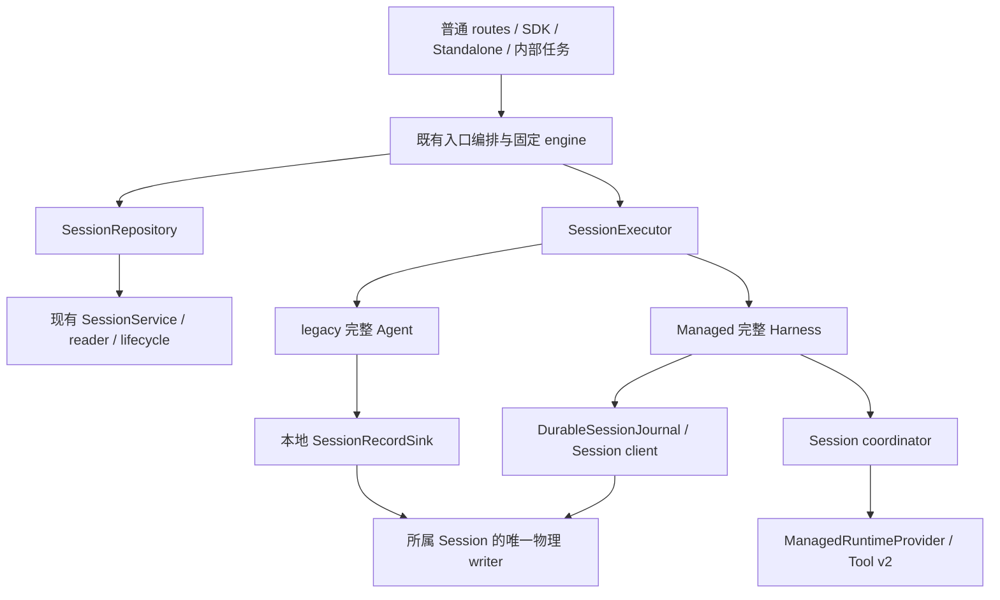

# Session 服务：兼容接口与实现串联

更新日期：2026-09-10。源码基线 `a8360814668b3dfdff72ad3d99cbcaf26dd009a9`；本轮补充设计，不表示接口已抽取或 Managed 已具备全部恢复能力。本文细化[三层全局架构](managed-agent-session-harness-runtime.md)第 4、10、12 节，逐方法证据见[兼容映射附录](managed-agent-session-method-map.md)，实施顺序以[首阶段计划](../plans/2026-09-09-managed-daemon-default.md)为准。

## 1. 结论与覆盖边界

现有服务能够作为新 Session 服务的第一版实现，但不能把所有方法统一转发到远端，或把现有成功返回解释为新的持久保证。采用接口组合：保留现有查询、维护、记录和执行语义；让 Managed 所需的持久提交与可恢复激活通过增强接口接入。旧接口的消费者逐个迁移，底层只保留一个权威日志和一个物理 writer。

本次逐项核对 Core SessionService、ChatRecordingService、SessionTranscriptReader、AcpSessionBridge 及其两个父接口、ManagedPromptService、ManagedRuntimeProvider、ManagedToolV2Client、文件历史 client、StandaloneSessionService。附录覆盖这些声明的全部公开方法和属性，不含构造器、private/protected 方法，也不宣称覆盖所有 Config、工具、网络路由和客户端 SDK 的公开 API。外部入口与生产者通过第 5 节的消费链验收；后续源码新增成员须同步映射。

“覆盖”分为四种结果：现有语义可复用、需要适配、Managed 增强待实现、保留在其他责任域。保留在其他域同样是明确的兼容结论，不能用空实现或一律返回 unsupported 假装已覆盖。

## 2. 接口与实现组合

| 逻辑接口/责任域              | 第一版实现与消费者                                                                                               | 保证与边界                                                                                                                                     |
| ---------------------------- | ---------------------------------------------------------------------------------------------------------------- | ---------------------------------------------------------------------------------------------------------------------------------------------- |
| `SessionRepository`          | `LocalSessionRepository` 包装现有 Core SessionService 和 reader；目录、历史与维护调用者经现有 lifecycle 编排接入 | 保留过滤、分页、父链、归档、批量部分失败及严格 owner 检查。进程内先用实际消费的类型子集，不复制整个类或提前建立 RPC                            |
| `SessionRecordSink`          | 现有 ChatRecordingService 作为本地适配；完整 Agent 的记录生产者先保持原签名                                      | `void`、排队、严格写与 flush 的语义分别保留。这是兼容写入口，不承诺所有记录已落盘；路径、lease、写屏障闭包不出进程                             |
| `DurableSessionJournal`      | 待实现的 Managed Session authority；底层复用普通 transcript、严格 writer 与版本化记录                            | 为输入、执行事实、检查点、审批决策、取消与终态提供显式可等待的条件提交。提交失败必须到达实际推进者；不能用 best-effort recorder 包装出虚假 ACK |
| `SessionExecutor`            | legacy Bridge 与完整 Managed host 的 Bridge 适配；按持久 engine 固定选择                                         | 延续已有会话执行方法和返回约定，保留完整 Agent 行为。它不是另一个简化模型循环，也不拥有第二份权威历史                                          |
| `RecoverableSessionExecutor` | 完整 Managed Harness 的增强实现，待实现                                                                          | 增加可验证的 checkpoint、activation 交接与 detach；未实现的引擎不能获得该能力。不能把 detach 映射成 close/dispose                              |
| workspace/process 控制       | 现有 workspace runtime、registry 和 Bridge 控制接口                                                              | MCP、Hooks、扩展、全局状态、preheat、shutdown、容量继续按原作用域执行；不能迁入按 sessionId 查找的通用服务                                     |
| Runtime 调用                 | 现有 ManagedRuntimeProvider、owned Tool v2 与文件历史 client                                                     | 工具实例、进程、工作目录、备份由 Runtime 持有；持久 Session 保存原 invocation 身份和结算事实。当前内存调用表不构成跨重启恢复证明               |
| 入口与调度编排               | 现有 StandaloneSessionService、普通 routes、ManagedPromptService 及内部任务入口                                  | 负责鉴权、用途、runtime 定位、目录 gate、准入和调度；组合上述接口。ManagedPromptService 保留控制层身份，不承接全部 Session 查询与记录职责      |

接口名是设计名称，不要求一一新增类、包或部署进程。Core 只接收领域类型和窄接口，不依赖 Express、ACP 或完整 Config；CLI/Bridge 承担协议适配。首批类型可用显式列举的 `Pick` 复用既有签名；不能 `Pick` 整个类后把路径、回调、Config 和 lease 直接序列化。

图中两条写入链按 Session 固定 owner 选择，不允许同一个 Session 同时由旧 host recorder 和新 authority 持有独立 writer。Managed 的 recorder 兼容入口必须归入 authority 的同一有序提交链，关键推进点显式等待提交。

## 3. 不能直接包装的语义接缝

### 3.1 Prompt：同步准入、持久受理与最终结果

现有 `sendPrompt` 不是 async 方法：部分非法 client、附件、预取消和队列容量错误同步抛出；缺失或正在关闭的 Session 可返回 rejected Promise。它返回最终 PromptResponse。`onPromptAdmitted` 目前同步表示取得 pending queue slot，Standalone 使用它释放目录 shared gate；普通 REST 在调用返回后发出 202，没有等待持久提交。

设计新增内部 admission ticket，包含可等待的 `accepted` 和 `completed` 两个结果；创建 ticket 的方法仍保持同步校验和槽位预留。旧 `sendPrompt` 适配继续返回 `completed`，保留同步错误时机；旧 `onPromptAdmitted` 保留队列准入含义，不原地改成落盘回调。Managed 非阻塞入口另行等待 `accepted`：完整规范化输入与 activation intent 在同一逻辑事务提交后，才能发出持久受理回执。legacy ticket 的 accepted 仅表示原队列接收，不对外宣称耐久性。

`accepted` 与 `completed` 的 rejection 都必须被消费。提交失败释放本次预留且不得启动模型；提交成功后即使 HTTP 断开，也由 authority 恢复唤醒，不能按 disconnected-create 清理删除已受理输入。重复 promptId 与相同规范化内容返回原受理/执行状态；不同内容冲突；无稳定 ID 的旧请求不自动获得跨请求幂等保证。gate 的释放只结束目录保护窗口，不赋予新副作用资格：在保护内捕获的 owner/generation 仍须在提交和实际派发前复核。Standalone 初始 prompt、REST、ACP/SDK、cron/Goal/内部续轮都必须进入同一个适配接缝，不能只改 REST 等待回执而留下内部直发。

### 3.2 审批、取消和队列修改

现有 permission 方法同步返回 boolean；true 可表示共识模式的中间投票已登记，不代表审批已最终通过，更不代表决策已落盘。保留旧布尔协议与未知/重复请求行为，在最后投票完成到工具派发之间增加可等待的 authority 决策提交。审批携带原调用、输入/权限版本和 activation；提交失败不能执行工具。若入口需要声明持久确认，使用内部异步回执再映射既有响应，不能把返回 boolean 的方法直接改成 Promise 而遗漏调用者。

现有 Bridge deadline 会发布超时终态并释放 FIFO，允许下一 prompt 在旧 ACP 调用结束前派发；legacy 保留这一行为。Managed 将调用方期限到达与原执行的物理结算分开：可以结束等待并显示超时/未决，但保留原 invocation、资源与回执通道；后续 activation 只有建立可验证的派发屏障并满足原调用安全条件，或等原调用结算后才能推进。释放 FIFO 本身不授予执行资格，这是明确的 Managed 增强差异。

同理，`enqueueMidTurnMessage` 的 accepted 只说明当前队列接收；移除、取消请求的确认与原工具物理退出是两件事。Managed 将排队输入及其撤销作为幂等命令提交，重启按事实重建队列；执行终态只能在原调用完成或取消收敛后发布；调用方 deadline 的失败回执不能把仍未决的执行伪装成已结算。背景通知被父 Session 接收不等于父 Session 已消费；子任务完成回执不能被误当作父 turn 完成。

### 3.3 记录、终态和游标

当前不少 record 方法是 void/best-effort，`recordTurnResult` 明确允许 inactive/failed writer 跳过；`getTranscriptCursor` 也可能指向排队中的记录。不能把这些结果作为 durable terminal 或已提交 sequence。旧生产者通过 SessionRecordSink 保留既有行为；Managed 关键输入、正式内容、工具回执、终态、checkpoint 的生产者必须等待新的提交命令。普通预览 delta 可以继续临时流式传送，但不能推动可恢复状态。

cursor 分开编码并由适配器转换：Bridge 的 eventId/eventEpoch、实验事件整数 cursor、transcript record UUID、branch checkpoint 的活动记录数、authority 的已提交 sequence 都有独立含义。历史分页保留原 parent/压缩/工具关系和 live overlay；重连以持久日志补齐后继续订阅，不能把 live buffer 的存在当作历史持久化证明。

当前 Bridge 历史分页走 workspace controlSlot，可能为传输延迟启动 control child，但不 attach 目标 Session、不建立其活事件总线。legacy 适配保留这一传输行为；Managed 无 Harness 读取的增强入口直接读取 authority/Repository，不能把“不恢复目标会话”误记成旧 Bridge 已经完全不需要子进程。

### 3.4 本地维护、writer 和生命周期

Core SessionService 的路径、文件身份、writer/maintenance lease 与 lifecycle 回调只留在 authority 所属进程。archive/remove/rename 的现有编排继续持有维护资格、storage/generation 检查和目录 gate；类方法本身不是完整的准入服务。损坏但可维护的 transcript 与可执行历史分开处理；保留批量结果中的已完成、未找到、冲突和错误项，不能统一折叠为 success。

Recorder 的 beginClose 同步封闭写准入；handoff flush 失败会保留锁并进入 integrity_failed，普通 close 的失败和释放顺序不同。适配器保留差异，不把失败统一处理为释放 writer 后重试。新 authority 接管前先封闭并排空旧 writer，确认交接后再公布新激活；原 host 的 Config/recorder 不得继续写。

`detachClient` 是客户端引用管理，最后一个空闲引用离开可能关闭 Session；它不是 Harness detach。当前完整 host dispose 会关闭 Managed Tool Session；新 recoverable detach 必须独立撤销 activation 和新调用派发权，只停止该 Harness，保留 coordinator、Runtime binding 与已准入的原调用。Session close/drain 才按原原因取消、结算、释放。旧 workspace generation 即使已退出 active registry，仍需限权访问原调用的 status/cancel/history/release；不能因此回退 primary runtime。

### 3.5 不支持、兼容回退与错误映射

| 情况                                             | 兼容处理                                                                                                                                                                                        |
| ------------------------------------------------ | ----------------------------------------------------------------------------------------------------------------------------------------------------------------------------------------------- |
| `null`、`undefined`、false、空列表与批量部分成功 | 逐方法保留；领域端需要更细分类时仅在内部转换，出口还原原协议，严格控制/恢复接口不把 I/O 错误伪装成 not found；旧展示查询中刻意的 false/undefined/0 或保守 true 降级仍逐方法保留，不用于严格准入 |
| 原同步 throw 与 Promise rejection                | 保留旧调用者可观察的时机；新异步增强使用明确边界，不用全接口 async 化替代迁移                                                                                                                   |
| Managed fork/rewind 或恢复尚无证明               | 保留当前限制及准确失败。现有 fork 的 legacy 检查不能通过换接口移除；普通 read/export 仍按历史适配处理                                                                                           |
| 新 Session 用途/依赖延期或不确定                 | 创建时选择 legacy；已有 Session 先读持久 engine。Managed 执行或初始化失败不切到 legacy                                                                                                          |
| 旧数据、实验四日志与新版本记录                   | legacy 普通、完整 Managed 普通与实验格式分别识别；严格只读扫描，不用可能截断 torn tail 的 open 充当读取。转换需单独证明，不能只取展示文本恢复模型                                               |
| 执行能力与字段存在性                             | 方法存在、optional fileHistory、内存状态或零工具数均不证明可恢复。只有实现并通过对应验收的能力才能用于选择；不用空实现扩大默认范围                                                              |

## 4. 条件提交与原实现如何串联

Managed authority 是唯一物理 writer；既有记录内容和 reader 保持可用，新增记录采用版本化 schema。每条命令带 Session/workspace 身份、稳定命令 ID；执行命令另带 activation fence 与 expectedSequence。成功回执包含已提交位置与原操作标识，相同 ID 的重试返回原回执，不重复写业务事实。

需要多条物理记录表达一次逻辑提交时，读者只暴露带完整提交标记且校验通过的事务；未完成尾部不能唤醒 Harness。具体 subtype、批次边界和旧 reader 拒绝策略采用[存储规范](managed-agent-session-storage.md)，R2.S1 按规范实现并测试。单机文件后端保证其定义的 flush/崩溃恢复范围，不凭接口名宣称跨主机事务或断电耐久性；storage durability 等级须写入实现验收，不能把 await write 自动等同 fsync。

执行检查点包含恢复所需完整上下文与引用，绑定已提交 sequence；仅保存展示文本、最后 UUID 或摘要不够。Runtime 调用结果先按原 invocation 落入 Session，再推动模型；新 activation 发起新 prepare/execute 前验证派发资格，旧代只能查询、取消和结算已准入调用。没有可靠“未执行”证明时保持 `recovery_ambiguous`，不通过重试 execute 消除未知。

## 5. 消费者接入与回归链

以下是迁移工作单，不宣称已完成源码替换。附录每个方法在本表找到所属消费链；施工时对实际改动的签名再搜索所有读写点，更新调用者和测试后才能移除旧入口。

| 消费链                                     | 当前接点                                                                                                               | 实施要求                                                                                                          |
| ------------------------------------------ | ---------------------------------------------------------------------------------------------------------------------- | ----------------------------------------------------------------------------------------------------------------- |
| 普通 HTTP / Web Shell / SDK                | CLI `serve/routes/session.ts`、ACP bridge 协议和普通会话事件/目录接口                                                  | DTO、状态码、同步准入、重连与 transcript 形状保持；Managed 202 等待新的持久 ACK；读历史不要求启动 host            |
| Standalone 与目录维护                      | CLI `serve/conversations/standalone-session-service.ts`、workspace runtime SessionService factory                      | 原 storage/归属证据、目录 gate、generation、归档与断连清理不绕过；已持久受理不能被创建失败清理删除                |
| 完整 ACP Agent                             | CLI `acp-integration/acpAgent.ts`、core `core/client.ts`、`core/llm-chat.ts`、Config 的 recorder/sessionService 注入点 | 先接本地兼容接口，再将 Managed 关键推进点改成 await authority；保持压缩、媒体、用量、工具关系、父子会话及错误语义 |
| 标题、Goal、文件历史、artifact、通知与统计 | 现有 recorder 生产者和 SessionRestoreProjection 消费者                                                                 | 正式事实归唯一写入口；侧表/live cache 是投影；子 Runtime 备份仍绑定父 Session 的原路径与 owner                    |
| 定时、Goal/cron、内部续轮与 Channels       | 现有 Bridge prompt/权限/队列入口及 Standalone 内部任务接口                                                             | 纳入调用者清单和兼容回归；延期迁移仍走固定 legacy。不能因为内部调用已有 sendPrompt 就宣称新的持久接入已完成       |
| 实验 Managed API                           | ManagedPromptService、Gateway binding/store/events                                                                     | 先保留既有准入、去重和格式；新增 Session authority 适配另行实现，实验页面通过不替代普通入口验证                   |
| Runtime / workspace / daemon               | ManagedRuntimeProvider、owned v2/fileHistory、workspace registry、process registry                                     | 会话工具与 workspace/process 控制分域；跨 workspace、旧 generation、draining 只按声明的权限操作原资源             |

## 6. 接口一致性与增强验收

每个旧接口适配先以原实现为基准，对同一隔离夹具比较返回形状、错误类别与时机、持久副作用和资源清理；不能只比较一段回复文本。下表同时覆盖旧契约一致性和 Managed 增强；持久 ACK、无 host 查询及 activation 屏障是后者的新保证，不能回写成 legacy 已有语义。下表是实施验收设计，本轮未运行产品验收。附录可给出本表编号或更具体场景。

| 编号              | 契约与必须观察的结果                                                                                                                                                                                     |
| ----------------- | -------------------------------------------------------------------------------------------------------------------------------------------------------------------------------------------------------- |
| T01 历史读取      | active/archived/缺失/损坏/外项目/父链/压缩夹具；列表、标题、分页和恢复结果保持，Managed authority 纯读取不启动 host；legacy Bridge 允许原 control child 传输但不激活目标 Session，读取不修复或改写源文件 |
| T02 维护          | archive/unarchive/delete/rename/fork 的冲突、部分失败、活 writer、storage 替换和跨 workspace；目录、sidecar、附件/备份处理与原契约一致，Managed 未支持的 fork 不放行                                     |
| T03 记录与 writer | void/best-effort、strict write、flush、写屏障、handoff/普通 close 分别注入故障；不得双 writer，排队 cursor 不作为提交成功                                                                                |
| T04 准入          | 同步非法 client/附件/预取消/满队列与异步缺失会话；旧返回时机保持，Managed 提交失败不发持久 202、不跑模型，已提交断连不删除输入                                                                           |
| T05 幂等与队列    | 同 ID 同内容、同 ID 异内容、重启、队列撤销、mid-turn/后台通知和过期输入；唯一受理、唯一激活，无漏唤醒或隐式重跑                                                                                          |
| T06 事件与恢复    | 各命名空间 cursor、断流/丢 ACK/重连、压缩与工具关系、checkpoint 超前和坏版本；正式终态仅在提交后可见，可无 host 读历史                                                                                   |
| T07 审批与取消    | 中间投票/最终决策/重复与迟到请求/输入修改/写失败；未持久最终授权不派发，cancel 接收不冒充原工具退出，取消后无迟到新写入                                                                                  |
| T08 引擎与配置    | legacy/Managed 普通历史/实验日志、旧格式、未知依赖、动态配置；固定 engine，错误不降级，未知不能变兼容，真实 cwd/trust/环境保持                                                                           |
| T09 生命周期      | detach client、detach Harness、cancel、close、shutdown 分别验证；新 host 接管不取消原调用，writer 交接失败不抢占，关闭不丢未决回执；超时后下一 prompt 与旧调用迟到时，新 activation 不能绕过安全屏障     |
| T10 作用域与资源  | primary/secondary/replacement/直接嵌入、workspace draining/remove/撤信任；新调用拒绝而旧调用能限权收敛，跨工作区不回退，容量统计不双计                                                                   |
| T11 Runtime       | invocation 身份、输入版本、父子 history、物理执行/取消、ACK 丢失、worker 丢失与旧 activation；无重复副作用，未知执行保持阻塞                                                                             |
| T12 入口一致性    | 普通 Web Shell/REST/ACP/SDK 与初始/后续/内部 prompt；逐入口记录实际引擎、持久受理、工具和 final，延期入口回归 legacy，不用实验入口代替普通入口                                                           |

## 7. 实施切片与全量专项

R2.S1 先按附录建立本地接口和适配的一致性基准，保持旧行为，再实现单一 authority 和可等待 ACK，所有被增强的关键生产者/消费者成对修改。[私有协议](managed-agent-control-protocol.md)已补命令字段、幂等、事务可见性、同步 ACK 和 Runtime 安装/接管；[Harness 专项](managed-agent-harness.md)补完整状态及内部方法接缝；[coordinator 专项](managed-agent-coordinator.md)补 activation authority、调度、装配与 drain。[存储规范](managed-agent-session-storage.md)已固定 subtype/schema/限额，[全量专项](managed-agent-full-design.md)补齐其他领域的接口和恢复决定；编码时实现 validator 与实际接线并验证平台同步和崩溃边界，不把设计当作检查通过。

R2.S2 接入完整 Harness，迁移正式记录和恢复上下文，验证普通会话首轮/后续/失败继续与历史兼容。R2.S3 实现持久等待、原调用查询结算、旧 activation 派发屏障、可恢复 detach 和限权 drain。之后才进入有效配置检查、四处普通 factory 和有限默认启用；方法已映射不代表功能已实现或能力可默认启用。

完成每片后更新附录的适配状态、实际消费者和对应验收证据。第一版保留最小本地组合；远端 Runtime 和跨主机 lease 按[恢复与运行专项](managed-agent-recovery-operations.md)的已定契约实施验收。公网 Session 服务或 SaaS 部署属于本轮边界外，普通公开 API 继续保持兼容。
