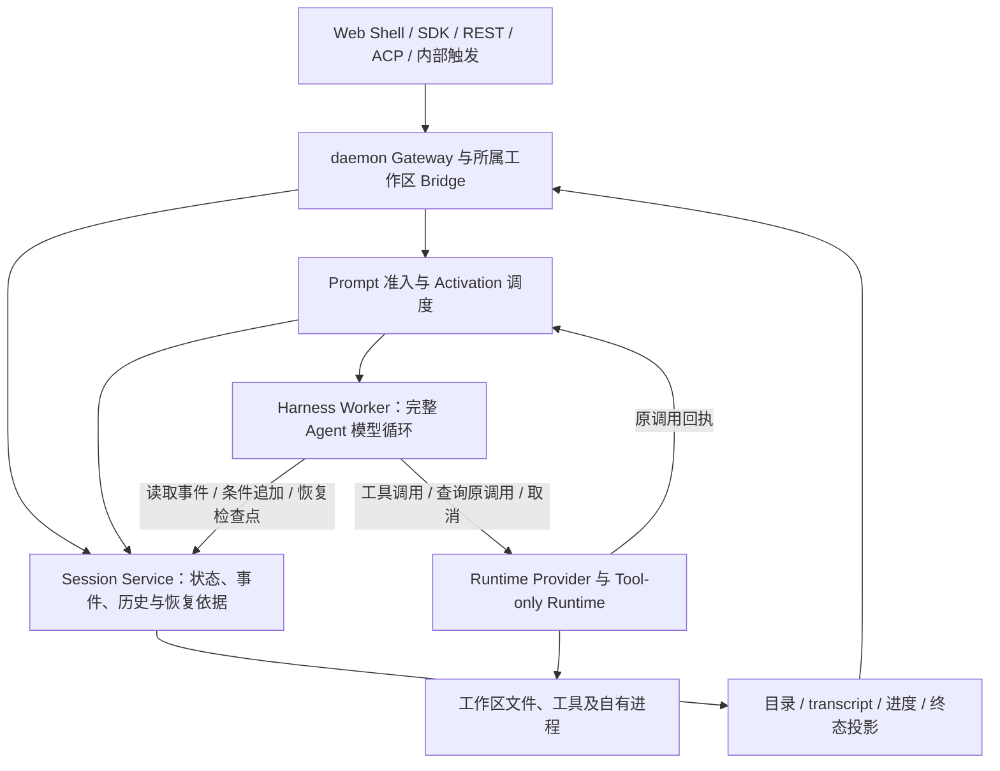
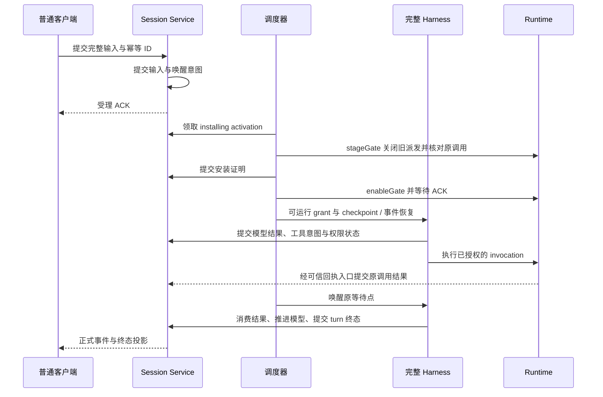

# Managed Agent 全局架构：Session、Harness 与 Runtime

## 决策、范围与当前状态

2026-09-10 用户明确要求按 Claude Managed Agents 拆分，并先完成全局方案设计。本文件定义目标架构；其中新增接口、统一事件存储、Harness 恢复与实施阶段均为待实现设计。当前生产源码基线为 `a836081466`，前一版文档基线为 `4dc4a90dcc`；本次不改生产代码、不构建启动、不触碰 4170 预览或用户数据。

目标是在保持普通 daemon 契约和现有 Agent 能力的前提下，将会话状态、模型执行和工具环境分成三个独立职责。Session 可以在没有活 Harness 或 Runtime 时被查询；Harness 可以从持久状态重建；Runtime 的退出不会删除会话。默认执行替换继续是产品目标，独立 Managed 页面作为实验和诊断入口保留。

Anthropic 公开架构将 Session 定义为持久追加事件日志，由 Harness 读取历史、组织模型上下文并派发工具，Sandbox 执行本地工作；三者通过接口独立替换。本文沿用这些职责边界。下文的文件布局、租约、兼容策略和阶段是 Qwen Code 的设计，不代表已知的 Claude 内部实现。[官方架构说明](https://www.anthropic.com/engineering/managed-agents)

本文件决定全局分层；[默认替换总方案](managed-agent-daemon-default.md)维护 C01～C18 的产品范围和证据；[首阶段计划](../plans/2026-09-09-managed-daemon-default.md)维护执行顺序；[执行引擎设计](managed-session-execution-engine.md)维护固定 owner 与兼容准入。先完成本轮设计，后续施工先建立 Session 权威存储与完整 Harness 接缝，再接四处普通 factory；不再将只接 factory 视作架构拆分完成。

专项契约现已补齐：[Session 兼容与方法映射](managed-agent-session-compatibility.md)、[完整 Harness 接口和检查点](managed-agent-harness.md)、[私有消息与 Runtime 接管协议](managed-agent-control-protocol.md)、[coordinator 调度和四处装配](managed-agent-coordinator.md)。这些文档给出可实施的责任与字段约束，尚不代表接口已经编码或故障验收通过。

## 1. 全局拓扑与职责

Gateway/Bridge 和调度器是接入与控制组件，不成为另一套 Agent 循环。网络协议不决定业务归属：普通客户端仍使用现有 Session/Prompt/ACP/REST；模型只由 Harness 推进。

| 层              | 权威责任                                                                                              | 不承担的责任                                                                       |
| --------------- | ----------------------------------------------------------------------------------------------------- | ---------------------------------------------------------------------------------- |
| Session Service | 会话身份、固定引擎、定义绑定、完整事件顺序、持久等待/终态、恢复检查点与查询；验证写入者资格           | 不调用模型，不运行工作区工具，不依赖活 Agent 对象才能读取历史                      |
| Harness         | 复用完整 Agent 的提示词、模型循环、压缩、权限决策、工具编排与停止逻辑；持有一次 activation 的执行资格 | 不成为唯一历史持有者，不直接写 Session 存储文件，不以 Runtime 生命周期定义会话生命 |
| Runtime         | 绑定工作区与执行作用域，执行获准工具，维护实际调用回执、文件备份和自有进程，支持取消与可验证释放      | 不持有模型凭据，不推进模型，不决定用户会话终态，不直接改 Session 权威日志          |

Session Service 中的“服务”首先是接口与生命周期边界。首个本地实现由 daemon 承载持久存储，完整 ACP host 作为 Harness 通过受控 Session client 访问；当前 Managed factory 使用 in-memory ACP host，Tool-only worker 使用已有独立进程。逻辑 handle 与可共享的物理 host 分别计量。即使开发时使用同进程适配器，也必须能独立销毁并重建 Harness，且存储不被它释放。后续可独立部署 Session 服务和 Harness 池；本轮不引入 Kubernetes、消息中间件或分布式数据库作为前置依赖。

## 2. 当前组件如何归位

| 当前组件                                                  | 已有能力 / 缺口                                                                                               | 目标归属与处理                                                                                                                 |
| --------------------------------------------------------- | ------------------------------------------------------------------------------------------------------------- | ------------------------------------------------------------------------------------------------------------------------------ |
| `ManagedPromptService`                                    | 实验 Gateway 的完整输入准入、去重、绑定、调度和取消；只接受 bootstrap/continuation，不能等同完整 Session 服务 | 留在控制层，组合 Session 的提交接口和调度器；逐步移出独立的会话状态、历史和终态事实                                            |
| `FileManagedSessionInbox`                                 | 持久输入、processing fence、终态；不是完整模型与工具事件日志                                                  | 复用校验、幂等和持久化语义；输入与状态进入统一 Session 写入口，旧格式仅通过明确适配器读取                                      |
| `FileManagedActivationStore` / `EmbeddedHarnessScheduler` | 激活队列、租约、续租和有界并发                                                                                | 普通 Session authority 提交 activation 与唤醒事实，调度器通过窄适配读取；原 File store 只保留实验后端，不成为第二个 epoch 权威 |
| `ManagedGatewaySessionEvents`                             | 独立持久展示事件和会话目录                                                                                    | 变为 Session 事件的可重建投影；展示缓存不负责判定是否执行或恢复                                                                |
| `FileManagedGatewayConversationStore`                     | 实验模型循环在成功轮次提交模型历史                                                                            | 迁移为 Harness 检查点/上下文投影，不另存一份可以覆盖 Session 事实的历史                                                        |
| `ResidentManagedGatewayModelRunner`                       | 实验受限模型循环，仍有其专用预算和续轮条件                                                                    | 保留实验兼容；默认 Harness 复用完整 ACP Agent，不将这套精简循环升级成第二套默认 Agent                                          |
| 完整 `QwenAgent` / `Session` / recorder                   | 模型、工具调度、队列、录制、上下文和部分生命周期集中在 host                                                   | 保留原 Agent 行为，抽出存储读写和持久等待接缝；用 Session client 替换直接文件写入，避免一次性重写整个类                        |
| 普通 turn ledger / `turn_result`                          | Bridge live overlay、terminal sidecar 和部分 transcript 终态目前是 best-effort                                | 新 Managed 提交定义权威终态，旧 ledger 成为兼容投影；不能将现有完成回执当作强持久保证                                          |
| core `SessionService` / transcript reader / writer lease  | 既有目录、历史解析、归档和严格 owner 证明                                                                     | 复用历史适配和物理 writer 保护，避免另造同名平行服务；新职责通过清晰接口接入                                                   |
| `ManagedRuntimeProvider` / owned v2 / tool session        | 工具执行、子作用域、备份、取消与释放已有局部验证                                                              | 保留已验证协议；补跨 Harness 恢复时原调用查询与回执交付，不把进程内 Map 当跨重启证明                                           |

现有普通引擎和实验 Gateway 两条路径必须分别调查。实验 Inbox/展示/对话文件和普通 ACP transcript 不能因为含有同一类消息就被直接合并，更不能据此声称当前已做到单一 Session 权威。

## 3. 身份、定义与所有权

会话身份使用所属 tenant、workspace 和逻辑 sessionId；沿用现有命名和授权来源，不从未验证的客户端字段取得权限。Runtime Session ID、进程 PID、worker ID 和端口都是执行绑定，不成为新的用户会话。存储定位复用持久 workspace/session 根，与 listener 端口、随机启动 ID 解耦；实验按监听实例哈希的旧路径通过显式 location 适配保留，不能因换端口创建一份空历史。

| 对象                  | 持久内容与边界                                                                                                            |
| --------------------- | ------------------------------------------------------------------------------------------------------------------------- |
| Session               | 身份、不可变 executionEngine、存储 schema 版本、创建来源与父子血缘、定义版本引用、已接受的配置变更、事件序列和投影状态    |
| AgentDefinition       | 有效模型、系统指令和能力/权限配置的可核对版本；复用真实 Config 解析结果，存非敏感配置或可解析引用，密钥仍由所属凭据源提供 |
| EnvironmentDefinition | 可信工作区定位、文件/工具能力、运行环境约束与资源策略；实际 Runtime lease 独立记录，不将临时进程写入不可变定义            |
| Turn / activation     | 稳定 prompt/message ID、来源、截止时间、处理游标、等待原因和终态；一次 turn 可以有多次恢复 activation                     |
| Invocation            | turn、scope、toolCall/invocation ID、输入摘要、准入与实际执行回执、Runtime lease 绑定；同 ID 不允许换输入                 |

初期定义可由现有设置生成内部版本引用，不要求用户先创建新的 Agent/Environment 资源，也不新增用户选择引擎的 UI。引用必须能恢复到原非敏感配置或明确拒绝；只有 digest 而无可解析内容不构成恢复能力。配置变更写明新 revision、适用轮次及兼容结果；密钥不写入事件、checkpoint 或诊断。

三种 owner 分开：

| 所有权                    | 谁持有             | 它证明什么                                                                                 |
| ------------------------- | ------------------ | ------------------------------------------------------------------------------------------ |
| 物理 Session writer lease | Session 存储 owner | 唯一进程有权追加该日志，保留现有严格文件身份、封存和交接校验                               |
| activation lease / epoch  | 当次 Harness       | 当前谁可以推进模型并提交执行事件；丢失后必须停止模型/新工具派发，旧 epoch 的状态提交被拒绝 |
| Runtime lease / epoch     | 所属工具环境绑定   | 哪个环境可以接受该作用域的工具调用；不自动赋予 Session 写权限或模型执行权                  |

Session Service 在追加时同时验证存储 writer、命令授权和所需 activation fence。客户端输入/取消与 Harness 执行事件采用不同命令权限：用户发送消息不要求持有 Harness lease，Harness 也不能伪造用户审批。替换 Harness 必须先隔离旧执行权；租约过期不是旧工具已停止的证明，原 invocation 仍由原执行账本约束。

工具的新派发也受 activation 资格约束，不能只在 Session append 时检查 epoch。可信 dispatcher/执行端在 beginTurn、history bind/checkpoint、prepare/build、confirm、preflight/Hook、execute 等实际副作用准入前校验 Session、当前 activation、Runtime lease、invocation 和输入/权限版本；相同 Runtime 仍存活时也必须拒绝旧 Harness 的迟到新调用。交接采用 installing → stageGate → authority 安装提交 → enableGate ACK，再把可运行 grant 交给新 Harness；无法确认屏障时保持阻塞，不能依赖旧 host 自觉停发。已准入的原调用仍允许 status/cancel/回执结算，重复 execute 只能查询原执行结果，不能重启副作用。当前 owned v2 不自动提供上述完整 activation 派发屏障，具体接线需在 R2.S1～R2.S3 实现并验收。

## 4. Session 的最小逻辑接口

以下是语义契约，不声明已有同名 API；字段、私有方法与版本见[协议专项](managed-agent-control-protocol.md)，实现前将其展开为可编译的 DTO/validator 并核对实际限额。保持 Core 不依赖 ACP/Express 或完整 Config，传输适配留在 CLI/Bridge。

| 接口                              | 输入和保证                                                                                                                                                                     |
| --------------------------------- | ------------------------------------------------------------------------------------------------------------------------------------------------------------------------------ |
| create / get / list               | create 校验用途、工作区和定义，在副作用前持久化固定 engine；创建空会话不触发模型；get/list 不要求有活 host                                                                     |
| submitInput                       | 稳定幂等 ID、完整规范化内容、来源与期限；内容及唤醒意图持久化后返回受理回执，同 ID 不同内容报冲突                                                                              |
| appendExecution                   | 身份、activation fence、expectedSequence、稳定 eventId 和事件；按私有协议条件追加并完成文件同步后回 ACK，重复调用返回原提交，序列冲突要求重读                                  |
| readEvents / subscribe            | 有界 cursor 分页/增量订阅，返回已提交事件；重连先补历史再追新事件，消费端按 eventId/sequence 去重；cursor 有命名空间/版本，普通 Bridge eventEpoch 与实验整数 cursor 不直接互换 |
| readCheckpoint / commitCheckpoint | checkpoint 绑定已提交 sequence、schema 和状态摘要；不能越过未持久化事件或代替原始事实，失败可从上个已验证检查点重建                                                            |
| requestCancel / resolveAction     | 定位原 turn/invocation/approval，先持久化请求，再唤醒其 owner；审批绑定实际输入版本，重复或迟到决策不得授权另一调用                                                            |
| close / archive / export          | close 封闭准入并等待原调用收敛；archive 为目录策略，活会话须先完成关闭；export/read 可复用历史适配，删除遵守既有数据与产物生命周期                                             |

不增加无消费者的公共 API。列表、归档和历史适配复用现有 SessionService；新增接口先服务实际输入、完整 host 的读写/恢复和普通客户端投影。其余管理方法随现有调用者逐项迁移。

逐方法接缝已补充到[兼容接口与实现串联](managed-agent-session-compatibility.md)和[完整方法映射](managed-agent-session-method-map.md)：区分旧接口行为与 Managed 持久增强，明确同步准入、审批投票、best-effort 记录、维护资格和 Harness detach 的适配方式。方法已归位不表示新接口已实现。

## 5. 事件、检查点与存储

每个 Session 有一个权威追加流。最小 envelope 包含版本、session 身份、单调 sequence、eventId、时间、来源和类型；执行事件另带 turn/scope/invocation 与 fence。类型覆盖输入受理、模型请求边界与正式内容、工具意图/审批/回执、持久等待、配置变更、取消请求、turn 终态和关闭。复用既有结构化内容块，不将媒体、权限、stopReason 或用量压成纯文本。

原始事实、模型上下文和展示投影分开。压缩保留原事件，追加压缩结果和覆盖范围；模型上下文由完整 Harness 的原有算法从事件/检查点组装。流式 delta 可以作为临时预览，正式消息和终态持久化后才成为可重放记录；预览中断不能伪造成完整模型结果。工具回执先持久化，再被后续模型步骤消费。

首期选定现有普通 transcript 作为权威载体，复用 JSONL、ChatRecord 与严格 writer，通过版本化记录增加准入、执行和恢复事实；同一逻辑事实只经一个事务入口提交。保留 parentUuid、压缩边界、工具关系、Goal、artifact、文件历史和通知，reader 继续提供完整 SessionRestoreProjection。精确记录 subtype/schema 和序列兼容在 R2.S1 冻结，不默认增加独立 owner 文件或多份互相覆盖的 transcript；若消费者调查证明需要新容器，先修订迁移设计再施工。大媒体、文件备份和大工具输出使用持久引用及哈希，不能引用将随 Runtime 回收删除的临时路径。

输入事件和待调度意图在同一提交边界持久化。Activation 候选队列允许单独缓存，但可根据权威输入与等待记录对账；claim/renew/release 仍只能由 Session authority 提交，不使用实验 store 的第二套 epoch；队列追加失败或丢 ACK 时重试原 ID，不重复追加输入。展示缓存、目录索引和纯模型上下文投影带来源 sequence，可由完整事实重建；包含执行阶段、稳定调用映射和未决引用的 Harness checkpoint 是恢复依据，必须持久保留到替代 checkpoint 及所需事实完整提交；投影失败不得回滚已提交的成功或发出第二次工具调用。物理多文件更新不声称具有跨文件原子性。

输入受理与进入模型上下文是同一 message ID 的不同阶段，投影不能生成两个用户消息。当前 core client、llm-chat、工具调度器、Session 终态、模型设置、Goal/记忆及文件历史的 recorder 写入都须迁移到受控 sink；只修改 `ManagedPromptService` 或 final callback 不足以建立统一权威。普通终态 sidecar/`turn_result` 的 best-effort 行为需要显式迁移，不能静默改变 legacy 原失败语义。

磁盘写失败后停止新的执行推进，保留现有不确定回执；不能一边拒绝持久化一边继续模型。坏的已提交记录和未知版本使执行恢复失败，历史展示保留原容错策略但不作为 owner 证明。首期设置消息/页/队列大小上限并记录磁盘增长，保留现有权限和用户删除语义；自动保留期、压缩回收与远端存储另设数据生命周期设计。

## 6. 一轮执行与等待

内部区分 Session、turn、activation 和 Runtime 状态：Session 可空闲/有工作/等待/关闭；turn 可排队/执行/等待/终结；activation 记录领取与释放；Runtime 独立记录准备、可用、排空和退出。具体对外枚举沿用普通协议的适配，不能因 UI 显示 idle 而推断 turn 完成，也不能因没有活 worker 而认定 Session 不存在。

完整目标是在工具、审批、定时唤醒等持久等待点释放 activation 槽位，由可信结果再次唤醒；等待记录必须包含 continuation 所需状态和调用关联。过渡期允许完整 host 的原 Promise 等待继续占槽，需如实计数，不能宣称已实现可迁移等待。模型流仍运行时保留执行槽位；上下文准备、工具等待与 Runtime 容量分别观测。

单 Session 继续保持一个推进者，普通已存在的多 Prompt 队列语义要保留。实验服务“一个未结束 turn 就拒绝新输入”及“必须有成功 bootstrap 才能继续”不能传播到普通客户端。新增输入、取消、工具结果和审批之间的顺序由 Session 命令规则决定，不靠进程 Map 或浏览器连接顺序。

## 7. 取消、故障恢复与副作用

恢复依据是已提交事件及实际 invocation 回执，不是“曾经请求过执行”。客户端可以重试提交，调度器可以重复唤醒，工具副作用不因此获得自动重放许可。

| 故障点                                 | 恢复行为与完成证明                                                                                                                      |
| -------------------------------------- | --------------------------------------------------------------------------------------------------------------------------------------- |
| 输入持久化前失败                       | 没有成功受理；客户端使用原幂等 ID 重试，不能伪造最终回复                                                                                |
| 输入已提交、入队/ACK 丢失              | 按原 ID 查询并对账激活，不重复产生输入或新 turn                                                                                         |
| Harness 在无工具副作用的模型请求中退出 | 隔离旧 epoch，从已验证边界恢复；必要的新模型请求作为新 attempt 记录，预览和未提交用量不能冒充精确续流或只计费一次                       |
| 工具意图已提交、发送结果不明           | 查询原 invocation；只有执行端有明确未开始且仍可安全准入的证明才允许派发；无法证明时保持不确定并阻止相关推进                             |
| 工具已完成、返回/持久化 ACK 丢失       | 查询并幂等接受原回执，随后恢复模型，不再次调用工具；回执已持久化但 checkpoint 未更新也按同一消费游标处理                                |
| Runtime 丢失且存在未决写调用           | 保留原 Runtime/invocation 关联与不确定状态；不通过启动新 Runtime 重演写入，明确暴露恢复阻塞                                             |
| cancel 与完成竞争                      | 先记录取消请求，再取消原调用；实际成功写入保留成功事实，取消不能把它改记为未执行。turn 的取消/完成由唯一序列化终态提交决定              |
| 旧 Harness 或旧 Runtime 迟到           | 旧 Harness 状态写入被 fence 拒绝；旧 Runtime 的原调用回执由可信入口核对输入、身份与取消状态后幂等接受，只能结算原调用，不能推进新 epoch |
| Session 存储不可用                     | 停止接纳和执行推进；仍尝试隔离/取消自有执行，待恢复核对实际结果；没有落盘不得报已完成                                                   |

取消 ACK 表示受理，结束需要原 invocation 结算或所属进程树退出。Session 终态、物理清理和 Runtime 释放分别记录；清理失败不释放占用或 writer 并继续声称可安全复用。`dispose()` 需要可等待的 drain 契约，不能只发送 AbortSignal 就销毁 provider。

现有实验 `processing → recovery_ambiguous` 是保守保护，未接入可恢复事件/执行账本前保留。全局目标不是直接去掉这条拒绝，而是用真实断点与回执证明逐类替换它。未决副作用继续明确阻塞，不承诺任意崩溃后无条件自动续跑。

## 8. 配置、权限与扩展能力归属

| 能力                 | Session / Harness / Runtime 分工                                                                                                          |
| -------------------- | ----------------------------------------------------------------------------------------------------------------------------------------- |
| 工作区与信任         | Gateway 解析所属 workspace/generation；Session 固定身份并记录变更；Harness/Runtime 使用同源有效配置，撤信任立即封闭新工作并排空原调用     |
| 模型与凭据           | Harness 使用所属非敏感模型配置和受控凭据源；Runtime 不接收模型密钥；Session 只存可恢复的配置内容/引用和诊断摘要                           |
| 工具权限与提问       | Harness 复用原权限逻辑，Session 持久化审批与真实输入版本；Runtime 校验实际 invocation 授权和路径约束，不接受来自展示事件的执行指令        |
| Skills、指令与初始化 | 内容/版本进入 Harness 上下文，依赖本地文件/脚本的工作在获准环境执行；禁止 host 初始化悄悄进行未迁移的本地副作用                           |
| MCP 与 Hooks         | 后续按模型侧策略和本地执行分别归位，凭据走受控边界；发现、动态变更、回执和取消有 owner，不把全部 MCP/Hook 默认丢到 Runtime                |
| 媒体与产物           | Session 保存结构化引用、哈希和归属；Harness 处理模型输入及转写；Runtime 读取/生成实际内容；客户端经原授权边界访问                         |
| 子 Agent、后台和记忆 | 复用现有 root/child/scope 与父接受结果契约；每个作用域有执行身份和恢复游标，后台工作不能只存在于父 host 内存；用户会话与工具 Session 分开 |

全局设计包含 MCP、Hooks、Channels、Skills、定时与后台能力的位置；首阶段依然按已有约定延期完整迁移，相关用途/依赖保留 legacy。设置、extension、runtime/client 动态注入的兼容检查仍是默认选择前置；只读空扩展证明不等于已迁移全部初始化。

## 9. 普通入口、部署和资源生命周期

所有普通调用者最终经过同一 Session 身份与准入规则，包括 Web Shell/SDK/REST/ACP、Channels、手动/自动 cron、Goal/Live/Conversations、子任务及冷恢复；不只改 HTTP Prompt 路由。入口和特殊用途的具体清单继续由总方案维护，定时 fresh child 失败后的父队列回退也必须使用原逻辑执行 ID 去重。

工作区 Bridge 保留原共享会话限额、ID reservation 和事件适配；创建时绑定固定 legacy/managed engine，恢复读取原 owner，随后在其引擎内绑定当前 Harness generation。Session owner、Harness placement 和 Runtime placement 是三个不同选择；替换同引擎 Harness 不改变逻辑 Session ID。Tool-only worker 和外部注入 Bridge 排除普通 factory 的递归接线。

正常关闭顺序是：封闭新输入/activation → 取消并结算模型和工具 → 提交终态/checkpoint 并等待投影必要交付 → 排空 Harness → 终结并确认 Runtime 自有进程退出 → 封存/释放存储 writer → 由 daemon owner 关闭共享资源。Session 服务和 Runtime provider 在排空期间保持可用；存储日志和持久产物不因关闭进程删除。各步失败保留责任归属和可重试清理，不误报安全交接。

上述完整 drain 用于 Session/daemon 关闭；回收或替换 Harness 是独立的 detach 操作。Runtime binding 和未决 invocation 由随持久 Session 存活的 coordinator 持有，恢复与回执入口不依赖原 host。持久等待后的 detach 只撤销原 activation/新派发资格并停止其模型与 Session client，不 terminal release 将由下一 Harness 接管的 Runtime，也不取消已准入的原调用。当前 host dispose 会沿 Config.closeManagedToolSession 释放工具 Session，因此不能直接复用为可恢复 detach；R2.S2/R2.S3 必须拆出这条生命周期接缝。用户 cancel/close 与 Runtime 自身故障才按各自原因结算和释放。

reload/remove/撤信任都先封闭原 generation。reload 对已有会话按已接受的配置版本处理，只有成功安装新配置并排空不兼容 host 后才能发布新 generation；失败保持暂停或明确原版本状态。一个 workspace 的清理只终止自身资源，不关闭共享 ProcessRegistry。状态、日志和指标必须区分逻辑 Session 数、活 host、activation 槽位、等待数、Runtime 数与真实进程树，不能以提高单一上限代替容量设计。

排空必须保留精确旧 generation 的清理通道，只允许 status/cancel/history/release，拒绝新的 prepare/execute。当前 registry 在 beginDrain 后会从活动查询隐藏 runtime，而 AutoLocalProvider 的绑定校验仍依赖该查询；仅调整 dispose 顺序不能解决此问题。后续需要持有原 owner 引用和受限清理资格，不能回退到当前同 cwd 的新 runtime 或 primary。

长期允许 Session 持久服务、Harness worker 池和 Runtime 池独立伸缩；单机文件后端不承诺跨主机多写或高可用。跨机迁移需要持久后端、可解析产物、可信凭据、分布式 fencing 和原副作用接管证明，单纯把接口改成 HTTP 不算完成。

## 10. 兼容迁移与回退

旧 legacy 会话保持原引擎和历史，不自动批量改写。新 Managed 格式采用显式版本；已有 Managed 会话必须经版本适配和严格 owner/历史证明才能恢复，不能缺失字段就当作新会话。实验 Gateway 的会话与普通 Session 分开识别，保留当前预览，不悄悄转换其数据。

迁移输入分三类：legacy 普通 transcript、完整 Managed host transcript、实验四日志。前两类优先原格式适配；实验模型续跑另需转换证明，不能把展示文本当模型历史。迁移扫描使用严格只读接口或隔离副本；当前部分 store 的 open 会截断 torn tail，不能把它当作不改源文件的扫描器。

物理 writer 从 ACP host 移到 Session 服务需要单独交接切片：封闭输入与新调用，排空原工作，flush 并封存旧 writer，校验完整历史身份/哈希与最后提交位置，再由新 owner 取得 writer 并恢复。活动录制者不能与新 Session 服务同时写同一文件。过渡适配器可以先代理旧存储，但在最终验收前必须证明销毁 host 不影响权威读写与恢复；仅包一层 RPC 不算完成。

禁止无事务的权威双写。版本化 transcript 是权威载体，旧版 transcript 查询视图、目录和展示接口成为带游标投影，不另写一份可以竞争执行状态的旧日志；投影中断可以补齐，不能从旧投影反向覆盖新事实。格式转换如确有必要，在独占 writer 下生成新版本并验证后发布，保留原数据及恢复边界；旧代码不支持新版本时明确拒绝执行，不能容错加载后改写。

关闭新默认只影响后续创建，不将已有 Managed Session 切回 legacy；Managed 失败不调用另一引擎重跑。首轮失败后继续、Prompt 排队、权限答复和普通取消行为都必须与原客户端契约保持一致。未支持的历史 fork/rewind/转换继续准确拒绝，随后按专项补齐。

## 11. 分阶段实施与验收门槛

本轮停留在方案设计，专项接口、状态机和故障矩阵已补充。R1 已有成果保留，新增拆分工作纳入 R2 的前半段，保留既有 R2.1～R2.4 编号以便追踪。

| 切片                             | 产物                                                                                                  | 必须证明                                                                                                                                               |
| -------------------------------- | ----------------------------------------------------------------------------------------------------- | ------------------------------------------------------------------------------------------------------------------------------------------------------ |
| R2.S1 Session 权威接口与存储接缝 | 冻结首批事件/命令、全部读写消费者、单一日志格式选择、幂等与 writer/fence、旧格式适配设计并实现        | 无活 Harness 时 create/get/read 正常；重复输入唯一；重启补队列；旧 epoch/跨 workspace 写入拒绝；不改旧用户数据                                         |
| R2.S2 完整 Harness 接入          | 完整 Agent 通过 Session client 读写，A/D 检查点和基础门禁、正式事件/展示投影及 writer 安全交接        | 普通 Agent 语义不变；关闭/替换 host 后历史、owner、配置与下一轮保留；首轮失败可继续；没有两份权威历史或第二套模型循环                                  |
| R2.S3 持久等待与断点恢复         | 工具/审批等待点、原 invocation 查询与幂等回执、派发资格交接屏障、Harness detach 与 Session close 分离 | 工具完成但 ACK 丢失不重写；旧 host 迟到的所有副作用入口均拒绝新工作；等待释放槽位后换 host 不取消原调用；不确定副作用明确阻塞；丢 Runtime 不丢 Session |
| R2.1～R2.4 配置与普通接线        | 原严格扩展/用途设计、统一 coordinator、四处 factory、默认关闭状态下的普通入口复验                     | 真实兼容新会话可走 Managed；旧/延期/未知走固定原路径；同工作区共存、跨代隔离及关闭/reload 成立                                                         |
| R3 / R4 普通验收与有限默认       | Web Shell/SDK 全链、故障矩阵、明确平台和能力范围                                                      | 前三项拆分证据与 C01～C18 首阶段适用项满足，才启用新默认；不以实验页面通过替代                                                                         |
| R5 完整能力扩大                  | 定时、Channels/MCP/Hooks、Skills、媒体、后台与历史等逐项接入                                          | 各调用者使用统一状态与恢复边界；延期范围逐项消除，有独立证据后扩大默认，不把有限默认当完整目标完成                                                     |

核心故障验收必须同时观测模型请求、工具物理结果、权威日志和客户端事件，覆盖：输入/调度/事件 ACK 丢失，模型中断，工具执行前后杀 Harness，等待时替换 host，Runtime 丢失，审批重连，cancel 与完成竞争，存储失败，旧 epoch 迟到，跨 workspace/reload，旧格式冷恢复及版本回退。所有产品测试使用自有目录、端口和配置；本轮未执行这些未来测试。

## 12. 实施前需冻结的细节与源码范围

全局责任、普通 transcript 权威载体与施工顺序已确定。现有公开方法见[兼容方案](managed-agent-session-compatibility.md)；Harness 状态机、九组 checkpoint 字段、实际 ACP 内部接缝和 A～E 安全点见[Harness 专项](managed-agent-harness.md)；消息、事务可见性、文件同步 ACK、派发安装/撤销、原调用结算和引用保留见[私有协议](managed-agent-control-protocol.md)；调度 authority、容量、四处 factory 和 generation drain 见[coordinator 专项](managed-agent-coordinator.md)。

R2.S1/S2/S3 实现前仍需把记录 subtype、复用内容 union、checkpoint 与 envelope 展开成编译通过的 schema/validator，并冻结实际字节/条数/深度限制、生产者可等待接线和平台同步证据。恢复先支持 coordinator 与原 worker 存活时更换 Harness；worker/daemon 丢失且有未决副作用保持 blocked，未来跨 worker 重启的持久回执后端另行实施。不能因字段设计已补齐就关闭保守恢复保护。

| 区域            | 预计涉及的现有接缝                                                                                                                                                                                     |
| --------------- | ------------------------------------------------------------------------------------------------------------------------------------------------------------------------------------------------------ |
| Core 存储与恢复 | `services/sessionService.ts`、transcript reader/recorder、`services/session-writer-lease.ts`、`managed-runtime/managed-session-inbox.ts` 与 activation store                                           |
| 完整 Agent      | CLI `acp-integration/acpAgent.ts`、`acp-integration/session/Session.ts`、Core client/llm-chat/tool scheduler、Config/上下文恢复/权限/内部 queue 的实际消费者；实现前逐一列出直接历史写入与内部续轮入口 |
| 控制与传输      | CLI `serve/managed-prompt-service.ts`、`managed-agent-channel.ts`、`run-qwen-serve.ts`、`server.ts`，ACP Bridge 的实际 owner 与私有消息边界                                                            |
| 事件与实验兼容  | CLI `serve/managed-gateway-session-events.ts`、`managed-gateway-conversation-store.ts`、`managed-gateway-model-runtime.ts`、普通 transcript/SSE 适配                                                   |
| 工具与生命周期  | CLI `serve/managed-tool-session.ts`、Runtime providers/activator、owned v2 invocation/status/cancel/release 与 worker 路由                                                                             |

接口名称和目录分布可随精确消费者调查收敛，但必须保持单一权威、完整 Agent 复用、独立恢复与无副作用重放四条边界。通过小切片逐步迁移，不以大规模移动文件或整体重写 Session 类证明架构完成。
