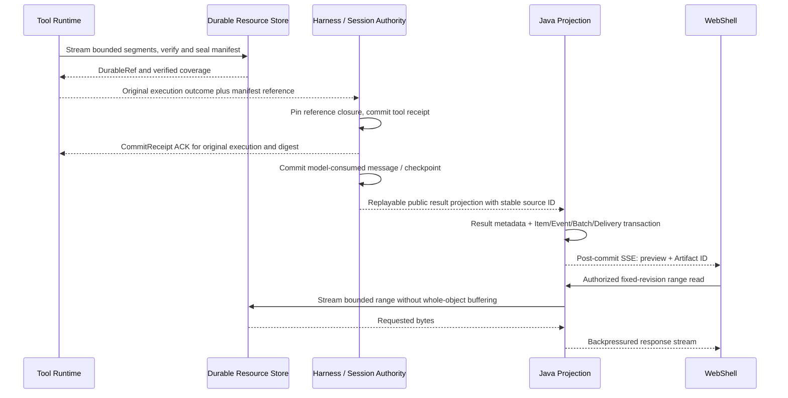

# Managed Agent Tool Results and Durable Artifacts

[English](managed-agent-tool-result-artifacts.md) | [简体中文](managed-agent-tool-result-artifacts.zh-CN.md)

Status: proposed, not implemented by this document. Research date: 2026-09-21. Verified code baseline: `72e215c1e5047b5291430b3dd4c1862c9439f0f6` on `feature/managed-agent-p2-delivery`. This specifies the missing delivery contract between existing local tool-result storage, Session authority, Java public projections, and WebShell. It refines the existing ordinary-tool receipt and resource design; it does not introduce a second execution authority. Repository paths below refer to this baseline.

## 1. Findings and Scope

| Verified source                                                                                                              | Existing behavior                                                                                                                                                                                              | Missing boundary                                                                                                                    |
| ---------------------------------------------------------------------------------------------------------------------------- | -------------------------------------------------------------------------------------------------------------------------------------------------------------------------------------------------------------- | ----------------------------------------------------------------------------------------------------------------------------------- |
| `packages/core/src/tools/tools.ts`, `ToolResult`                                                                             | Separates `llmContent`, `returnDisplay`, `persistedOutputFiles`, and `artifacts`. Undefined persistence metadata means undecided; an empty array means no reusable producer file.                              | A local filename is not a remotely durable or publicly readable resource. Preserve these distinctions.                              |
| `packages/core/src/tools/truncation.ts`, `persistAndTruncateToolResult`                                                      | Offloads selected oversized text to private local files; this path can skip persistence above 50 MiB or the 500 MiB Session budget. Write failures also yield a preview without a reusable file.               | Existing previews do not prove that full bytes survive. These limits are not universal limits for every producer.                   |
| `packages/core/src/tools/shell.ts`, `services/shellExecutionService.ts`, `services/backgroundShellRegistry.ts`               | Shell has producer-side output files, bounded buffering, and background output files; completion notifications read at most an 8192-byte tail.                                                                 | Capture before truncation, stream upload, and durable background output ownership remain necessary.                                 |
| `packages/core/src/tools/managed-tool-runtime.ts`                                                                            | Copies native result fields and Hook outcomes into the invocation result.                                                                                                                                      | Serialization and HTTP/frame limits still apply; copying the result does not transfer referenced file bytes.                        |
| `packages/core/src/managed-runtime/managed-session-resources.ts`, `managed-session-message-projection.ts`                    | Local resources use controlled temporary files, sync/rename, and length/SHA-256 validation; message records can reference these resources. Root: `<runtimeBaseDir>/resources/<sessionId>/<kind>/<resourceId>`. | `publish(Buffer)` and whole-file `read` are not large-stream APIs; local durability does not establish cross-host recovery.         |
| `packages/sdk-java/managed-agent-server/src/main/java/com/alibaba/qwen/code/managedagent/service/HarnessEventProjector.java` | Tool projection retains IDs, title, name, and status.                                                                                                                                                          | Full input/output, structured content, file references, and preview are currently dropped here.                                     |
| `packages/web-shell/client/components/managed/managed-session-messages.ts`                                                   | Tool cards can consume `input` and string `output`.                                                                                                                                                            | Java does not populate the complete result contract. Live tool-name/status normalization also needs parity with Snapshot hydration. |

Therefore “full tool output is not stored” is too broad: some output is stored locally, and private Session resources already exist. The unimplemented part is verified remote persistence, reference ownership, public projection, bounded reading, and end-to-end display.

Scope includes foreground Shell output, read/search/edit results, structured MCP results, and referenced files/media. Background Shell/Monitor uses the same storage contract when its existing H-stage lifecycle is enabled; this design does not enable that feature. Workspace backup, arbitrary file versioning, publication to external sites, and raw provider response archival remain separate designs.

## 2. Decisions and Alternatives

Use an object store such as OSS for immutable large bytes, the existing private Session authority for accepted tool results and resource ownership, and Java SQL for public metadata, previews, projection receipts, and event delivery. MQ/Redis distribute small events; they do not hold the sole copy of full output. Initially Java streams authenticated downloads so the existing browser-to-Java boundary remains intact.

| Option                              | Decision                                                                                                                                 |
| ----------------------------------- | ---------------------------------------------------------------------------------------------------------------------------------------- |
| Put all bytes in SQL, SSE, or MQ    | Reject for large output: it expands transactions, replay, memory, and duplicate payloads.                                                |
| Keep Runtime-local paths            | Reuse as bounded capture/spool; not the hosted durability boundary.                                                                      |
| Immutable objects plus manifests    | Select. Explicitly reconcile object publication and metadata commits; no assumed transaction spans OSS, Session authority, and Java SQL. |
| Append to one growing remote object | Defer. Immutable segments make retry identity, digest verification, and reads against a fixed revision simpler.                          |

Reuse the existing `DurableRef {resourceId, kind, schemaVersion, byteLength, digest}` and `ToolOutcomeRef`/`CommitReceipt` concepts. Do not add fields to owned Tool v2 in place: negotiate a versioned result envelope and resource operations before enabling the remote capability. Unsupported old peers reject capability admission before side effects. Local legacy behavior stays on its existing path.

## 3. Three Representations and Completeness

| Representation        | Contents and owner                                                                                                                                                        | Readers                                                         |
| --------------------- | ------------------------------------------------------------------------------------------------------------------------------------------------------------------------- | --------------------------------------------------------------- |
| Captured result       | Producer bytes before display/context truncation, native structured result, execution outcome, and approved attachment snapshots; Runtime publishes immutable resources.  | Restricted result reader and recovery.                          |
| Model-consumed result | Exact post-Hook/post-budget tool message actually supplied to the model, with resource references and policy version; Harness commits it in existing history/checkpoints. | Harness restoration; never reconstructed from a public preview. |
| Public display        | Sanitized bounded preview, tool status, MIME, byte count, completeness, and opaque Artifact IDs; Java derives it from committed source facts.                             | WebShell and public Agent API.                                  |

“Complete” means every byte in the declared capture scope was durably received and verified. It does not promise an upstream MCP server returned an entire dataset, a search tool did not cap matches, or a PTY preserved separate stdout/stderr. Record `captureScope`, `upstreamTruncated`, and `sourceVersion`. PTY transcripts are a single ordered stream; separate pipes retain their own byte order and observed frame sequence without claiming a universal cross-pipe order.

Track orthogonal state:

- `executionStatus`: original `not_started | success | error | cancelled | unknown`; storage failure never rewrites an executed side effect as not started.
- `captureStatus`: `pending | complete | partial | unavailable`; a partial resource has `missingRanges` when known and a typed reason, including upstream truncation or quota exhaustion.
- `deliveryStatus`: `pending | committed | blocked`; only a Session receipt establishes committed result delivery.
- `previewTruncated`: only describes UI clipping. A complete 100 MiB output can have a truncated 8 KiB preview.

When complete capture is required for an admitted tool, missing bytes block result acceptance and model continuation. An explicitly admitted best-effort policy may accept a partial result with its reason; it never labels it complete. Once a side effect happened, capture failure preserves the original outcome and recovery state and never triggers tool re-execution.

## 4. Resource and Metadata Contract

`ToolResultManifestV1` is a resource body referenced by the original `ToolOutcomeRef`; it does not replace the stable `DurableRef` shape.

| Field group | Required meaning                                                                                                                                                                                                     |
| ----------- | -------------------------------------------------------------------------------------------------------------------------------------------------------------------------------------------------------------------- |
| Identity    | `tenantId`, `sessionId`, `turnId`, `executionCallId`, `callId`, invocation digest, original binding generation, manifest revision. Never use `callId` alone for global identity.                                     |
| Outcome     | Physical outcome, exit/signal/error information, `captureScope`, `captureStatus`, `upstreamTruncated`, capture-policy version.                                                                                       |
| Contents    | Ordered descriptors for stdout, stderr or PTY, structured JSON, native result, Hook outcome, and attachments. Each descriptor names MIME, length, SHA-256, and a `DurableRef` or a paged segment-manifest reference. |
| Coverage    | Contiguous durable byte offsets per stream; missing ranges and their causes where known. End-of-stream plus final digest seals a complete stream.                                                                    |
| Projection  | Bounded approved preview and stable source identity; public Artifact IDs are produced by Java, not accepted as caller-authorized object keys.                                                                        |

An immutable segment is keyed by the scoped capture ID, stream ID, and segment ordinal. Repeating a publish with identical size/digest returns the original result; different bytes for the same identity conflict. A new manifest revision may only extend the verified prefix of an open stream. A sealed revision is immutable. Pages and the root manifest are size bounded; a large segment list must not become another unbounded SSE/JSON payload.

Proposed Java projections are `managed_agent_tool_result` (unique tenant/Session/execution/source revision), `managed_agent_artifact` (opaque ID, authorized representation, verified manifest reference, status and retention metadata), and a reference-edge projection. Full bytes and private model messages do not enter these rows. These names are design candidates, not a Flyway migration or an already supported backend. Rebuild rows from authority/resource facts; do not let SQL edits overwrite the accepted native result.

A Workspace filename may be overwritten after a tool returns. Capture a stable snapshot under the owning Runtime before publication; checking size twice is insufficient for same-size writes. Use a tool-owned sealed spool or a protected snapshot operation. If no stable snapshot can be obtained, report pending/unavailable rather than publishing a digest of changing bytes. `resultFilePaths` alone is not permission to snapshot every referenced file. Raw tool results may contain secrets; only explicitly authorized public representations become downloadable Artifacts.

## 5. Capture, Commit, ACK, and Recovery

1. Runtime reserves capture capacity before execution and tees supported streams into a bounded spool. Adapters capture before native truncation/serialization, reusing `persistedOutputFiles` if its bytes are still verified and accessible. The Session store needs stream publish/range read operations in addition to current Buffer APIs.
2. Publish bytes and manifest, validating digest/length against a trusted receiver or provider checksum plus end-to-end verification. A caller-supplied SHA-256 metadata string or an object HEAD alone is insufficient. Multipart completion is not a Session receipt. Use immutable keys/version IDs; never overwrite accepted objects.
3. Authority obtains a durable publication hold, commits the existing resource ownership and tool receipt with references, and returns the original receipt on an identical retry. Resource content must outlive Harness/Runtime replacement in the configured deployment. A local fsync is sufficient only for the explicitly local durability profile.
4. Runtime validates the receipt's execution identity and manifest digest before marking delivered. It may discard its spool only when all referenced bytes are retained elsewhere; process-tree drain and other lifecycle pins remain independent release conditions. Do not wait for a browser or MQ consumer ACK to release an already durable result.
5. Java consumes a replayable projection from the committed source. It atomically deduplicates `(tenantId, sessionId, sourceEventId)` and persists approved metadata with the public event/batch/delivery. Retain that source mapping through the promised replay/retry window. A local SSE notification alone cannot be the only carrier of an Artifact publication.

| Failure window                                              | Recovery                                                                                                                                         |
| ----------------------------------------------------------- | ------------------------------------------------------------------------------------------------------------------------------------------------ |
| Bytes uploaded, authority commit absent                     | Query/retry the same publication and original receipt; quarantine orphans behind a publication hold and grace period. Do not run the tool again. |
| Authority committed, ACK lost                               | Query the original execution receipt; return the same manifest and receipt.                                                                      |
| Java SQL unavailable after authority commit                 | Replay the public projection later. Harness/Runtime durability does not depend on a browser connection or Java projection availability.          |
| Producer disappears before an unsealed tail was published   | Keep the verified prefix, mark the missing tail partial/unavailable, and apply the admitted completeness policy.                                 |
| Cancel races with process exit/upload                       | Preserve the physical outcome and collected bytes. Cancellation of execution does not erase result ingestion/reconciliation.                     |
| Digest mismatch, wrong generation, or conflicting duplicate | Reject acceptance, quarantine corrupt content, and block recovery; never substitute another execution's output.                                  |

Broker-owned execution records and Session receipt state keep their established responsibilities. ACK transitions do not become a second mutable source of tool results.

## 6. Background Output and Bounded Capacity

Foreground and enabled background producers share immutable segment storage. Background Shell/Monitor additionally retain the existing task/process owner and Runtime lifecycle pin. A public progress event announces `durableThroughByte` and a manifest revision with a small preview; transient bytes are labeled live/uncommitted and never advance that durable cursor. EOF is a separate fact from process exit because pipe descendants may still hold output handles.

Proposed starting values for validation, not shipped defaults: preview at most 8 KiB UTF-8 and 200 lines, public result event at most 16 KiB, 4 MiB capture segments, at most two in-flight segments per execution, manifest page at most 256 KiB, text read at most 64 KiB, binary range at most 1 MiB. Reserve spool and concurrency capacity at Session and tenant level; per-execution bounds alone do not bound process memory. Repeated progress updates are coalesced; control/terminal events are not dropped.

Storage exhaustion requires an explicit policy: throttle/pause a producer only if supported safely; otherwise cancel and drain the original process, retain the known prefix, and report partial capture. No infinite spool, silent overwrite, or unbounded retry. Legacy paths that already construct a huge string cannot claim streaming memory bounds until their producer adapter is changed. Shell buffering, MCP frame limits, and serialization budgets must be tested independently of the object-store adapter.

## 7. Read API and Model Access

These are proposed additions or refinements to the reserved public resource routes, not currently implemented endpoints. Apply the same authenticated tenant, Session membership, and resource visibility rules to metadata, preview, range, and download requests.

| Proposed route                                                                    | Contract                                                                                                                                                   |
| --------------------------------------------------------------------------------- | ---------------------------------------------------------------------------------------------------------------------------------------------------------- |
| `GET /v1/agents/sessions/{sessionId}/items/{itemId}/tool-result`                  | Latest accepted result descriptor: outcome, capture/delivery state, bounded preview, revision, readable Artifact IDs. No raw private result or object key. |
| `GET /v1/agents/sessions/{sessionId}/artifacts`                                   | Cursor pagination by immutable creation identity; stable snapshot cursor for one listing.                                                                  |
| `GET /v1/agents/sessions/{sessionId}/artifacts/{artifactId}`                      | Authorized descriptor, available revisions, MIME/length/digest, completeness and expiry. Segment pages remain internal.                                    |
| `GET /v1/agents/sessions/{sessionId}/artifacts/{artifactId}/content?revision=...` | Stream full download or bounded byte range of that immutable authorized representation. No caller-provided filesystem path or URL.                         |

Use standard HTTP `Range`, `206`, `Content-Range`, and `416`; require a fixed revision and use its digest as the validator. A mismatched `If-Match` returns `412`; a deleted revision returns `410`; unknown or unauthorized resources follow the product's uniform not-found policy. Reject oversized/multiple range requests with a documented policy error rather than silently returning the entire object. Full download is a backpressured stream with separate concurrency limits. Byte ranges refer to the exact stored representation with no transparent re-compression. UTF-8 decoding is incremental; a preview reports its actual covered byte range. [HTTP semantics](https://www.rfc-editor.org/rfc/rfc9110.html#name-range-requests)

Harness uses an authenticated resource reader bound to the original Session/execution, with offset/limit and model token budgets. Public IDs are not credentials. Return bounded text or typed media blocks through existing tool semantics; do not place 100 MiB back into model context. On restoration, load the exact previously consumed tool message. Further reads are new explicit reads of the same resource, not implicit reruns of the original side effect. Hooks consume their intended native/model representation, not the public sanitized preview.

MCP adapters preserve structured results and media descriptors; `resource_link` remains an external/provider resource until explicitly fetched with provider authorization and captured. Do not assume a resource link implies bytes were archived or permit arbitrary backend URL fetches. [MCP 2025-11-25 Tools](https://modelcontextprotocol.io/specification/2025-11-25/server/tools)

## 8. WebShell Presentation

Reuse the current tool card and lazy-load an output panel. The card shows execution status, an independent “saving output”/“output unavailable” state, a bounded preview, size, completeness, and “View output”/“Download” actions when authorized. A failed command can still have a complete downloadable error log; a successful command can have blocked result delivery. Never show “complete output” based only on tool success.

Output panels use a virtualized bounded text buffer, range pagination, and revision-aware resume. Initial search covers loaded text and labels that scope; whole-output server search is deferred until it has a bounded API and cost policy. Active logs follow verified prefix updates. Preserve raw bytes for download when authorized; render terminal escapes as inert text or through the existing safe renderer. HTML/SVG/documents require safe previews or an isolated viewer; no execution in the application's authenticated origin. Media uses authorized streaming reads, not base64 in SSE.

Extend `HarnessEventProjector` with a validated public result descriptor, then `WebShellContentPart`/tool attributes and TypeScript DTOs. Normalize `toolCallId/callId`, `name/toolName`, and failure/cancel state on both live and Snapshot paths. Snapshot retains the same Artifact ID/revision as its coverage watermark; repeated SSE must not duplicate cards. Growing stream notifications only advertise committed revisions. Expired resources retain a clear metadata tombstone instead of a broken link.

## 9. Ownership, Authorization, and Retention

Resource publication, reference acquisition, and GC must share a serializable ownership protocol, implemented with the existing resource-domain ledger and a durable storage catalog. Publishing reserves an uncollectable hold. Authority commit converts it to a Session/history/checkpoint reference; failed or abandoned publications release it only after reconciliation. GC marks a revision retiring under the same generation check; no new pin can succeed after that mark. This prevents delete-versus-commit races across databases.

When catalog and authority use different stores, acquire the durable hold in the catalog first, include its identity in the authority commit, and reconcile it to a reference afterward. A timeout cannot delete that hold: a reconciler must prove the original commit exists or fence that publication from any future commit before releasing it. An unreachable authority keeps the hold and consumes quota. This sacrifices cleanup availability to preserve bytes; it is not a cross-store atomic transaction.

Retain resources while referenced by any accepted receipt, model history/checkpoint, replayable public event, public Artifact, fork/export, background task, investigation hold, or bounded active read lease. Removing an Artifact card removes a public edge; it does not erase model recovery resources. Event retention of 24 hours is unrelated to artifact retention. Fork/rewind releases only the relevant references; tenant deletion needs ordered reference revocation and physical cleanup with audit records.

No cross-tenant deduplication in the first version. Use scoped immutable object keys, encryption, server-side credential handling, and read audit. Raw input/output and signed URLs must not appear in application logs, trace attributes, or MQ metadata. Public preview redaction and download authorization are separate decisions; redacting the preview alone never authorizes the raw object.

## 10. Storage Adapter and Research Basis

Extend existing resource storage at the publish/read seam: `beginCapture`, idempotent segment publication, `seal`, metadata inspection, bounded `readRange`, and receipt query, all scoped and versioned. Blob operations do not themselves grant Session ownership. Shared-volume and OSS implementations must pass the same contract suite. Do not build a new standalone Artifact microservice initially; use the existing Runtime/resource adapter and Java control plane.

OSS supports multipart upload and ranged GetObject. Use independent application SHA-256 identities and verified length; OSS ETag is not universally a content MD5, and multipart-completion request checksums do not by themselves verify the completed object's bytes. An upload marked complete must satisfy the adapter's checksum/read-back proof. [OSS consistency verification](https://help.aliyun.com/en/oss/user-guide/data-verification/), [OSS GetObject](https://www.alibabacloud.com/help/en/oss/developer-reference/getobject), [multipart completion](https://www.alibabacloud.com/help/en/oss/developer-reference/complete-multipart-upload)

The provider and protocol documents establish available primitives, not our crash guarantees. The commit, pin, retry, and projection rules above are this project's proposed design and require fault tests. The MCP comparison is explicitly for revision 2025-11-25; deployed peers must negotiate their actual version.

## 11. Implementation Slices and Acceptance

These slices refine C/D/F/G and the existing ordinary-tool acceptance; they do not replace A–H or require RocketMQ first.

| Slice                                    | Deliverable                                                                                                      | Required proof                                                                                                                                                                                   |
| ---------------------------------------- | ---------------------------------------------------------------------------------------------------------------- | ------------------------------------------------------------------------------------------------------------------------------------------------------------------------------------------------ |
| O1: Reference contract and local adapter | Versioned manifest, capture completeness, stream publish/range read, original receipt ACK, local spool adapters. | Original 100 MiB Shell output survives truncation and process replacement on retained storage; old peers fail capability admission before execute. Local tests do not prove cross-host recovery. |
| O2: Hosted durable delivery              | OSS/shared-storage adapter, quota/backpressure, publication holds, receipt reconciliation and resource closure.  | Kill Runtime/Harness during each upload/commit/ACK window; no duplicate side effect, no false completeness, and verified bytes survive a new host.                                               |
| O3: Public projection and WebShell       | Java result/Artifact metadata, replayable source projection, range/download API, tool-card preview/panel.        | Live and Snapshot display agree; authorized reconnect recovers all accepted references without inlining large bodies.                                                                            |
| O4: Lifecycle and enabled extensions     | Reference-aware cleanup, background streams and MCP/media adapters.                                              | Pin/GC races, expiry, forks, cancellation, partial output, and long-running producers pass before enabling cleanup or extensions.                                                                |

Acceptance cases:

1. Success and failure with small text; 100 MiB output; non-UTF-8 bytes; zero-byte files; split UTF-8 code points; structured JSON; binary media. Full-byte digests and capture scope match.
2. Existing oversized/no-file paths preserve `partial/unavailable`; cannot infer full capture from `persistedOutputFiles=[]` or a textual path marker.
3. Upload duplicate, different-content duplicate, timeout after object commit, lost receipt ACK, and Java outage. Each resolves the original execution and never executes twice.
4. Kill Runtime before tail flush and after sealing; reboot Harness from exact consumed model message; missing resources block recovery rather than becoming empty success.
5. Cancel while descendants hold pipes; quota exhaustion mid-stream; storage slowdown; SSE disconnect. Memory/spool remain bounded and physical versus delivery outcome stays distinct.
6. Cross-tenant and cross-Session reads, path/symlink substitution, unauthorized raw download, HTML/terminal payloads, expired cursor/revision, and forged digest all fail in the declared way.
7. Concurrent pin/fork/read versus GC cannot delete required bytes; deleting a public card does not break model resume. Expired unreferenced resources are eventually collected.
8. Measure capture throughput, preview latency, publish/ACK latency, per-process heap, spool size, read amplification, object count and cost under concurrency. Enable hosted capability only after assigned limits pass, not solely because unit tests are green.

## 12. Remaining Product Parameters

Confirm deployment storage and credentials, retained-volume guarantees, per-tool completeness policy, permitted raw-download roles, retention classes, and Session/tenant byte quotas. The concrete limits in section 6 are test inputs pending measurement. Until O2/O3 passes, describe the feature as local persistence plus a proposed hosted result contract; until O4 passes, disable automated deletion. This documentation change does not declare any of those gates passed.
