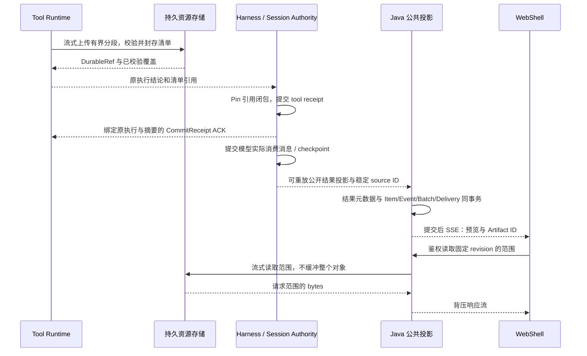

# Managed Agent 完整工具结果与持久产物

[English](managed-agent-tool-result-artifacts.md) | [简体中文](managed-agent-tool-result-artifacts.zh-CN.md)

状态：设计提案，本文未实现这些能力。调研日期：2026-09-21。核实源码基线：`feature/managed-agent-p2-delivery` 的 `72e215c1e5047b5291430b3dd4c1862c9439f0f6`。本文补齐现有本地工具结果存储、Session authority、Java 公共投影与 WebShell 之间的交付契约，细化已有普通工具回执及资源设计，不建立第二份执行权威。下文仓库路径均对应此基线。

## 1. 调研结论与范围

| 核实的来源                                                                                                                   | 已有行为                                                                                                                                                | 缺少的边界                                                                     |
| ---------------------------------------------------------------------------------------------------------------------------- | ------------------------------------------------------------------------------------------------------------------------------------------------------- | ------------------------------------------------------------------------------ |
| `packages/core/src/tools/tools.ts` 的 `ToolResult`                                                                           | 已区分 `llmContent`、`returnDisplay`、`persistedOutputFiles` 和 `artifacts`。持久化元数据 undefined 表示尚未决定，空数组表示没有可复用生产者文件。      | 本地文件名不等于远端持久或公开可读资源，必须保留上述区别。                     |
| `packages/core/src/tools/truncation.ts` 的 `persistAndTruncateToolResult`                                                    | 部分大文本会转存私有本地文件；该路径超过单文件 50 MiB 或 Session 500 MiB 预算可跳过保存，写入失败也可能只剩预览。                                       | 已有预览不能证明完整正文存在；这些限制并非所有生产者的统一上限。               |
| `packages/core/src/tools/shell.ts`、`services/shellExecutionService.ts`、`services/backgroundShellRegistry.ts`               | Shell 有生产者输出文件、有界缓冲和后台输出文件；完成通知最多读取 8192 字节尾部。                                                                        | 仍需裁剪前捕获、流式上传和后台输出持久归属。                                   |
| `packages/core/src/tools/managed-tool-runtime.ts`                                                                            | 原生结果字段及 Hook 结果复制进 invocation result。                                                                                                      | 仍受序列化和 HTTP/frame 限制；复制结果对象不会传输其引用文件的 bytes。         |
| `packages/core/src/managed-runtime/managed-session-resources.ts`、`managed-session-message-projection.ts`                    | 本地资源已有受控临时文件、sync/rename、长度与 SHA-256 校验；消息记录可引用资源。根路径为 `<runtimeBaseDir>/resources/<sessionId>/<kind>/<resourceId>`。 | `publish(Buffer)` 与整文件 `read` 还不是大流接口；本地持久化不证明跨主机恢复。 |
| `packages/sdk-java/managed-agent-server/src/main/java/com/alibaba/qwen/code/managedagent/service/HarnessEventProjector.java` | 工具投影保留 ID、标题、名称、状态。                                                                                                                     | 当前丢弃完整输入/输出、结构化内容、文件引用和预览。                            |
| `packages/web-shell/client/components/managed/managed-session-messages.ts`                                                   | 工具卡可以消费 `input` 和字符串 `output`。                                                                                                              | Java 尚未填充完整结果契约；实时工具名称/状态归一化也须与 Snapshot 恢复一致。   |

因此，“完整工具输出没有存储”过于笼统：部分输出已存本地，私有 Session 资源也已存在。未完成的是经过校验的远端持久化、引用归属、公共投影、有界读取及端到端展示。

范围包括前台 Shell 输出、读取/搜索/编辑结果、结构化 MCP 结果及引用文件/媒体。后台 Shell/Monitor 在原 H 阶段生命周期启用后复用同一存储契约，本文不启用该能力。Workspace 备份、任意文件版本管理、外站发布及模型供应商原始响应归档仍由各专项负责。

## 2. 决策与选项

不可变大内容使用 OSS 等对象存储；已接受工具结果及资源归属仍由既有私有 Session authority 保存；Java SQL 保存公开元数据、预览、投影回执和事件投递。MQ/Redis 分发小事件，不保存完整输出的唯一副本。首版由 Java 流式代理鉴权下载，保持浏览器只访问 Java 的边界。

| 选项                         | 决定                                                                                   |
| ---------------------------- | -------------------------------------------------------------------------------------- |
| 所有 bytes 放 SQL、SSE 或 MQ | 大输出不采用：放大事务、重放、内存和重复载荷。                                         |
| 保留 Runtime 本地路径        | 复用为有界捕获/暂存，不作为 Hosted 持久边界。                                          |
| 不可变对象加清单             | 采用。显式核对对象发布和元数据提交，不假设 OSS、Session authority、Java SQL 共享事务。 |
| 向同一远端对象持续追加       | 后置。不可变分段更便于固定重试身份、校验摘要和按确定版本读取。                         |

复用原 `DurableRef {resourceId, kind, schemaVersion, byteLength, digest}` 和 `ToolOutcomeRef`/`CommitReceipt` 概念。不原地向 owned Tool v2 增加字段：先协商有版本的结果 envelope 和资源操作，再启用远端能力。旧 peer 不支持时必须在副作用执行前拒绝能力准入，本地 Legacy 沿用原路径。

## 3. 三种结果表示与完整性

| 表示             | 内容与 owner                                                                                             | 读取者                             |
| ---------------- | -------------------------------------------------------------------------------------------------------- | ---------------------------------- |
| 捕获结果         | 展示/上下文裁剪前的生产者 bytes、原生结构化结果、执行结论及获准附件快照；Runtime 发布不可变资源。        | 受限结果读取与恢复。               |
| 模型实际消费结果 | Hook/预算处理后实际提供给模型的精确工具消息，携带资源引用与策略版本；Harness 提交到原有历史/checkpoint。 | Harness 恢复；不能从公共预览重建。 |
| 公开展示         | 脱敏有界预览、工具状态、MIME、字节数、完整性和不透明 Artifact ID；Java 从已提交事实派生。                | WebShell 与公共 Agent API。        |

“完整”表示声明捕获范围内的所有 bytes 已持久接收并校验，不承诺上游 MCP 返回整个数据集、搜索未限制匹配数或 PTY 保留独立 stdout/stderr。记录 `captureScope`、`upstreamTruncated`、`sourceVersion`。PTY 是一条有序记录；独立管道分别保留字节顺序和观察到的 frame sequence，不承诺两条管道存在绝对全序。

状态正交保存：

- `executionStatus`：原始 `not_started | success | error | cancelled | unknown`；存储失败不能把已执行副作用改写成未执行。
- `captureStatus`：`pending | complete | partial | unavailable`；部分结果在已知时带 `missingRanges` 和类型化原因，例如上游裁剪或配额耗尽。
- `deliveryStatus`：`pending | committed | blocked`；只有 Session 回执证明结果交付已提交。
- `previewTruncated`：仅表示 UI 裁剪。100 MiB 完整输出可以有一份被裁剪的 8 KiB 预览。

已准入工具若要求完整捕获，缺少 bytes 就阻止结果接受和模型续跑。显式准入的 best-effort 策略可以接受带原因的 partial，永远不能标为 complete。副作用已经发生后，捕获失败保留原结论和恢复状态，不能触发工具重执行。

## 4. 资源与元数据契约

`ToolResultManifestV1` 是原 `ToolOutcomeRef` 引用的资源正文，不替换稳定的 `DurableRef` 结构。

| 字段组 | 必须表达的含义                                                                                                                                                |
| ------ | ------------------------------------------------------------------------------------------------------------------------------------------------------------- |
| 身份   | `tenantId`、`sessionId`、`turnId`、`executionCallId`、`callId`、invocation digest、原 binding generation、manifest revision。不能仅以 `callId` 作为全局身份。 |
| 结论   | 物理结论、exit/signal/error、`captureScope`、`captureStatus`、`upstreamTruncated`、捕获策略版本。                                                             |
| 内容   | stdout、stderr 或 PTY、结构化 JSON、原生结果、Hook 结果及附件的有序描述；每项带 MIME、长度、SHA-256 和 `DurableRef` 或分页分段清单引用。                      |
| 覆盖   | 每条流连续持久化的字节偏移；已知缺口及原因。流结束和最终摘要共同封存完整流。                                                                                  |
| 投影   | 获准有界预览和稳定源身份；Java 生成公共 Artifact ID，不接受调用者用对象 key 自行声明授权。                                                                    |

不可变分段按带作用域的 capture ID、stream ID、segment ordinal 定位。同一身份重复发布相同大小/摘要返回原结果，内容不同则冲突。新 manifest revision 只允许延长开放流的已校验前缀，sealed revision 不可变。清单页面和根清单都限大小，不能让大分段列表变成另一份无界 SSE/JSON 载荷。

Java 投影拟为 `managed_agent_tool_result`（tenant/Session/execution/source revision 唯一）、`managed_agent_artifact`（不透明 ID、获准表示、已校验 manifest 引用、状态和保留元数据）及引用边投影。完整 bytes 与私有模型消息不进入这些行。这些表名是设计候选，不是 Flyway migration 或已支持后端。根据 authority/资源事实重建投影，不允许 SQL 编辑覆盖已接受的原生结果。

Workspace 文件在工具返回后可能被覆盖。发布前必须由所属 Runtime 获取稳定快照；前后两次检查大小不足以发现等长写入。使用工具已封存的 spool 或受保护的快照操作，无法获得稳定快照就标记 pending/unavailable，不发布变化内容的摘要。`resultFilePaths` 本身不是快照所有关联文件的权限。原始工具结果可能包含凭据等敏感内容，只有明确获准的公开表示成为可下载 Artifact。

## 5. 捕获、提交、ACK 与恢复

1. Runtime 执行前预留捕获容量，将支持的输出流分流到有界 spool。适配器在原生裁剪/序列化之前捕获；`persistedOutputFiles` 仍可访问且 bytes 已核验时复用。Session 存储需要在现有 Buffer API 之外补流式发布和范围读取。
2. 发布内容和清单，通过可信接收方或供应商校验加端到端验证确认摘要/长度。调用者自行填的 SHA-256 metadata 或仅 HEAD 对象不够。Multipart complete 不是 Session 回执；使用不可变 key/version ID，不覆盖已接受对象。
3. Authority 取得持久发布保留凭据，提交原资源归属和工具回执及其引用；相同重试返回原回执。配置的部署必须保证内容经过 Harness/Runtime 替换仍可读取，本地 fsync 仅满足显式 local durability profile。
4. Runtime 核对回执中的执行身份和清单摘要，再标记 delivered。只有所有引用 bytes 已在别处受保留时才可丢弃本地 spool；进程树排空及其他生命周期 pin 仍是独立释放条件。结果已持久后不等待浏览器或 MQ 消费 ACK 才释放。
5. Java 从已提交源消费可重放投影，在事务中按 `(tenantId, sessionId, sourceEventId)` 去重，保存获准元数据及公共 event/batch/delivery；源映射至少覆盖承诺的重放/重试窗口。本机 SSE 通知不能成为 Artifact 发布的唯一载体。

| 失败窗口                             | 恢复方式                                                                     |
| ------------------------------------ | ---------------------------------------------------------------------------- |
| bytes 已上传、authority 尚未提交     | 查询/重试原发布和原回执，孤儿对象由发布保留凭据和宽限期隔离，不重跑工具。    |
| authority 已提交、ACK 丢失           | 查询原 execution receipt，返回相同清单和回执。                               |
| authority 提交后 Java SQL 不可用     | 后续重放公开投影；Harness/Runtime 持久性不依赖浏览器连接或 Java 投影可用性。 |
| 未封存尾部发布前生产者消失           | 保留已验证前缀，尾部标为 partial/unavailable，按已准入完整性策略处理。       |
| Cancel 与进程退出/上传竞争           | 保留物理结论与收集到的 bytes；取消执行不能抹掉结果接收/核对过程。            |
| 摘要不符、代际错误或重复身份内容不同 | 拒绝接受，隔离损坏内容并阻塞恢复，不能用另一调用的输出替代。                 |

Broker 的执行记录和 Session 回执状态保持原职责；ACK 转换不能成为第二份可变工具结果事实。

## 6. 后台输出与有界容量

前台和已开放的后台生产者复用不可变分段存储。后台 Shell/Monitor 额外保留原任务/进程 owner 与 Runtime 生命周期 pin。公开进度事件携带 `durableThroughByte`、manifest revision 和小预览；临时 bytes 标为 live/uncommitted，不能推进持久游标。EOF 与进程退出分开记录，因为后代进程可能仍持有管道句柄。

建议初始验证参数，不是已交付默认值：预览最多 8 KiB UTF-8 且 200 行，公开结果事件最多 16 KiB，捕获分段 4 MiB，每个执行最多两个在途分段，清单每页最多 256 KiB，文本读取最多 64 KiB，二进制 range 最多 1 MiB。Session 和租户级同时预留 spool 与并发容量；只有每调用上限不能限制进程总内存。重复进度更新合并，控制/终态事件不可丢弃。

存储耗尽须有明确策略：只有生产者能安全支持时才减速/暂停，否则取消并排空原进程、保留已知前缀并报告 partial。不能无限 spool、静默覆盖或无限重试。仍先构造大字符串的旧路径，必须改造生产者适配器后才能声称流式内存有界。Shell 缓冲、MCP frame 和序列化预算需独立于对象存储适配器验证。

## 7. 读取 API 与模型访问

以下是对已预留公共资源路由的新增或细化，不是当前已实现端点。元数据、预览、range 和下载请求均校验相同的认证租户、Session 成员权限及资源可见性。

| 拟议路由                                                                          | 契约                                                                                                                  |
| --------------------------------------------------------------------------------- | --------------------------------------------------------------------------------------------------------------------- |
| `GET /v1/agents/sessions/{sessionId}/items/{itemId}/tool-result`                  | 最新已接受结果描述：执行结论、capture/delivery 状态、有界预览、revision、可读 Artifact ID；无原始私有结果或对象 key。 |
| `GET /v1/agents/sessions/{sessionId}/artifacts`                                   | 按不可变创建身份分页，一次遍历固定 snapshot cursor。                                                                  |
| `GET /v1/agents/sessions/{sessionId}/artifacts/{artifactId}`                      | 获准描述、可用版本、MIME/长度/摘要、完整性和过期信息；分段页面保留为内部细节。                                        |
| `GET /v1/agents/sessions/{sessionId}/artifacts/{artifactId}/content?revision=...` | 流式完整下载或读取该不可变获准表示的有界字节范围；调用者不能传文件系统路径或 URL。                                    |

使用标准 HTTP `Range`、`206`、`Content-Range`、`416`；固定 revision，以其摘要作为校验标识。`If-Match` 不匹配返回 `412`，已删除版本返回 `410`，未知或无权限资源遵守产品统一 not-found 策略。超限/多 range 按已声明策略报错，不能静默退化为返回整个对象。完整下载走独立并发配额的背压流。字节范围对应精确存储表示，不透明重压缩；UTF-8 增量解码，预览声明实际覆盖的字节区间。[HTTP 语义](https://www.rfc-editor.org/rfc/rfc9110.html#name-range-requests)

Harness 使用绑定原 Session/execution 的鉴权资源读取器，带 offset/limit 和模型 token 预算；公开 ID 不是凭证。通过原工具语义返回有界文本或类型化媒体块，不把 100 MiB 重新塞进上下文。恢复时加载上次实际消费的精确工具消息；进一步读取是对同一资源的显式新读取，不是隐式重跑原副作用。Hook 消费其应有的原生/模型表示，不消费公共脱敏预览。

MCP 适配器保留结构化结果和媒体描述；`resource_link` 在使用供应商权限显式读取并捕获前，仍只是外部/供应商资源。不能假设链接表示已归档 bytes，也不能允许后端任意抓取 URL。[MCP 2025-11-25 Tools](https://modelcontextprotocol.io/specification/2025-11-25/server/tools)

## 8. WebShell 展示

复用现有工具卡，按需加载输出面板。工具卡分别显示执行状态、“输出保存中”/“输出不可用”、有界预览、大小、完整性；鉴权允许时提供“查看输出”/“下载”。失败命令可以有完整可下载错误日志，成功命令也可能处于结果交付阻塞；不能仅凭工具成功就显示“输出完整”。

输出面板使用虚拟化有界文本缓冲、range 分页以及按 revision 续接。首版搜索只覆盖已加载文本并标明范围，完整输出的服务端搜索在具备有界 API 与成本策略后再加入。活日志跟随已验证前缀更新。获准下载可保留原 bytes，终端转义序列以无执行能力的文本或原有安全渲染器显示。HTML/SVG/文档使用安全预览或隔离查看器，不能在应用鉴权 origin 中执行；媒体通过鉴权流式读取，不把 base64 放入 SSE。

先向 `HarnessEventProjector` 增加经过校验的公共结果描述，再补 `WebShellContentPart`/工具 attributes 和 TypeScript DTO。实时与 Snapshot 路径统一归一化 `toolCallId/callId`、`name/toolName` 和失败/取消状态。Snapshot 保存与覆盖水位一致的 Artifact ID/revision，重复 SSE 不生成重复卡片。增长流通知仅公布已提交版本；过期资源保留明确元数据墓碑，避免只留下坏链接。

## 9. 归属、授权与保留

资源发布、引用取得和 GC 必须共用可串行化的归属协议，以原 resource domain 账本和持久存储目录实现。发布先取得不可回收的 hold；authority 提交后转换成 Session/history/checkpoint 引用，失败或废弃发布核对后才释放。GC 在相同 generation 校验下标为 retiring，标记后不得成功取得新 pin，防止跨数据库删除与提交竞争。

目录和 authority 分属不同存储时，先在目录取得持久 hold，将其身份写入 authority commit，之后再核对成正式引用。超时不能直接删除 hold：核对器必须证明原提交已存在，或封住该发布今后的提交资格后才能释放。Authority 无法访问时继续保留 hold 并占用配额。这是用清理可用性换内容安全，不是跨存储原子事务。

已接受回执、模型历史/checkpoint、可重放公共事件、公共 Artifact、fork/export、后台任务、调查保留或有界读取租约任一仍引用时均保留。删除 Artifact 卡片只移除公共引用边，不能删除模型恢复资源。事件 24 小时保留与 Artifact 保留无关。Fork/rewind 只释放相应引用；租户删除需有序撤销引用、清理物理内容并记录审计。

首版不跨租户去重。使用隔离的不可变对象 key、加密、服务端凭证处理和读取审计。原始输入/输出、签名 URL 不进入应用日志、trace attributes 或 MQ metadata。公共预览脱敏和下载权限分别决定，预览脱敏本身不授权下载原对象。

## 10. 存储适配与外部调研依据

在原资源存储 publish/read 接缝扩展：`beginCapture`、幂等分段发布、`seal`、元数据检查、有界 `readRange` 和回执查询，均带作用域及版本。Blob 操作本身不赋予 Session 归属。共享卷与 OSS 实现通过同一契约测试；首版不额外建设独立 Artifact 微服务，复用 Runtime/资源适配器与 Java 控制面。

OSS 提供 multipart upload 和 GetObject 范围读取。应用独立记录 SHA-256 身份和已验证长度：OSS ETag 并不总是内容 MD5，multipart complete 请求的校验也不能单独证明完整对象 bytes 正确。标为 complete 前必须达到适配器的校验/回读证明。[OSS 数据一致性校验](https://help.aliyun.com/en/oss/user-guide/data-verification/)、[OSS GetObject](https://www.alibabacloud.com/help/en/oss/developer-reference/getobject)、[multipart completion](https://www.alibabacloud.com/help/en/oss/developer-reference/complete-multipart-upload)

供应商与协议文档只证明基础能力，不证明本系统的崩溃保证。上面的提交、pin、重试和投影规则是本项目提议，仍须故障验证。MCP 对照明确采用 2025-11-25 版本，部署双方须协商实际支持版本。

## 11. 实施切片与验收

这些切片细化 C/D/F/G 和已有普通工具验收，不替换 A～H，也不要求先接 RocketMQ。

| 切片                     | 交付内容                                                                   | 必须证明                                                                                                                     |
| ------------------------ | -------------------------------------------------------------------------- | ---------------------------------------------------------------------------------------------------------------------------- |
| O1：引用契约与本地适配   | 有版本清单、捕获完整性、流式发布/range 读取、原回执 ACK、本地 spool 适配。 | 原始 100 MiB Shell 输出经过裁剪和进程替换后在保留存储中仍完整；旧 peer 在 execute 前拒绝能力准入。本地测试不证明跨主机恢复。 |
| O2：Hosted 持久交付      | OSS/共享存储适配、配额/背压、发布 hold、回执核对和资源闭包。               | 在每个上传/提交/ACK 窗口杀 Runtime/Harness；无重复副作用、无虚假完整性，新主机仍可读校验 bytes。                             |
| O3：公共投影与 WebShell  | Java 结果/Artifact 元数据、可重放源投影、range/下载 API、工具卡预览/面板。 | 实时与 Snapshot 展示一致，鉴权重连可恢复所有已接受引用，不内嵌大正文。                                                       |
| O4：生命周期与已开放扩展 | 引用感知清理、后台输出及 MCP/媒体适配。                                    | 启用清理或扩展前通过 pin/GC 竞争、过期、fork、取消、部分输出和长任务验收。                                                   |

验收用例：

1. 成功/失败的小文本、100 MiB 输出、非 UTF-8 bytes、空文件、跨段 UTF-8、结构化 JSON、二进制媒体；全量摘要与捕获范围一致。
2. 现有超限/无文件路径明确保留 `partial/unavailable`，不能从 `persistedOutputFiles=[]` 或文本路径标记推断完整捕获。
3. 重复上传、同身份不同内容、对象提交后超时、回执 ACK 丢失和 Java 故障；全部查询原执行，不执行两次。
4. 在尾部 flush 前和 seal 后杀 Runtime；Harness 从精确消费消息恢复，资源缺失阻塞恢复，不能成为空成功。
5. 后代持有管道时取消、中途配额耗尽、存储变慢、SSE 断开；内存/spool 有界，物理与交付状态保持独立。
6. 跨租户/跨 Session 读取、路径/符号链接替换、未获准原始下载、HTML/终端载荷、过期 cursor/revision、伪造摘要按约定拒绝。
7. Pin/fork/read 与 GC 并发不能删除仍需 bytes；删除公共卡片不破坏模型 resume，无引用的过期资源最终回收。
8. 并发测量捕获吞吐、预览时延、发布/ACK 时延、进程堆、spool、读取放大、对象数和费用；设定限制通过后才启用 Hosted，不能仅凭单测通过开放。

## 12. 待确定产品参数

确认部署存储与凭证、持久卷保证、每类工具的完整性策略、允许原始下载的角色、保留等级以及 Session/租户字节配额。第 6 节具体限制是待测输入。O2/O3 通过前应描述为“本地持久化加拟议 Hosted 结果契约”，O4 通过前不启用自动删除。本次文档修改不宣称这些门槛已经通过。
